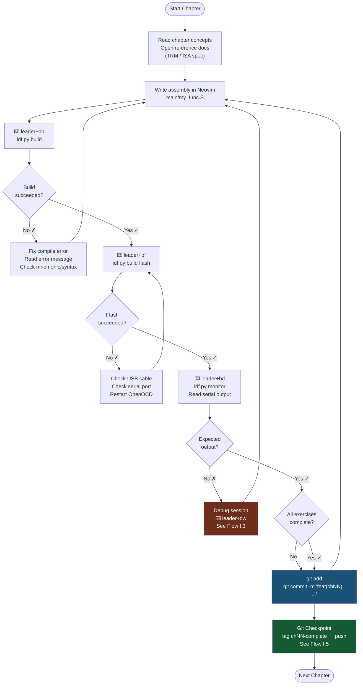
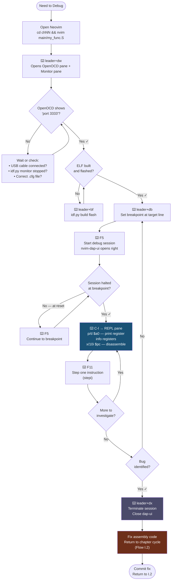
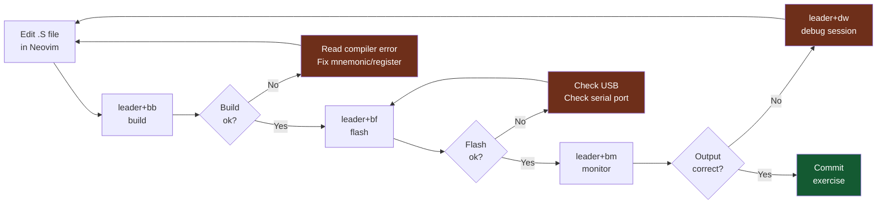
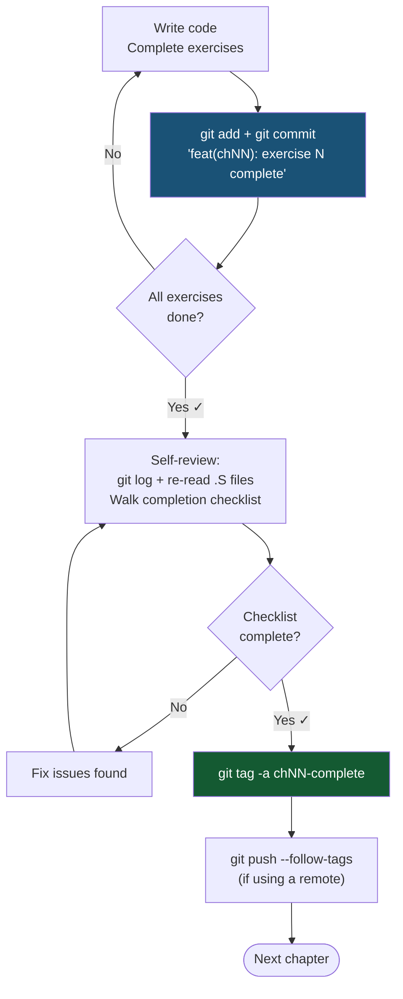

# Bare Metal: Assembly Programming the ESP32-C3
## A Fourteen-Week Course from First Instruction to WiFi and Bluetooth

---

*For everyone who has used a computer their whole life and never once wondered what it is actually doing — and for those who have always wondered but never known where to start.*

---

## Table of Contents

**Front Matter**
- About This Book — who it is for, why the ESP32-C3, why Neovim, how to approach the course
- What You Are Really Learning: Fundamentals Over Specifics
- Conventions Used in This Book
- Prerequisites — knowledge, hardware, and software
- Setup — toolchain, Neovim configuration, project template
- Git Version Control Setup — repository, branching, commit conventions, the chapter workflow
- Tracking Your Progress

**Phase 1: Foundations (Weeks 1–4) — The Instruction Set**
- Chapter 1: The Register File
- Chapter 2: Arithmetic, Logic, and Shifts
- Chapter 3: Load, Store, and Memory
- Chapter 4: Branches, Loops, and Control Flow

**Phase 2: Functions and Memory (Weeks 5–7)**
- Chapter 5: The Stack and Calling Convention
- Chapter 6: Strings, Data Structures, and Multiple Source Files
- Chapter 7: Linker Scripts and Memory Sections

**Phase 3: Hardware (Weeks 8–10)**
- Chapter 8: Memory-Mapped I/O and GPIO
- Chapter 9: UART From Scratch
- Chapter 10: Timers and Cycle Measurement

**Phase 4: Bare Metal (Weeks 11–12)**
- Chapter 11: Interrupts and Exception Handling
- Chapter 12: Reset Vector, Startup Code, and Capstone

**Phase 5: Applied Projects (Weeks 13–14)**
- Chapter 13: WiFi in Assembly
- Chapter 14: Bluetooth Low Energy in Assembly

**Appendices**
- Appendix A: Quick Reference — RISC-V RV32IMAC Instructions
- Appendix B: ESP32-C3 Memory Map and Key Registers
- Appendix C: Complete Reference Library
- Appendix D: Neovim Commands Reference for This Course
- Appendix E: Quick Link Index
- Appendix F: Git Reference for This Course
- Appendix G: Applying These Fundamentals to Other Architectures
- Appendix H: Assembly Debugging with OpenOCD and GDB
- Appendix I: Flow Charts and Neovim Execution Cheat Sheet

---

## About This Book

### Who This Is For

This book is written for developers who are comfortable with at least one high-level language — Python, JavaScript, C, Go, it does not matter which — and who want to understand what a computer is genuinely doing at the hardware level.

You do not need prior assembly experience. You do not need an electrical engineering background. You do not need to have worked with microcontrollers before.

You do need to be comfortable with the Linux command line. You need to be able to write a basic C function, even if you would not describe yourself as a C programmer. And you need patience — assembly programming rewards careful, deliberate thinking far more than it rewards speed.

This book is also specifically for people who learn by doing. Every chapter is built around a project. Concepts are introduced only when you have a concrete reason to need them. You will be flashing real code to real hardware from the very first session.

### Why the ESP32-C3

The ESP32-C3 is a microcontroller made by Espressif Systems. It is inexpensive (around five to ten Australian dollars), widely available, and physically small. It can be powered from a USB cable plugged into your laptop.

More importantly, the ESP32-C3 uses a RISC-V processor core. RISC-V is an instruction set architecture that was designed, deliberately and explicitly, to be clean, regular, and easy to learn. Where older architectures like x86 carry decades of historical complexity, RISC-V was built from scratch with education and clarity as explicit goals.

The base integer instruction set — which is all you need to start — has 47 instructions. That is a number a human being can actually memorise. The design is so regular that once you understand ten instructions you largely understand all of them.

### Why Neovim

Neovim is a powerful, keyboard-driven text editor that runs in your terminal. It requires no graphical interface, works over SSH, and once configured, is fast and precise. More practically for this course: it keeps you in the same terminal environment where you compile, flash, and monitor your programs. You never leave the keyboard.

This book will not teach you Neovim from scratch, but the setup chapter gives you the minimal configuration you need, and useful workflow commands are noted throughout.

### How to Approach This Course

**One week is a guideline, not a deadline.** The fourteen-week structure assumes roughly eight to ten hours of focused work per week — reading, writing code, debugging, and reading again. If you can only give five hours a week, budget twenty-eight weeks. If you can give fifteen, you might finish in ten. The chapters are sequential and each genuinely depends on the previous, so do not skip ahead.

**Read the references.** This book will tell you what things mean, but it cannot replace the primary sources. The RISC-V specification and the ESP32-C3 Technical Reference Manual are cited throughout. Reading original technical documentation is a skill, and this course is a good place to develop it. Start with the sections indicated — you do not need to read three hundred pages before writing your first instruction.

**Do the exercises before looking at the solutions.** The solutions are included for verification, not as shortcuts. If you look at a solution before attempting the exercise you rob yourself of the most valuable part of the learning.

**Expect your first instinct to be wrong.** Assembly programming will repeatedly reveal assumptions you did not know you were making. A function that looks correct will corrupt the stack in a subtle way. A loop that looks like it terminates will run forever. This is not a failure — it is the mechanism by which you learn. Every crash is information.

**Use a notebook.** Trace through programs by hand before running them. Write down register values at each step. This is slow at first and becomes fast once the mental model is solid. The developers who are best at low-level work are almost always the ones who can simulate the machine in their head.

### What You Are Really Learning: Fundamentals Over Specifics

This book teaches assembly on one specific processor — the RISC-V core in the ESP32-C3. But the processor is the vehicle, not the destination. What you are actually learning is a set of fundamentals that are true of *every* processor ever made:

- A CPU has a small number of fast registers and a large, slow memory, and your job is to move data between them deliberately.
- Arithmetic and logic happen in registers; memory is accessed through load and store operations.
- Control flow is built from conditional and unconditional jumps — every `if`, `while`, and `for` you have ever written compiles down to these.
- Function calls require a convention: where arguments go, where the return value goes, and who is responsible for preserving which registers.
- The stack is how a machine with finite registers supports arbitrarily deep function calls and recursion.
- Hardware is controlled by reading and writing specific memory addresses.
- Interrupts let hardware events redirect the processor, and handling them correctly means saving and restoring state.
- A program does not run by magic: something must initialise memory and jump to your first instruction.

Every one of these is universal. RISC-V happens to express them with unusual clarity, which is exactly why it is the right place to learn them. Once you hold these fundamentals firmly, moving to ARM, x86-64, or any other architecture is a matter of learning new spelling for ideas you already understand — different register names, different mnemonics, different calling-convention details, but the same underlying machine.

Throughout the book, when a concept is universal, it is presented as universal — not as "a RISC-V thing." **Appendix G** maps every core concept in this book directly onto ARM (both Cortex-M and AArch64) and x86-64, so you can see the consistent fundamentals beneath the surface differences. Read it once you have finished Phase 1, and again at the end of the course. It is what turns this from a book about one chip into a foundation you can build on anywhere.

### Conventions Used in This Book

**Code blocks** containing assembly use GNU assembler (GAS) syntax throughout, since that is what `riscv32-esp-elf-gcc` expects. Each function begins with a comment block giving its C-equivalent signature and its register usage:

```asm
# function_name(arg_type arg)  — one-line description
# a0 = first argument
# returns result in a0
        .global function_name
function_name:
        # ... body ...
        ret
```

**Shell commands** are shown in `bash` code blocks. Commands you type are shown without a prompt; expected output, where relevant, is shown as a comment with `#`.

**Register names** use the ABI aliases (`a0`, `sp`, `t0`) rather than the hardware names (`x10`, `x2`, `x5`) in prose and code, except where the distinction matters.

**Memory addresses and register values** are written in hexadecimal with a `0x` prefix. Bit positions are written as `[high:low]`, so `[7:0]` means the lowest eight bits.

**Chapter structure:** Each chapter follows the same pattern — Learning Objectives, concept sections, a project or exercises with sample solutions, a Git Checkpoint, a Chapter Summary, and References. The repetition is deliberate: a predictable structure lets you focus on content rather than navigation.

**A note on "should":** When the book says a value "should" be something, it means the calling convention or hardware specification requires it, and violating it produces bugs. When it says something "can" be done, it is one valid choice among several.

---

## Prerequisites

### Knowledge Prerequisites

Before beginning Chapter 1, verify that you can do the following without looking anything up.

**Command line:**
- Navigate the filesystem, create and remove files and directories
- Run a program, read its output, redirect output to a file
- Edit a file in Neovim: open, enter insert mode, make a change, save, quit
- Understand what `PATH` is and how to add something to it
- Write a basic shell script with a loop and a conditional

**C programming:**
- Declare a variable and a function
- Understand what a pointer is and how to dereference it
- Write a `for` loop and an `if/else` statement
- Know the difference between `int`, `char`, and `unsigned int`
- Know what a `struct` is and how to access its fields

**Number systems:**

Work through these before continuing. Do not use a calculator.

1. Convert `0b11011010` to hexadecimal and decimal.
2. Convert `0xC4` to binary and decimal.
3. What is the result of `0b10110000 >> 3`?
4. What is `0xFF & 0x0F`?
5. What is `0x0A | 0x50`?
6. What is `0b10101010 ^ 0b11001100`?
7. In an 8-bit signed integer, what decimal value does `0b11111111` represent?
8. What is the largest value a 32-bit unsigned integer can hold?

Answers: 1) 0xDA / 218, 2) 0b11000100 / 196, 3) 0b00010110 / 22, 4) 0x0F / 15, 5) 0x5A / 90, 6) 0b01100110 / 102, 7) -1, 8) 4,294,967,295

If any of those took more than a minute or required guessing, work through binary and hexadecimal arithmetic exercises for a full day before returning. Everything in this course builds on fluent number system conversion.

### Hardware Prerequisites

- One ESP32-C3 development board. The SuperMini, DevKitM-1, and XIAO ESP32C3 all work. Any board labelled ESP32-C3 will work.
- A USB-C cable with data lines. Many cheap cables are charge-only and will not allow the computer to communicate with the board. If your board does not appear as a serial device, the cable is the most common cause.
- *(Optional)* A breadboard, a few LEDs, and 220-ohm resistors. The SuperMini's onboard LED and BOOT button cover the first hardware exercises with zero wiring; external components are only needed for the later GPIO exercises.

### Software Prerequisites

- Linux (Ubuntu 22.04 or later recommended) or macOS with Homebrew. Windows users should use WSL2 with Ubuntu.
- Neovim 0.9 or later
- Git
- Python 3.10 or later
- A working internet connection for the initial toolchain download

---

## Your Board: The ESP32-C3 SuperMini

This course is built around one specific board: the **ESP32-C3 SuperMini**. Everything from the flash-size default to the debug configuration assumes it. Take five minutes to know your hardware before plugging it in.

```
                ┌──────── USB-C ────────┐
                │  ┌─────┐    ┌─────┐  │
           5V ──┤  │ RST │    │BOOT │  ├── GND
          GND ──┤  └─────┘    └─────┘  ├── GPIO10
          3V3 ──┤      ┌──────────┐    ├── GPIO9  ← BOOT button
        GPIO0 ──┤      │ ESP32-C3 │    ├── GPIO8  ← onboard blue LED
        GPIO1 ──┤      │  RISC-V  │    ├── GPIO7
        GPIO2 ──┤      │  160MHz  │    ├── GPIO6
        GPIO3 ──┤      └──────────┘    ├── GPIO5
        GPIO4 ──┤   ┌─────────────┐    │
                │   │   antenna   │    │
                └───┴─────────────┴────┘
```

| Feature | Detail | Why it matters in this course |
|---------|--------|------------------------------|
| CPU | Single-core RISC-V RV32IMAC, 160 MHz | The instruction set you are learning |
| Flash | 4 MB | `sdkconfig.defaults` sets this (ESP-IDF assumes 2 MB) |
| RAM | 400 KB SRAM | Where your `.data`, `.bss`, and stack live |
| Onboard LED | Blue LED on **GPIO8** | Your first hardware output — no wiring needed (Chapter 8) |
| BOOT button | **GPIO9**, pulls low when pressed | Your first hardware input — no wiring needed |
| RST button | Hardware reset | Used in debugging and recovery |
| USB-C port | Power + serial + JTAG in one cable | GPIO18/19 are the USB D−/D+ pins — never reconfigure them |
| Antenna | PCB trace antenna at one end | Keep clear of metal; matters in Chapters 13–14 (WiFi/BLE) |

**Three practical notes:**

1. **The onboard LED polarity varies between board revisions.** On most SuperMini boards the LED is wired *active-low*: writing 0 to GPIO8 turns it on, writing 1 turns it off. Some revisions are active-high. Chapter 8's first exercise has you determine yours empirically — a two-minute experiment that teaches a real lesson about trusting silicon over documentation.

2. **One USB port does everything.** Flashing, serial monitor, and JTAG debugging all run over the same USB-C cable simultaneously. No external programmer or debug probe is required for any chapter of this course.

3. **GPIO11–17 are not broken out** (they connect to the internal flash). The pins you have are GPIO0–10 plus GPIO20/21 (UART). Plan hardware exercises accordingly.

---

## Setup: Toolchain and Neovim Configuration

### Installing ESP-IDF

ESP-IDF is Espressif's official development framework for the ESP32 family. In the early chapters it provides the startup code and serial output infrastructure so you can focus on learning the instruction set. In the later chapters you will replace it piece by piece until nothing of it remains.

```bash
# Create the directory structure
mkdir -p ~/esp
cd ~/esp

# Clone the ESP-IDF repository
# This will take several minutes on first run
git clone --recursive https://github.com/espressif/esp-idf.git
cd esp-idf

# Install the toolchain for ESP32-C3 specifically
./install.sh esp32c3

# Load the environment variables into your current shell
source export.sh
```

Add the source command to your shell configuration so it is available in every new terminal:

```bash
# For bash users
echo 'source ~/esp/esp-idf/export.sh' >> ~/.bashrc

# For zsh users
echo 'source ~/esp/esp-idf/export.sh' >> ~/.zshrc
```

Verify the installation:

```bash
idf.py --version
# Expected: ESP-IDF v5.x.x or v6.x.x

riscv32-esp-elf-gcc --version
# Expected: riscv32-esp-elf-gcc (crosstool-NG ...) 13.x.x

riscv32-esp-elf-objdump --version
# Expected: GNU objdump (crosstool-NG ...) 2.x.x
```

> **Version note:** This course was validated against ESP-IDF **v5.4.x** and **v6.0.1 (stable)**. If your `idf.py --version` shows a `-dev-` suffix (e.g. `v6.1-dev-5317-g2e2909506f`), you are on a development snapshot. Development branches may contain build regressions and unstable APIs. For a learning course, switch to a stable release:
>
> ```bash
> cd ~/esp/esp-idf
> git fetch --all --tags
> git checkout v6.0.1          # latest stable as of this writing
> git submodule update --init --recursive
> ./install.sh esp32c3
> source export.sh
> ```
>
> Check the [ESP-IDF release page](https://github.com/espressif/esp-idf/releases) for the latest stable tag before installing.

If any of these commands are not found, ensure the `source export.sh` line ran without errors. The most common issue is an incomplete clone — if you see errors about missing submodules, run `git submodule update --init --recursive` inside the `esp-idf` directory.

### Finding Your Board's Serial Port

When you plug in the ESP32-C3, it appears as a serial device:

```bash
# On Linux
ls /dev/ttyUSB* /dev/ttyACM*
# Common results: /dev/ttyUSB0 or /dev/ttyACM0

# On macOS
ls /dev/cu.usbserial-* /dev/cu.usbmodem*

# If nothing appears, try:
dmesg | tail -20
# Look for lines mentioning "ttyUSB" or "ch340" or "cp210x"
```

If you see a `Permission denied` error when trying to communicate with the port:

```bash
sudo usermod -a -G dialout $USER
# Log out and back in for this to take effect
```

### Neovim Configuration

The following configuration provides syntax highlighting for assembly files, quick build commands, and a split-pane workflow suited to writing assembly alongside a terminal.

If you already have a Neovim configuration using lazy.nvim, add these plugins to your existing setup. If you are starting fresh, create the directory structure and files below.

```bash
mkdir -p ~/.config/nvim/lua
```

**`~/.config/nvim/init.lua`** — if starting fresh:

```lua
-- Bootstrap lazy.nvim plugin manager
local lazypath = vim.fn.stdpath("data") .. "/lazy/lazy.nvim"
if not vim.loop.fs_stat(lazypath) then
  vim.fn.system({
    "git", "clone", "--filter=blob:none",
    "https://github.com/folke/lazy.nvim.git",
    "--branch=stable", lazypath,
  })
end
vim.opt.rtp:prepend(lazypath)

require("lazy").setup("plugins")
require("config.options")
require("config.keymaps")
```

**`~/.config/nvim/lua/plugins/init.lua`**:

```lua
return {
  -- Syntax highlighting via Tree-sitter
  {
    "nvim-treesitter/nvim-treesitter",
    build = ":TSUpdate",
    opts = {
      ensure_installed = { "c", "asm", "make", "cmake", "lua", "bash" },
      highlight = { enable = true },
      indent = { enable = true },
    },
  },

  -- LSP framework (for C files alongside your assembly)
  { "neovim/nvim-lspconfig" },

  -- Easy comment toggling
  { "numToStr/Comment.nvim", opts = {} },

  -- Keymap helper (win replaces deprecated window in v3+)
  {
    "folke/which-key.nvim",
    event = "VeryLazy",
    opts  = {
      win    = { border = "rounded" },
      notify = false,
    },
  },

  -- Status line (optional but useful)
  { "nvim-lualine/lualine.nvim", opts = { options = { theme = "auto" } } },

  -- ── Debugging ────────────────────────────────────────────────────
  -- Debug Adapter Protocol core
  { "mfussenegger/nvim-dap" },

  -- DAP UI — right-side panels (REPL, stack, breakpoints, scopes)
  -- Position = right keeps the bottom row free for :terminal splits
  {
    "rcarriga/nvim-dap-ui",
    dependencies = { "mfussenegger/nvim-dap", "nvim-neotest/nvim-nio" },
    opts = {
      layouts = {
        {
          elements = {
            { id = "repl",        size = 0.40 },
            { id = "stacks",      size = 0.25 },
            { id = "breakpoints", size = 0.20 },
            { id = "scopes",      size = 0.15 },
          },
          size     = 45,
          position = "right",
        },
      },
      floating = { border = "rounded" },
    },
  },

  -- DAP virtual text — shows values inline at end of line
  {
    "theHamsta/nvim-dap-virtual-text",
    dependencies = { "mfussenegger/nvim-dap", "nvim-treesitter/nvim-treesitter" },
    opts = { enabled = true, show_stop_reason = true, virt_text_pos = "eol" },
  },
}
```

**`~/.config/nvim/lua/config/options.lua`**:

```lua
local opt = vim.opt

opt.number = true
opt.relativenumber = true
opt.expandtab = false       -- assembly uses real tabs
opt.tabstop = 8             -- 8-space tabs are conventional in assembly
opt.shiftwidth = 8
opt.smartindent = true
opt.termguicolors = true
opt.splitright = true       -- vertical splits open to the right
opt.splitbelow = true       -- horizontal splits open below
opt.scrolloff = 8           -- keep 8 lines above/below cursor
opt.signcolumn = "yes"
opt.updatetime = 250
```

**`~/.config/nvim/lua/config/keymaps.lua`**:

```lua
local map = vim.keymap.set
local opts = { noremap = true, silent = true }

-- Build, flash, and monitor shortcuts
map("n", "<leader>bb", ":terminal idf.py build<CR>", opts)
map("n", "<leader>bf", ":terminal idf.py build flash<CR>", opts)
map("n", "<leader>bm", ":terminal idf.py monitor<CR>", opts)
map("n", "<leader>bd", ":terminal idf.py build flash monitor<CR>", opts)

-- Disassemble the built ELF
map("n", "<leader>da", function()
  vim.cmd("terminal riscv32-esp-elf-objdump -d -M no-aliases build/*.elf | less")
end, opts)

-- Disassemble a specific function (prompts for name)
map("n", "<leader>df", function()
  vim.ui.input({ prompt = "Function name: " }, function(name)
    if name then
      vim.cmd(string.format(
        "terminal riscv32-esp-elf-objdump -d -M no-aliases build/*.elf | grep -A 50 '<%s>'",
        name
      ))
    end
  end)
end, opts)

-- Open a terminal split below
map("n", "<leader>t", ":split | terminal<CR>", opts)

-- Navigate between windows easily
map("n", "<C-h>", "<C-w>h", opts)
map("n", "<C-l>", "<C-w>l", opts)
map("n", "<C-j>", "<C-w>j", opts)
map("n", "<C-k>", "<C-w>k", opts)

-- ── Debug workspace ───────────────────────────────────────────────────────────
-- <leader>dw opens two :terminal splits at the bottom:
--   Left  → OpenOCD  (wait for "Listening on port 3333" before pressing <F5>)
--   Right → idf.py monitor  (serial output)
-- nvim-dap-ui opens automatically on the RIGHT when <F5> starts a session.
-- Navigate between panes with <C-h/j/k/l>.

map("n", "<leader>dw", function()
  local main_win = vim.api.nvim_get_current_win()
  vim.cmd("botright split")
  vim.cmd("resize 10")
  vim.cmd("terminal openocd -f board/esp32c3-builtin.cfg")
  vim.api.nvim_buf_set_name(0, "OpenOCD")
  vim.cmd("vsplit")
  vim.cmd("terminal idf.py monitor")
  vim.api.nvim_buf_set_name(0, "Monitor")
  vim.api.nvim_set_current_win(main_win)
  vim.notify(
    "[Debug] Workspace open.\nWait for port 3333 in OpenOCD pane (<C-j>),\nthen press <F5>.",
    vim.log.levels.INFO
  )
end, { desc = "Debug: Open workspace (OpenOCD + monitor)" })

-- ── Debug session controls ────────────────────────────────────────────────────
local function get_dap()   return require("dap") end
local function get_dapui() return require("dapui") end

map("n", "<F5>",       function() get_dap().continue()          end, { desc = "Debug: Continue / Start" })
map("n", "<F10>",      function() get_dap().step_over()         end, { desc = "Debug: Step Over (nexti)" })
map("n", "<F11>",      function() get_dap().step_into()         end, { desc = "Debug: Step Instruction (stepi)" })
map("n", "<F12>",      function() get_dap().step_out()          end, { desc = "Debug: Finish function" })

-- macOS alternatives: F10/F11/F12 are intercepted by the OS by default.
-- These leader-key bindings work on all platforms without any system changes.
-- Use these on macOS; the F-key bindings work if you disable the system bindings
-- in: System Settings → Keyboard → Keyboard Shortcuts → Mission Control.
map("n", "<leader>dc", function() get_dap().continue()  end, { desc = "Debug: Continue (macOS: alt for F5)" })
map("n", "<leader>dn", function() get_dap().step_over() end, { desc = "Debug: Step Over (macOS: alt for F10)" })
map("n", "<leader>di", function() get_dap().step_into() end, { desc = "Debug: Step Into (macOS: alt for F11)" })
map("n", "<leader>do", function() get_dap().step_out()  end, { desc = "Debug: Step Out (macOS: alt for F12)" })
map("n", "<leader>db", function() get_dap().toggle_breakpoint() end, { desc = "Debug: Toggle breakpoint" })
map("n", "<leader>dB", function()
  get_dap().set_breakpoint(vim.fn.input("Condition: "))
end, { desc = "Debug: Conditional breakpoint" })
map("n", "<leader>du", function() get_dapui().toggle()    end, { desc = "Debug: Toggle UI panels" })
map("n", "<leader>dr", function() get_dap().repl.open()  end, { desc = "Debug: Open GDB REPL" })
map("n", "<leader>dx", function()
  get_dap().terminate()
  get_dapui().close()
end, { desc = "Debug: Terminate session" })

-- Assembly file settings autocmd
vim.api.nvim_create_autocmd("FileType", {
  pattern = "asm",
  callback = function()
    vim.opt_local.commentstring = "# %s"
    vim.opt_local.tabstop = 8
    vim.opt_local.shiftwidth = 8
    vim.opt_local.expandtab = false
    vim.opt_local.colorcolumn = "40,60"  -- visual guides for label/mnemonic/operand columns
  end,
})

-- which-key group labels (gc registered as operator to silence overlap warning)
local ok, wk = pcall(require, "which-key")
if ok then
  wk.add({
    { "<leader>b", group = "Build / Flash" },
    { "<leader>d", group = "Debug / Disassemble" },
    { "<leader>t", group = "Terminal" },
    { "gc", group = "Comment",         mode = { "n", "v" } },
    { "gb", group = "Comment (block)", mode = { "n", "v" } },
  })
end
```

> **Debug adapter configuration:** debugging also requires a `~/.config/nvim/lua/config/dap.lua`
> file that registers the OpenOCD + GDB adapter and configures sign column icons.
> The complete verified-working file is provided in the companion document
> `neovim_complete_setup.md` (Step 7); Appendix H covers how to use it.

### Project Template

Every chapter in this course uses the same ESP-IDF project structure. Create a template you can copy:

```bash
mkdir -p ~/esp32c3-assembly-course/template/main

cat > ~/esp32c3-assembly-course/template/CMakeLists.txt << 'EOF'
cmake_minimum_required(VERSION 3.22...4.3)
include($ENV{IDF_PATH}/tools/cmake/project.cmake)
project(asm_project)
EOF

cat > ~/esp32c3-assembly-course/template/main/CMakeLists.txt << 'EOF'
idf_component_register(
    SRCS "main.c" "my_func.S"
    INCLUDE_DIRS "."
)
EOF

cat > ~/esp32c3-assembly-course/template/sdkconfig.defaults << 'EOF'
# Hardware defaults for ESP32-C3 SuperMini
# The SuperMini ships with a 4MB flash chip.
# ESP-IDF defaults to 2MB, which produces a flash size warning at boot.
# This file is read by idf.py set-target and idf.py menuconfig when
# sdkconfig is first generated — no manual menuconfig step required.
CONFIG_ESPTOOLPY_FLASHSIZE_4MB=y
CONFIG_ESPTOOLPY_FLASHSIZE="4MB"
EOF

# Placeholder sources so `idf.py set-target` can configure the project.
# set-target runs a CMake configure that needs every file named in SRCS
# to exist on disk. You overwrite these with real code in each chapter.
cat > ~/esp32c3-assembly-course/template/main/main.c << 'EOF'
#include <stdio.h>
#include "freertos/FreeRTOS.h"
#include "freertos/task.h"

void app_main(void)
{
    while (1) {
        vTaskDelay(pdMS_TO_TICKS(1000));
    }
}
EOF

cat > ~/esp32c3-assembly-course/template/main/my_func.S << 'EOF'
# Placeholder — replaced with real code in each chapter.
# A valid empty translation unit so the assembler and linker succeed.
        .global my_func
my_func:
        ret
EOF
```

`sdkconfig.defaults` is a source file — commit it with the template. Each chapter copies it automatically via `cp -r template/* chNN/`, and `idf.py set-target esp32c3` applies it when generating that chapter's `sdkconfig`.

The two placeholder sources matter for a subtle reason: `idf.py set-target` runs a full CMake configure, and CMake needs every file listed in `SRCS` to already exist on disk — otherwise the configure fails before you have written a line of code. The placeholders are valid, compilable stubs. You overwrite `my_func.S` (and `main.c` when a chapter needs it) with the chapter's real code, and the `SRCS` line stays in sync as you add files.

> **Chapter 1 only:** if you have already run `idf.py set-target` for Chapter 1, its `sdkconfig` exists and will not be updated automatically. Run once:
> ```bash
> cd ~/esp32c3-assembly-course/ch01
> rm sdkconfig && idf.py set-target esp32c3
> ```

To start each chapter:

```bash
cp -r ~/esp32c3-assembly-course/template ~/esp32c3-assembly-course/ch01
cd ~/esp32c3-assembly-course/ch01
idf.py set-target esp32c3
```

### A Note on the idf.py Monitor

The monitor command (`idf.py monitor`) opens a serial terminal connected to your ESP32-C3. It displays output from the board and also decodes panic messages and stack traces. Exit it with `Ctrl+]`. When running from inside Neovim's terminal mode, you will need to press `Ctrl+\ Ctrl+n` first to leave terminal insert mode, then close the split normally.

---

## Git Version Control Setup

Version control is not optional on this course. Every exercise you complete, every crash you diagnose, and every optimisation you make should be tracked in Git. This serves three purposes: you build the habit of committing working code before experimenting; you have a complete history to diff against when something breaks; and at the end of fourteen weeks you have a portfolio of real bare-metal assembly that you can show to anyone.

### Why Git Matters for Assembly Work

Assembly is uniquely unforgiving. A single wrong offset in a stack frame produces a crash with no error message, no line number, and no obvious cause. The ability to run `git diff` and see exactly what changed between a working state and a broken one is invaluable. Commit every time your code builds and runs correctly. Never go more than one exercise without committing.

### Repository Initialisation

Create one repository for the entire course:

```bash
mkdir -p ~/esp32c3-assembly-course
cd ~/esp32c3-assembly-course
git init
git branch -M main
```

Create a `.gitignore` that excludes ESP-IDF build artefacts:

```bash
cat > .gitignore << 'EOF'
# ESP-IDF build output
build/
sdkconfig
sdkconfig.old
sdkconfig.bak
dependencies.lock
managed_components/

# Editor and OS files
.nvim.lua
.DS_Store
*.swp
*.swo
*~
tags
.tags

# Compiled objects (keep .S and .c, ignore .o and .elf)
*.o
*.elf
*.bin
*.map
*.d

# Python cache
__pycache__/
*.pyc
EOF
```

Create the initial project structure:

```bash
mkdir -p template/main
# (create CMakeLists.txt files as shown in the Project Template section above)

# Create a README.md — update the progress checklist as you complete each phase
cat > README.md << 'EOF'
# ESP32-C3 Assembly Course

Bare-metal RISC-V assembly programming on the ESP32-C3.
Following: Bare Metal: Assembly Programming the ESP32-C3 v2.0

## Progress
- [ ] Phase 1: Foundations (Chapters 1–4)
- [ ] Phase 2: Functions and Memory (Chapters 5–7)
- [ ] Phase 3: Hardware (Chapters 8–10)
- [ ] Phase 4: Bare Metal (Chapters 11–12)
- [ ] Phase 5: Applied Projects (Chapters 13–14)
EOF

git add .gitignore template/ README.md
git commit -m "chore: initial repo structure, gitignore, and README"
```

### Branch Strategy: One Branch

This course uses a single branch: `main`. You are one person writing course exercises. Feature branches, integration branches, and pull requests exist to coordinate teams — for a solo learning repository they add ceremony without value. Commit working code directly to `main`, tag each completed chapter, push.

If you later work in a team, multi-branch workflows are covered by the Git learning resources at the end of this section. The habits that matter now are smaller and more durable: commit frequently, write meaningful messages, tag milestones.

---

**Optional: Push to GitHub immediately after initialisation**

If you want the repository on GitHub from the start (recommended for backup and portfolio), run the following block once after creating the `dev` branch. This is optional — the course works entirely locally without it — but doing it now means every subsequent chapter push is a single `git push` with no further setup.

*Prerequisites: [GitHub CLI](https://cli.github.com) installed and authenticated (`gh auth login`).*

```bash
# Create the remote repository on GitHub (private by default)
gh repo create esp32c3-assembly-course \
    --private \
    --description "Bare-metal RISC-V assembly on ESP32-C3 — 14-week course" \
    --source=. \
    --remote=origin \
    --push

# Confirm the repository is visible on GitHub
gh repo view --web
```

If you prefer SSH over HTTPS, or are using GitLab, set the remote manually instead:

```bash
# GitHub via SSH
git remote add origin git@github.com:YOUR_USERNAME/esp32c3-assembly-course.git
git push -u origin main

# GitLab via SSH
git remote add origin git@gitlab.com:YOUR_USERNAME/esp32c3-assembly-course.git
git push -u origin main
```

After this point every chapter push uses simply:
```bash
git push
```

---

### Commit Message Convention

This course uses [Conventional Commits](https://www.conventionalcommits.org/):

```
type(scope): short description in imperative mood

Optional longer body explaining why, not what.
```

**Types used in this course:**

| Type | When to use |
|------|-------------|
| `feat` | A working new function or exercise |
| `fix` | Corrected a bug in existing assembly |
| `refactor` | Restructured code without changing behaviour |
| `test` | Added or updated an exercise test |
| `docs` | Comments added or improved in `.S` files |
| `chore` | Build system, gitignore, toolchain changes |
| `wip` | Work in progress — incomplete, do not merge |

**Scope** is the chapter and function name:

```bash
git commit -m "feat(ch01): my_func returns constant 42"
git commit -m "feat(ch02): get_nibble extracts 4-bit field correctly"
git commit -m "fix(ch03): correct sign extension in sign_extend_8"
git commit -m "refactor(ch05): use s-registers to simplify array_sum loop"
git commit -m "docs(ch08): add register offset comments to gpio_init_output"
```

**Rules:**
- Commit message subject line is 72 characters or fewer
- Use the imperative mood: "add", "fix", "remove" — not "added", "fixing", "removed"
- Every commit must build without errors. Never commit broken code to `dev` or `main`
- Use `wip:` prefix freely on chapter branches for in-progress saves, but squash or reword before merging

### The Chapter Workflow (Repeat Every Week)

This is the exact sequence of Git operations you run for every chapter:

**Step 1 — Start the chapter (run once at the beginning)**
```bash
git pull                                    # get latest if working with a remote
mkdir -p ch01/main
cp -r template/* ch01/
cd ch01
idf.py set-target esp32c3
```

> **Note:** The `cp -r template/*` step brings placeholder `main.c` and `my_func.S` files with it, so `idf.py set-target` can configure the project before you have written any chapter code. You then overwrite those placeholders with the chapter's real source. The template `main/CMakeLists.txt` lists `"main.c" "my_func.S"` as its source files — update the `SRCS` line for each chapter to match the actual `.S` files you create. For example, Chapter 2 would list `"main.c" "compute.S" "bitops.S"`. When you add a `.S` file, create it (even as an empty stub with a `.global` line) before running `set-target` or `build`, or CMake will fail the configure. Commit the updated `CMakeLists.txt` as part of the chapter's first commit.

**Step 2 — Commit after each working exercise (repeat throughout the chapter)**
```bash
# After Exercise 1.1 passes:
git add ch01/main/my_func.S
git commit -m "feat(ch01): exercise 1.1 register arithmetic returns 65"

# After Exercise 1.2 (trace analysis — no code change, but add your notes):
git add ch01/main/my_func.S
git commit -m "docs(ch01): exercise 1.2 trace analysis annotations"

# After Exercise 1.3:
git commit -m "feat(ch01): exercise 1.3 use zero register for copy"

# After Exercise 1.4 (disassembly output saved as a file):
echo "See disassembly output below" > ch01/DISASM_NOTES.md
# paste objdump output into the file
git add ch01/DISASM_NOTES.md
git commit -m "docs(ch01): exercise 1.4 disassembly analysis notes"
```

**Step 3 — Self-review (before tagging)**

Before tagging the chapter complete, review your own work: read `git log` and `git diff ch00-something..HEAD` (or just re-read the chapter's `.S` files top to bottom), and walk this checklist:

```markdown
## Chapter 01 Completion Checklist

### Exercises
- [ ] Exercise 1.1: register arithmetic — correct output verified
- [ ] Exercise 1.2: trace analysis — all intermediate values correct
- [ ] Exercise 1.3: zero register rewrite — builds and returns same result
- [ ] Exercise 1.4: disassembly analysis — questions answered in DISASM_NOTES.md

### Code Quality
- [ ] All functions have a comment block with signature and register usage
- [ ] All exercises produce expected output on hardware
- [ ] .gitignore is not bypassed (no build/ or .bin files committed)

### Understanding Check
- [ ] Can name all 32 registers and their ABI aliases from memory
- [ ] Can explain why x0 is hardwired to zero
- [ ] Can predict output of a short program by hand tracing
```

**Step 4 — Tag and push (after self-review passes)**
```bash
git tag -a ch01-complete -m "Chapter 1: Register File complete. Exercises 1.1-1.4 passing."
git push --follow-tags        # if using a remote
```

One annotated tag per chapter. That is the entire release process.

**Step 5 — Phase completion tags (after Chapters 4, 7, 10, 12)**

After completing each phase, apply an additional tag to mark the milestone:

```bash
git tag -a phase1-complete -m "Phase 1 complete: Chapters 1-4, full RV32I instruction set"
git tag -a phase2-complete -m "Phase 2 complete: Chapters 5-7, stack/calling convention/UART/linker"
git tag -a phase3-complete -m "Phase 3 complete: Chapters 8-10, MMIO/GPIO/UART/timers, no C"
git tag -a course-complete -m "Course complete: Chapters 1-14, full bare-metal ESP32-C3 with WiFi and BLE"
```

### Checking Your Git Log

At any point, view a clean log of your progress:

```bash
# Pretty one-line log with tags
git log --oneline --decorate

# Show what changed in the last commit
git show HEAD

# Show diff of uncommitted changes
git diff

# Show diff between two tags
git diff ch01-complete ch02-complete
```

### Git Learning Resources

If you are new to Git or want to strengthen your fundamentals alongside the course, use the following resources. They are listed in order from beginner to advanced.

**Official Git Documentation**
- Reference manual: [https://git-scm.com/docs](https://git-scm.com/docs)
- Full documentation index: [https://git-scm.com/doc](https://git-scm.com/doc)

**Pro Git (free book — the definitive reference)**
The complete Git book by Scott Chacon and Ben Straub, freely available in full online. Chapters 1–3 cover everything needed for this course. Chapter 7 covers advanced tools used in Appendix F.
- Online (HTML): [https://git-scm.com/book/en/v2](https://git-scm.com/book/en/v2)
- PDF download: [https://github.com/progit/progit2/releases/latest](https://github.com/progit/progit2/releases/latest)

**Learn Git Branching (interactive visual tutorial)**
The best interactive tool for understanding branches, merges, rebases, and the commit graph. The best interactive way to build a mental model of the commit graph, useful well beyond this course.
- URL: [https://learngitbranching.js.org](https://learngitbranching.js.org)

**GitHub Skills (guided hands-on courses)**
Free, short courses that walk through Git and GitHub workflows with automated feedback.
- URL: [https://skills.github.com](https://skills.github.com)
- Recommended: "Introduction to GitHub", "Review pull requests", "Resolve merge conflicts"

**Atlassian Git Tutorials**
Well-written tutorials covering Git workflows, branching strategies, and rebasing.
- URL: [https://www.atlassian.com/git/tutorials](https://www.atlassian.com/git/tutorials)
- Branching strategies: [https://www.atlassian.com/git/tutorials/comparing-workflows](https://www.atlassian.com/git/tutorials/comparing-workflows)

**Conventional Commits Specification**
The commit message format used throughout this course. Read the full specification — it is short.
- URL: [https://www.conventionalcommits.org/en/v1.0.0/](https://www.conventionalcommits.org/en/v1.0.0/)

**Oh Shit, Git!?!**
A practical guide to recovering from Git mistakes, written without jargon. Bookmark this for when things go wrong.
- URL: [https://ohshitgit.com](https://ohshitgit.com)

**GitHub CLI Documentation**
Used in the setup section to create the remote repository from the terminal.
- URL: [https://cli.github.com/manual/](https://cli.github.com/manual/)
- Installation: [https://cli.github.com](https://cli.github.com)

**gitignore.io — Generate .gitignore Files**
Generates `.gitignore` files for any combination of languages, editors, and operating systems. Useful if you extend the course to use additional tools.
- URL: [https://www.toptal.com/developers/gitignore](https://www.toptal.com/developers/gitignore)


---

## Tracking Your Progress

The README.md you created above contains the phase checklist. That is all the project management this course needs: tick a box when a phase is done, and commit the change as part of the chapter checkpoint.

If you want per-chapter granularity, expand the README list to fourteen lines — one per chapter — and tick those instead. If you already live in a task tool (Trello, Notion, a paper notebook), one line per chapter is plenty.

What matters is the rhythm: finish the exercises, commit the code, tick the box, move on. The work itself is the tracker; anything more elaborate is procrastination with extra steps.

---

# PHASE 1: FOUNDATIONS
## Weeks 1 – 4 | The Instruction Set

*In Phase 1, C handles all startup code, clock initialisation, and serial output. Your assembly functions are called from C and return values that C prints. Your job is to learn the instruction set without fighting the hardware at the same time.*

---

# Chapter 1: The Register File

## Learning Objectives

By the end of this chapter you will be able to:

- Describe what a register is and why it exists
- Name all 32 RISC-V registers by both their hardware names and ABI aliases
- Explain the purpose of each register group
- Write a valid assembly function that computes a simple value and returns it
- Use the ESP-IDF build system to compile, flash, and monitor a program

## 1.0 What a Processor Actually Does

Before the first instruction, fix the machine itself in your mind. Strip away every layer — operating system, compiler, language runtime — and a processor is a circuit that repeats one loop forever:

```
loop forever:
    1. FETCH    read 4 bytes from memory at the address in pc
    2. DECODE   interpret those bytes: which operation? which registers?
    3. EXECUTE  perform the operation; write any result
    4. ADVANCE  pc = pc + 4 (or wherever a branch redirected it)
```

That is the whole machine. Everything in this book is a refinement of these four steps.

**The instruction is just bytes.** When you write `li a0, 42`, the assembler produces four bytes — `13 05 A0 02` — which sit in flash memory at some address. They are not special; they are data, exactly like any other data, until the moment `pc` points at them. Then the decode circuitry reads the bit pattern and recognises: *this is an `addi`, destination register 10, source register 0, immediate value 42*. Chapter 2 shows you exactly how those fields pack into the 32 bits.

**The pc drives everything.** The program counter is the register holding the address of the current instruction. Sequential execution is nothing more than `pc += 4` after every instruction. An `if` statement, a loop, a function call — all of them are just instructions that write a different value into `pc`. When you single-step in the debugger (Chapter 1.6), you are watching this loop run exactly once per keypress.

**The clock sets the pace.** The ESP32-C3 runs this loop at 160 MHz — 160 million cycles per second. Simple instructions complete in one cycle. That number is worth internalising: a 6.25-nanosecond heartbeat. When Chapter 10 has you counting cycles, and when a "slow" busy-wait loop burns 80 million iterations in half a second, this is the clock you are spending.

**Registers are the workbench; memory is the warehouse.** The fetch-decode-execute loop can only compute on values in registers. Anything in memory must be loaded into a register first (Chapter 3), worked on (Chapter 2), and stored back. This separation is not a RISC-V quirk — it is the fundamental economics of silicon: a register read costs nothing; a memory access costs many cycles.

Hold this loop in your head for the rest of the book. Every concept that follows — the register file below, branches in Chapter 4, interrupts in Chapter 11 — is a precise answer to the question *"what does this do to the fetch-decode-execute loop?"*

## 1.1 What Is a Register?

When a CPU executes instructions, it needs somewhere to keep the values it is currently working with. Main memory (RAM) is too slow — reading a value from RAM takes many clock cycles. Cache memory is faster but still architecturally separate from the execution units.

Registers are the answer. They are tiny storage locations built directly into the processor. On the ESP32-C3, a register holds exactly 32 bits. Reading from or writing to a register happens in a single clock cycle. There is no faster storage available to the processor.

The tradeoff is quantity. You cannot have thousands of registers — each one adds silicon area and complexity. RISC-V, like most modern architectures, provides exactly 32 general-purpose registers. That is the entire working memory available to the CPU at any given moment. When you are writing assembly, your job is to manage these 32 locations effectively.

## 1.2 The RISC-V Register File

The 32 registers are named `x0` through `x31`. These are their hardware names. The RISC-V Application Binary Interface (ABI) also defines a second set of names — aliases — that reflect each register's conventional purpose. You will use the ABI names in almost all assembly code you write.

| Hardware | ABI Name | Purpose | Notes |
|----------|----------|---------|-------|
| x0 | zero | Constant zero | Writes are silently discarded |
| x1 | ra | Return address | Where to go when function returns |
| x2 | sp | Stack pointer | Top of the current stack frame |
| x3 | gp | Global pointer | Points to global data area |
| x4 | tp | Thread pointer | Per-thread data |
| x5 | t0 | Temporary | Caller-saved, free to use |
| x6 | t1 | Temporary | Caller-saved, free to use |
| x7 | t2 | Temporary | Caller-saved, free to use |
| x8 | s0 / fp | Saved / frame pointer | Callee-saved |
| x9 | s1 | Saved | Callee-saved |
| x10 | a0 | Argument / return value | First argument or return value |
| x11 | a1 | Argument / return value | Second argument or return value |
| x12 | a2 | Argument | Third argument |
| x13 | a3 | Argument | Fourth argument |
| x14 | a4 | Argument | Fifth argument |
| x15 | a5 | Argument | Sixth argument |
| x16 | a6 | Argument | Seventh argument |
| x17 | a7 | Argument | Eighth argument |
| x18 | s2 | Saved | Callee-saved |
| x19 | s3 | Saved | Callee-saved |
| x20 | s4 | Saved | Callee-saved |
| x21 | s5 | Saved | Callee-saved |
| x22 | s6 | Saved | Callee-saved |
| x23 | s7 | Saved | Callee-saved |
| x24 | s8 | Saved | Callee-saved |
| x25 | s9 | Saved | Callee-saved |
| x26 | s10 | Saved | Callee-saved |
| x27 | s11 | Saved | Callee-saved |
| x28 | t3 | Temporary | Caller-saved, free to use |
| x29 | t4 | Temporary | Caller-saved, free to use |
| x30 | t5 | Temporary | Caller-saved, free to use |
| x31 | t6 | Temporary | Caller-saved, free to use |

The terms "caller-saved" and "callee-saved" will be explained in depth in Chapter 5. For now, note that the `t` registers are yours to use freely, the `a` registers carry function arguments and return values, and the `s` registers must be preserved across function calls.

### The Zero Register

`x0` (also called `zero`) is special. It is hardwired to the value zero. You can read it at any time and always get zero. You can write to it and nothing happens — the write is silently discarded.

This sounds like a limitation but it is actually extremely useful. Many common operations — clearing a register, comparing a value against zero, an unconditional branch — can all be expressed using the zero register without special-case instructions. RISC-V's regularity is one of its great strengths.

### The Program Counter

There is one more register that is not in the table above: the program counter, or `pc`. It holds the address of the instruction currently being executed. You cannot directly read or write the `pc` using the standard register operations. Some instructions implicitly read or modify it — branches, jumps, and the `auipc` instruction. Understanding the `pc` deeply becomes important in Chapter 4 when you start writing loops and branches.

## 1.3 Your First Instructions

RISC-V instructions follow a consistent pattern: an operation name (the mnemonic), a destination register, and one or two source registers or immediate values. The destination always comes first.

```
mnemonic  destination, source1, source2
```

Here are the instructions you need for this chapter:

**`li rd, imm` — Load Immediate**

Places a constant value into a register. This is technically a pseudoinstruction — the assembler expands it into one or two real instructions depending on the size of the constant — but you use it as if it were a single instruction.

```asm
li    a0, 42        # a0 = 42
li    t0, 0xFF      # t0 = 255
li    a1, -7        # a1 = -7
```

**`mv rd, rs` — Move**

Copies the value from one register to another. Also a pseudoinstruction, expands to `addi rd, rs, 0`.

```asm
mv    a0, t0        # a0 = t0
mv    s0, a1        # s0 = a1
```

**`add rd, rs1, rs2` — Add**

Adds two registers and stores the result.

```asm
add   a0, a1, a2    # a0 = a1 + a2
add   t0, t0, t1    # t0 = t0 + t1
```

**`addi rd, rs1, imm` — Add Immediate**

Adds a register and a 12-bit signed constant. The constant range is -2048 to 2047.

```asm
addi  a0, a0, 10    # a0 = a0 + 10
addi  t0, t0, -1    # t0 = t0 - 1  (subtraction using negative immediate)
```

**`ret` — Return**

Returns from the current function to the caller. This is a pseudoinstruction that expands to `jalr zero, ra, 0` — it jumps to the address stored in `ra`. The mechanics of how `ra` gets set are covered in Chapter 5.

## 1.4 Assembly File Structure

An assembly source file in GNU Assembler (GAS) format has two essential parts: directives and instructions. Directives give instructions to the assembler itself (where to put things, what is visible to other files). Instructions are the actual machine operations.

```asm
# This is a comment

        .global my_func        # directive: make my_func visible to the linker

my_func:                       # label: defines the address of this location
        li    a0, 42           # instruction: load 42 into the return register
        ret                    # instruction: return to caller
```

**Labels** are names for memory addresses. When you write `my_func:`, you are saying "the address of the next instruction is called `my_func`". Labels are how you refer to functions and branch targets by name instead of hard-coded numbers.

**The `.global` directive** makes a label visible outside the current file. Without it, the linker cannot see the function and your C code cannot call it.

**Column conventions:** Assembly code traditionally uses columns: labels at the left margin, mnemonics indented one tab stop, operands after the mnemonic, and comments aligned further right. Neovim's `colorcolumn = "40,60"` setting puts visual guides at useful positions.

## 1.5 The C Scaffolding (Chapters 1–2)

In the first two weeks, C handles everything except your function logic. Read this code carefully — it is short — but you will not be modifying it. Replace the template's placeholder `main/main.c` with this version for Chapter 1:

**`main/main.c`:**

```c
#include <stdio.h>
#include "esp_log.h"
#include "freertos/FreeRTOS.h"
#include "freertos/task.h"

static const char *TAG = "ch01";

/*
 * Declare the assembly function.
 * 'extern' tells the C compiler that this function is defined elsewhere.
 * It takes no arguments and returns an int.
 */
extern int my_func(void);

void app_main(void)
{
    int result = my_func();
    ESP_LOGI(TAG, "my_func returned: %d", result);

    /*
     * app_main() is launched by ESP-IDF as a FreeRTOS task and must not
     * return. Returning causes the task to be deleted, after which
     * idf_monitor floods the console with serial timeout warnings.
     * vTaskDelay() yields to the scheduler each iteration rather than
     * spinning in a busy loop — correct practice in an RTOS environment.
     *
     * This idle loop applies to Chapters 1–7 where assembly functions
     * return a value. From Chapter 8 onward, assembly functions contain
     * their own infinite loops and app_main() never returns naturally.
     *
     * Further reading:
     * https://docs.espressif.com/projects/esp-idf/en/stable/esp32c3/api-guides/startup.html
     */
    while (1) {
        vTaskDelay(pdMS_TO_TICKS(1000));
    }
}
```

`ESP_LOGI` sends a formatted message over the serial port. The `TAG` string appears in the output so you can tell which module a message came from. You will replace this mechanism with your own UART driver in Chapter 5.

**`main/CMakeLists.txt`:**

```cmake
idf_component_register(
    SRCS "main.c" "my_func.S"
    INCLUDE_DIRS "."
)
```

## 1.6 Your First Assembly File

Create `main/my_func.S` in your Chapter 1 project, replacing the placeholder
stub from the template:

```asm
# my_func.S
# Ch01: Return a constant value
#
# Function signature (C equivalent):
#   int my_func(void)
#
# RISC-V calling convention:
#   - Return value goes in a0
#   - No arguments

        .global my_func

my_func:
        li    a0, 42           # load the value 42 into the return register
        ret                    # return to caller
```

Build and flash:

```bash
cd ~/esp32c3-assembly-course/ch01
idf.py build flash monitor
```

Expected output:
```
I (xxx) ch01: my_func returned: 42
```

Press `Ctrl+]` to exit the monitor. You now have a working program on the
chip — which means you have something to debug.

## 1.7 Your First Debug Session

Now that `my_func` is built, flashed, and returning 42, learn the debugger on
it. You know exactly what this program should do, which makes it the ideal
place to learn the five operations you will repeat throughout the course.

**Prerequisites:** the Chapter 1 project must be built and flashed (you just
did this in 1.6). If you have changed anything since, rebuild:
```bash
idf.py build flash
```

**Step 1 — Open the debug workspace**

With `main/my_func.S` open in Neovim, press `<leader>dw`. Two terminal
panes open at the bottom of the screen:

```
────────────────────────────────────────────────────────────────
  OpenOCD pane (bottom-left)    │  Serial monitor (bottom-right)
  ─────────────────────────     │  ──────────────────────────
  Info: Listening port 3333     │  I (xxx) ch01: my_func...
────────────────────────────────────────────────────────────────
```

Navigate to the OpenOCD pane with `<C-j>` and wait for:
```
Info : Listening on port 3333 for gdb connections
```
Return to the source with `<C-k>`.

**Step 2 — Set a breakpoint**

Place the cursor on the `li    a0, 42` line. Press `<leader>db`. A `●`
marker appears in the sign column.

**Step 3 — Start the session**

Press `<F5>`. The nvim-dap-ui panels open on the right automatically. GDB
connects to OpenOCD, the chip resets and halts at the reset vector. The
current PC position is highlighted in the source.

Press `<F5>` again to continue to your breakpoint at `li    a0, 42`.

**Step 4 — Step one instruction**

Press `<leader>di` — step one machine instruction. The `li a0, 42` executes.

> **macOS note:** `<F11>` is bound to "Show Desktop" in Mission Control and never
> reaches Neovim. Use `<leader>di` instead — it is available on all platforms.
> To restore the F-key bindings, go to **System Settings → Keyboard →
> Keyboard Shortcuts → Mission Control** and uncheck `F11`.

**Step 5 — Read the register**

Navigate to the REPL pane (`<C-l>`) and type the register name as an
expression:
```
dap> $a0
42
```

The instruction loaded 42 into `a0`. Navigate back with `<C-h>`.

> **REPL syntax:** the REPL evaluates *expressions* by default — a register
> name like `$a0` returns its value directly. Full GDB commands need a `>`
> prefix: `>info registers`, `>x/10i $pc`, `>p/d $a0`. Console command
> output may run onto the prompt line (e.g. `>p/d $a0$1 = 42`) — this is
> cosmetic; the value is correct. Prefer the bare expression form for
> register reads.

**Step 6 — Inspect the return address**

Press `<leader>di` once more to reach `ret`. Check where it will return:
```
dap> $ra
1107296452
dap> >p/x $ra
$1 = 0x420000c4
```

The bare expression returns decimal; the `>p/x` command form shows it as
a hex address. Press `<F5>` to continue. The serial monitor shows:
```
I (xxx) ch01: my_func returned: 42
```

**What you have learned:**

| Action | Keymap / command | What it showed |
|--------|----------------|----------------|
| Open debug workspace | `<leader>dw` | OpenOCD + monitor panes |
| Set breakpoint | `<leader>db` | Execution halts at `li a0, 42` |
| Start session | `<F5>` | dap-ui opens; chip resets and halts at reset vector |
| Step instruction | `<leader>di` (or `<F11>` if unlocked) | `li a0, 42` executes; `$a0` = 42 |
| Read register | `$a0` in REPL | Value is 42 |
| Read return address | `>p/x $ra` in REPL | Where `ret` will jump (hex) |
| Continue | `<F5>` | Function returns; result printed |

**Scrolling REPL output:** long output (e.g. `>info registers`) scrolls past
the pane but is never lost — the REPL is a normal Neovim buffer. Press
`<Esc><Esc>` to leave insert mode, scroll with `Ctrl-u`/`Ctrl-d`, search
with `/`, then `G` to jump back to the prompt and `i` to type again.
`<C-w>_` maximises the pane for reading large dumps; `<C-w>=` restores it.

See **Appendix H** for the full GDB command reference and common debug scenarios.

## 1.8 Exercises

Work through each exercise by hand before running the code. Write down your predicted output. If the actual output differs, trace through the instructions again to find your mistake.

---

**Exercise 1.1: Register Arithmetic**

Write a function `int exercise_1(void)` that uses only `li`, `add`, `addi`, and `mv` to compute `((10 + 7) * 4) - 3`. Do not use a multiply instruction — multiplication by 4 can be done with two additions. Return the result.

Expected result: 65

Sample solution:

```asm
        .global exercise_1

exercise_1:
        li    t0, 10
        li    t1, 7
        add   t0, t0, t1       # t0 = 17
        add   t1, t0, t0       # t1 = 34  (t0 * 2)
        add   t0, t1, t1       # t0 = 68  (t1 * 2 = original * 4)
        addi  a0, t0, -3       # a0 = 65
        ret
```

---

**Exercise 1.2: Trace Without Running**

Without running this code, determine the final value of `a0` when the function returns. Show your working.

```asm
        .global exercise_2

exercise_2:
        li    a0, 100
        li    t0, 25
        li    t1, 3
        add   a0, a0, t0       # line A
        addi  t0, t0, -10      # line B
        add   a0, a0, t1       # line C
        mv    t2, a0            # line D
        li    a0, 0             # line E
        add   a0, a0, t2       # line F
        addi  a0, a0, -28      # line G
        ret
```

After line A: `a0` = ?
After line C: `a0` = ?
After line E: `a0` = ?
After line G: `a0` = ? ← this is the return value

Answer: 100, 128, 0, 72

---

**Exercise 1.3: Use the Zero Register**

Rewrite this function to use the `zero` register instead of loading zero with `li`:

```asm
        .global exercise_3_original

exercise_3_original:
        li    a0, 0
        add   a0, a0, t0       # effectively: a0 = t0
        ret
```

Hint: `add rd, zero, rs` is equivalent to `mv rd, rs`. Both are valid; know both.

Sample solution:

```asm
        .global exercise_3

exercise_3:
        add   a0, zero, t0     # a0 = 0 + t0 = t0
        ret
```

---

**Exercise 1.4: Disassembly Analysis**

After building, run:

```bash
riscv32-esp-elf-objdump -d -M no-aliases build/*.elf | grep -A 10 "<my_func>"
```

You will see output similar to:

```
420000a4 <my_func>:
420000a4:  02a00513    li  a0,42
420000a8:  00008067    ret
```

Answer these questions:
1. What is the memory address of the `ret` instruction?
2. How many bytes does each instruction occupy?
3. The address advances by 4 between instructions. What does this tell you about instruction size?

Note: The ESP32-C3 also supports compressed (16-bit) instructions from the RISC-V C extension. The `ret` instruction above is 4 bytes, but you may occasionally see 2-byte variants. Chapter 12 discusses this in depth.

## 1.9 Git Checkpoint

Before reading the summary or moving on, complete the following Git steps. Do not skip this — the habit built here carries through all fourteen chapters.

**Commit all completed exercises:**
```bash
cd ~/esp32c3-assembly-course
git add ch01/
git status                    # verify only intended files are staged
git commit -m "feat(ch01): all exercises complete"
```

**Raise and self-review the PR:**
```bash
# If using GitHub CLI:
gh pr create --base dev --title "Ch01: Register File — all exercises complete" \
  --body "Exercises 1.1-1.4 complete. All outputs verified on hardware."

# If working locally, review with:
git log --oneline ch01/register-file
git diff dev..ch01/register-file
```

**Merge, tag, and clean up:**
```bash
git tag -a ch01-complete -m "Chapter 1: Register File complete"
git push --follow-tags        # if using a remote
```

## 1.10 Chapter Summary

- The ESP32-C3 has 32 general-purpose 32-bit registers named `x0`–`x31`, with ABI aliases
- `x0`/`zero` is always zero. All writes to it are discarded
- Return values go in `a0`. Function arguments arrive in `a0`–`a7`
- `t` registers are free-to-use temporaries. `s` registers must be preserved across calls
- `li`, `mv`, `add`, `addi`, and `ret` are enough to write simple functions
- The `.global` directive makes a function visible to the linker
- Every assembly instruction follows the pattern: mnemonic, destination, source(s)

**Check your understanding** (answers are all in this chapter):
1. Why does writing to `x0` have no effect, and why is that *useful* rather than wasteful?
2. What is the difference between `a0` and `x10`?
3. After `li a0, 42` executes, what happened to the program counter, and by how much?

## 1.11 References for This Chapter

- *The RISC-V Reader* — Waterman & Asanović — Chapters 1 and 2
- RISC-V ISA Specification (Unprivileged) — Chapter 2, sections 2.1–2.4
- RISC-V ABI / psABI Specification — Section 2 (register conventions table)
- RISC-V Card (jameslzhu) — print and keep on your desk

---

# Chapter 2: Arithmetic, Logic, and Shifts

## Learning Objectives

By the end of this chapter you will be able to:

- Use every arithmetic, logic, and shift instruction in RV32I
- Write functions with multiple intermediate values
- Perform bitwise manipulation operations correctly
- Understand how the assembler handles large immediate values
- Use Godbolt Compiler Explorer to compare your assembly against compiler output

## 2.1 The Full Arithmetic Instruction Set

RISC-V's arithmetic instructions follow a highly regular pattern. Most have two forms: a register form (the operation takes two registers as source) and an immediate form (one register and a constant). Immediate forms are identified by the `i` suffix.

### Subtraction

```asm
sub   rd, rs1, rs2     # rd = rs1 - rs2
```

There is no `subi` instruction. Subtraction by a constant is done with `addi` and a negative immediate:

```asm
addi  a0, a0, -5       # a0 = a0 - 5
```

### Set Less Than

These instructions are essential for implementing comparisons without branches:

```asm
slt   rd, rs1, rs2     # rd = 1 if rs1 < rs2 (signed), else 0
sltu  rd, rs1, rs2     # rd = 1 if rs1 < rs2 (unsigned), else 0
slti  rd, rs1, imm     # rd = 1 if rs1 < imm (signed), else 0
sltiu rd, rs1, imm     # rd = 1 if rs1 < imm (unsigned), else 0
```

A particularly useful pattern: `sltiu rd, rs, 1` sets `rd` to 1 if `rs` is zero, 0 otherwise. This is the `seqz` pseudoinstruction.

## 2.2 Bitwise Logic Instructions

Logic instructions operate bit-by-bit across the full 32-bit register:

```asm
and   rd, rs1, rs2     # rd = rs1 & rs2   (bitwise AND)
or    rd, rs1, rs2     # rd = rs1 | rs2   (bitwise OR)
xor   rd, rs1, rs2     # rd = rs1 ^ rs2   (bitwise XOR)
andi  rd, rs1, imm     # rd = rs1 & imm
ori   rd, rs1, imm     # rd = rs1 | imm
xori  rd, rs1, imm     # rd = rs1 ^ imm
```

### Common Bitwise Patterns

These patterns appear so frequently that you should memorise them:

**Masking — isolate specific bits:**
```asm
# Extract bits 7:0 (low byte)
andi  a0, a0, 0xFF

# Extract bits 11:4
srli  t0, a0, 4
andi  a0, t0, 0xFF

# Check if bit 5 is set
andi  t0, a0, (1 << 5)
# t0 is non-zero if bit 5 was set
```

**Setting a bit:**
```asm
ori   a0, a0, (1 << 3)   # set bit 3
```

**Clearing a bit:**
```asm
# Clear bit 3: AND with ~(1 << 3) = 0xFFFFFFF7
andi  a0, a0, -9         # -9 in two's complement = 0xFFFFFFF7
```

**Toggling a bit:**
```asm
xori  a0, a0, (1 << 5)   # toggle bit 5
```

**Bitwise NOT (pseudoinstruction):**
```asm
not   rd, rs             # expands to: xori rd, rs, -1
```

XOR with -1 (all ones in two's complement) flips every bit — which is the definition of bitwise NOT.

## 2.3 Shift Instructions

Shifts move all bits in a register left or right by a specified number of positions.

```asm
sll   rd, rs1, rs2     # shift left logical  (by register amount)
srl   rd, rs1, rs2     # shift right logical (by register amount)
sra   rd, rs1, rs2     # shift right arithmetic (by register amount)
slli  rd, rs1, shamt   # shift left logical  (by immediate 0–31)
srli  rd, rs1, shamt   # shift right logical (by immediate 0–31)
srai  rd, rs1, shamt   # shift right arithmetic (by immediate 0–31)
```

The difference between logical and arithmetic right shifts is critical:

- **Logical right shift (`srl`/`srli`):** Fills vacated high bits with zero. Used for unsigned values.
- **Arithmetic right shift (`sra`/`srai`):** Fills vacated high bits with the original sign bit. Used for signed values.

Example: Consider the signed value -4, which is `0xFFFFFFFC` in 32-bit two's complement.

```asm
li    t0, -4            # t0 = 0xFFFFFFFC

srli  t1, t0, 1         # t1 = 0x7FFFFFFE = 2147483646  (wrong for signed division)
srai  t2, t0, 1         # t2 = 0xFFFFFFFE = -2           (correct: -4 / 2 = -2)
```

Arithmetic right shift by `n` is equivalent to dividing a signed integer by `2^n` (rounding toward negative infinity).

### Multiplication via Shift

Left shift by `n` multiplies by `2^n`:

```asm
slli  a0, a0, 1        # a0 = a0 * 2
slli  a0, a0, 3        # a0 = a0 * 8
slli  a0, a0, 10       # a0 = a0 * 1024
```

To multiply by a non-power-of-two, combine shifts and addition:

```asm
# Multiply a0 by 5: (a0 * 4) + a0
slli  t0, a0, 2        # t0 = a0 * 4
add   a0, t0, a0       # a0 = t0 + a0 = a0 * 5

# Multiply a0 by 6: (a0 * 4) + (a0 * 2)
slli  t0, a0, 2        # t0 = a0 * 4
slli  t1, a0, 1        # t1 = a0 * 2
add   a0, t0, t1       # a0 = a0 * 6
```

The RV32I base specification does not include a multiply instruction. The `M` extension adds it, and the ESP32-C3 does implement the M extension (`mul rd, rs1, rs2`). However, understanding how to implement multiplication from first principles is a valuable exercise, and you will encounter architectures without hardware multiply.

## 2.4 Loading Large Constants

The `addi` instruction accepts only a 12-bit signed immediate (values -2048 to 2047). What happens when you need a larger constant?

**`lui rd, imm` — Load Upper Immediate**

Places a 20-bit value into the upper 20 bits of a register, setting the lower 12 bits to zero.

```asm
lui   a0, 0xABCDE      # a0 = 0xABCDE000
```

Combined with `addi`, this loads any 32-bit value:

```asm
lui   a0, 0xABCDE      # a0 = 0xABCDE000
addi  a0, a0, 0xF00    # a0 = 0xABCDEF00
```

There is a subtlety: `addi` sign-extends its 12-bit immediate. If the lower 12 bits of your target value have bit 11 set (i.e., the lower 12 bits form a value >= 0x800), the `addi` will be negative and will subtract 1 from the upper 20 bits. You must compensate by adding 1 to the `lui` immediate.

The `li` pseudoinstruction handles all of this automatically. When you write `li a0, 0xABCDEF00`, the assembler works out the correct two-instruction sequence. Use `li` freely and examine the disassembly to see what it expands to:

```bash
riscv32-esp-elf-objdump -d build/*.elf | grep -A 5 "<your_func>"
```

**`auipc rd, imm` — Add Upper Immediate to PC**

Places the current PC value plus a 20-bit upper immediate into a register. This is used for PC-relative addressing — accessing data at a known offset from the current instruction's address. The `la` (load address) pseudoinstruction uses `auipc` internally.

## 2.5 Using Godbolt to Learn from the Compiler

[Godbolt Compiler Explorer](https://godbolt.org) is an indispensable tool. You write C code, choose a compiler, and see the generated assembly in real time. For this course, use `riscv32-esp-elf-gcc` as the compiler.

To configure it:
1. Go to godbolt.org
2. Click "Add compiler"
3. Search for "riscv32"
4. Select "riscv32-esp-elf-gcc" or "riscv32-unknown-elf-gcc"
5. In the compiler flags box, start with `-O0 -march=rv32imc`

Compare your code against the compiler's output. At `-O0` (no optimisation), the compiler is verbose and predictable. At `-O2` it becomes clever — sometimes frustratingly so. Understanding both is valuable.

Example: write this C function on Godbolt and examine the assembly:

```c
int mask_and_shift(int x) {
    return (x & 0xFF) >> 2;
}
```

Then write your own assembly version without looking at the compiler output. Compare afterward.

## 2.6 How Instructions Become Bits

Every instruction you have written is, in flash, exactly 32 bits. This section decodes one by hand — the single most clarifying exercise in low-level programming, because it removes the last layer of magic between your source file and the silicon.

### The I-Type Format

RISC-V instructions come in a handful of fixed layouts. `addi` uses the **I-type** format (I for *immediate*):

```
 31                  20 19      15 14  12 11       7 6        0
┌──────────────────────┬──────────┬──────┬──────────┬──────────┐
│      imm[11:0]       │   rs1    │funct3│    rd    │  opcode  │
│       12 bits        │  5 bits  │3 bits│  5 bits  │  7 bits  │
└──────────────────────┴──────────┴──────┴──────────┴──────────┘
```

Five fields, fixed positions, always. The decoder circuitry in the chip is little more than wires routing these bit ranges to the register file and the ALU.

### Worked Example: `li a0, 42`

`li a0, 42` is a pseudo-instruction; the assembler emits `addi a0, zero, 42`. Encode it field by field:

| Field | Meaning | Value | Bits |
|-------|---------|-------|------|
| imm[11:0] | The constant 42 | 42 = 0x02A | `000000101010` |
| rs1 | Source register `zero` = x0 | 0 | `00000` |
| funct3 | Selects ADDI among I-type ops | 0 | `000` |
| rd | Destination `a0` = x10 | 10 | `01010` |
| opcode | OP-IMM group | 0x13 | `0010011` |

Concatenate, left to right:

```
000000101010 00000 000 01010 0010011
```

Group into nibbles and convert:

```
0000 0010 1010 0000 0000 0101 0001 0011
   0    2    A    0    0    5    1    3   →  0x02A00513
```

### Verify Against the Toolchain

```bash
riscv32-esp-elf-objdump -d build/*.elf | grep -A1 "<my_func>:"
```

```
420000a4 <my_func>:
420000a4:  02a00513    li  a0,42
```

There it is: `02a00513`. The bytes you computed by hand are the bytes in flash. The four bytes appear in memory in little-endian order (`13 05 A0 02`), which is why a hex dump of the flash reads "backwards" — Chapter 3 returns to endianness.

### Why This Matters

Once, by hand, is enough — you will use `objdump` for the rest of your life. But now you *know*, rather than believe, three things: instructions are data; the register names in your source are 5-bit field values; and the assembler is a deterministic translator, not a compiler making choices. When Chapter 12 discusses compressed 2-byte instructions, and when the debugger shows you raw words at `$pc`, nothing about it will be mysterious.

The full format catalogue (R, I, S, B, U, J types) is one page of the RISC-V specification, Chapter 24 — bookmark it.

### Try One Yourself

Decode `0x00A50533` by hand before reading on. (Fields: opcode `0110011` = R-type OP; rd = `01010`; funct3 = `000`; rs1 = `01010`; rs2 = `01010`; funct7 = `0000000`.)

Answer: `add a0, a0, a0` — double whatever is in `a0`.

## 2.7 Exercises

---

**Exercise 2.1: Bit Extraction**

Write `int get_nibble(int x, int n)` that extracts the `n`th 4-bit nibble from `x`. Nibble 0 is bits 3:0, nibble 1 is bits 7:4, nibble 2 is bits 11:8, and so on. Return the nibble value as a number from 0 to 15.

Test cases:
- `get_nibble(0xABCD, 0)` → `0xD` = 13
- `get_nibble(0xABCD, 1)` → `0xC` = 12
- `get_nibble(0xABCD, 2)` → `0xB` = 11
- `get_nibble(0xABCD, 3)` → `0xA` = 10

Hint: Shift right by `n * 4` bits, then mask the low 4 bits.

Sample solution:

```asm
# int get_nibble(int x, int n)
# a0 = x, a1 = n
        .global get_nibble

get_nibble:
        slli  a1, a1, 2        # a1 = n * 4  (nibble position in bits)
        srl   a0, a0, a1       # shift x right by that amount
        andi  a0, a0, 0xF      # mask low 4 bits
        ret
```

---

**Exercise 2.2: Sign Extension**

Write `int sign_extend_8(int x)` that takes the low 8 bits of `x` and sign-extends them to 32 bits. That is, if bit 7 of `x` is 1, the result should be negative; if bit 7 is 0, the result should be a positive 8-bit value.

Test cases:
- `sign_extend_8(0x7F)` → 127
- `sign_extend_8(0x80)` → -128
- `sign_extend_8(0xFF)` → -1
- `sign_extend_8(0x1FF)` → -1 (upper bits are ignored)

Hint: Shift left by 24, then arithmetic shift right by 24. This brings bit 7 up to bit 31 (sign bit) and then back down, replicating the sign.

Sample solution:

```asm
        .global sign_extend_8

sign_extend_8:
        slli  a0, a0, 24       # move bit 7 to bit 31
        srai  a0, a0, 24       # arithmetic shift back, sign-fills
        ret
```

---

**Exercise 2.3: Count Set Bits (Popcount)**

Write `int popcount(unsigned int x)` that counts the number of 1-bits in `x`.

For example:
- `popcount(0)` → 0
- `popcount(1)` → 1
- `popcount(0xFF)` → 8
- `popcount(0xAAAAAAAA)` → 16

Use a loop: repeatedly check if the lowest bit is set (using `andi` with 1), count it, then shift right by 1. Repeat 32 times. Branch instructions are covered formally in Chapter 4, but you have enough knowledge now — use `bnez` (branch if not zero) and `beqz` (branch if zero) which work exactly as their names suggest.

Sample solution:

```asm
        .global popcount

popcount:
        # a0 = x (input), will be destroyed
        # t0 = count (accumulator)
        # t1 = loop counter

        mv    t0, zero         # count = 0
        li    t1, 32           # loop 32 times

count_loop:
        beqz  t1, count_done   # if counter == 0, exit
        andi  t2, a0, 1        # t2 = lowest bit of x
        add   t0, t0, t2       # count += lowest bit
        srli  a0, a0, 1        # shift x right (unsigned)
        addi  t1, t1, -1       # decrement loop counter
        j     count_loop

count_done:
        mv    a0, t0           # move result to return register
        ret
```

---

**Exercise 2.4: Godbolt Comparison**

Write these three C functions, compile them on Godbolt with `riscv32-esp-elf-gcc -O0 -march=rv32imc`, and study the generated assembly. Then write your own assembly versions without referring to the Godbolt output, and compare.

```c
// Function 1: simple arithmetic
int compute(int a, int b) {
    return (a * 3) + (b >> 2) - 1;
}

// Function 2: bitwise operations
unsigned int pack_bytes(unsigned char high, unsigned char low) {
    return ((unsigned int)high << 8) | (unsigned int)low;
}

// Function 3: check a flag
int has_flag(int value, int bit_position) {
    return (value >> bit_position) & 1;
}
```

Note where the compiler's output differs from yours. Is the compiler more or less efficient? Why?

## 2.8 Git Checkpoint

```bash
cd ~/esp32c3-assembly-course
git add ch02/
git commit -m "feat(ch02): all exercises complete — bit ops and Godbolt analysis"

# - [ ] Exercise 2.1: get_nibble verified for all four nibbles
# - [ ] Exercise 2.2: sign_extend_8 correct for 0x7F, 0x80, 0xFF
# - [ ] Exercise 2.3: popcount verified for 0, 1, 0xFF, 0xAAAAAAAA
# - [ ] Exercise 2.4: Godbolt comparison notes committed

git tag -a ch02-complete -m "Chapter 2: Arithmetic, Logic, Shifts complete"
git push --follow-tags        # if using a remote
```

## 2.9 Chapter Summary

- RISC-V arithmetic instructions follow a regular pattern: register and immediate forms
- There is no `subi` — use `addi` with a negative immediate
- Logic instructions (`and`, `or`, `xor`) operate bitwise across all 32 bits
- Logical right shift (`srl`) fills with zeros; arithmetic right shift (`sra`) preserves the sign bit
- `lui` + `addi` loads any 32-bit constant; `li` is the pseudoinstruction that handles this automatically
- Bit manipulation patterns (masking, setting, clearing, toggling) are worth memorising
- Godbolt is an essential tool for understanding the relationship between C and assembly

**Check your understanding:**
1. Why is there no `subi` instruction, and what do you use instead?
2. What is the difference between `srli` and `srai`, and when does it matter?
3. In the encoding of `addi a0, zero, 42`, which 5 bits identify the destination register, and what is their value?

## 2.10 References for This Chapter

- RISC-V ISA Specification (Unprivileged) — Chapter 2 (complete)
- *The RISC-V Reader* — Chapter 2 (full)
- *Patterson & Hennessy* (RISC-V Edition) — Chapter 2, sections 2.4–2.6
- Godbolt Compiler Explorer — godbolt.org

---

# Chapter 3: Load, Store, and Memory

## Learning Objectives

By the end of this chapter you will be able to:

- Explain RISC-V's load/store memory access model
- Use all load and store instructions correctly, understanding sign extension
- Declare data in assembly source files using GAS directives
- Access arrays and struct-like data through pointer arithmetic
- Understand the difference between `.data`, `.rodata`, and `.bss` sections

## 3.1 How RISC-V Accesses Memory

RISC-V is a load/store architecture. This means that arithmetic and logic operations work exclusively on registers — they never directly read or write memory. If you want to add two values that live in memory, you must first load them into registers, add them, and then optionally store the result back.

This is different from architectures like x86 where instructions can operate directly on memory operands. The load/store model makes the hardware simpler and more regular, and it makes the cost of memory access explicit in your code.

The trade-off is verbosity: operations that take one x86 instruction may take three RISC-V instructions (load, operate, store). However, because the operations are separated, you have full control over when and how memory is accessed.

## 3.2 Addressing Mode

RISC-V has exactly one addressing mode for memory access: **base plus offset**.

```
address = register + immediate_offset
```

The register holds a base address. The immediate is a 12-bit signed constant (range -2048 to 2047 bytes) that is added to the register to form the actual address. All loads and stores use this mode.

```asm
lw    a0, 0(sp)        # load word from address sp + 0
lw    a1, 4(sp)        # load word from address sp + 4
sw    a0, 8(sp)        # store word to address sp + 8
lw    t0, -4(a1)       # load word from address a1 - 4
```

There is no indexed addressing (base + register), no auto-increment, and no absolute addressing. Simplicity is a feature.

## 3.3 Load Instructions

```asm
lw    rd, offset(rs)   # load 32-bit word         (sign-extended to 32 bits)
lh    rd, offset(rs)   # load 16-bit halfword      (sign-extended to 32 bits)
lhu   rd, offset(rs)   # load 16-bit halfword      (zero-extended to 32 bits)
lb    rd, offset(rs)   # load 8-bit byte           (sign-extended to 32 bits)
lbu   rd, offset(rs)   # load 8-bit byte           (zero-extended to 32 bits)
```

The `u` suffix means unsigned — the value is zero-extended to 32 bits. Without the suffix, the value is sign-extended: if the high bit of the loaded value is 1, the upper bits of the register are filled with 1s.

This matters. Loading a byte value of `0x80` (128):
- `lb` produces `0xFFFFFF80` = -128 (sign-extended)
- `lbu` produces `0x00000080` = 128 (zero-extended)

Use `lbu` and `lhu` for unsigned data. Use `lb` and `lh` only when you intend the value to be treated as signed.

### Alignment

Loads and stores must be naturally aligned:
- `lw`/`sw` — address must be a multiple of 4
- `lh`/`lhu`/`sh` — address must be a multiple of 2
- `lb`/`lbu`/`sb` — no alignment requirement

Accessing a misaligned address causes a hardware exception (trap). The GAS assembler will warn you in some cases, but not all. Be careful when computing addresses manually.

## 3.4 Store Instructions

```asm
sw    rs2, offset(rs1) # store 32-bit word
sh    rs2, offset(rs1) # store low 16 bits of rs2
sb    rs2, offset(rs1) # store low 8 bits of rs2
```

Note that stores do not have a signed/unsigned distinction — you are writing bits, not interpreting them.

## 3.5 Declaring Data in Assembly

The GNU Assembler supports several directives for placing data in your program.

**Section directives:**

```asm
        .section .rodata       # read-only data (string literals, constants)
        .section .data         # read-write initialised data
        .section .bss          # uninitialised data (zero-filled at startup)
        .section .text         # executable code (default section)
```

**Data directives:**

```asm
my_byte:
        .byte   0xFF           # 1 byte

my_halfword:
        .hword  0x1234         # 2 bytes (halfword)

my_word:
        .word   0xDEADBEEF     # 4 bytes (word)

my_string:
        .asciz  "Hello\n"      # ASCII string with null terminator

my_array:
        .word   10, 20, 30, 40, 50   # array of 5 words

my_buffer:
        .space  64             # 64 bytes of uninitialised space
```

**Alignment directive:**

```asm
        .align  2              # align to 4-byte boundary (2^2 = 4)
        .align  1              # align to 2-byte boundary
```

Always align word data to 4-byte boundaries and halfword data to 2-byte boundaries.

## 3.6 Loading the Address of a Label

To access data declared with a label, you need the address of that label in a register. Use the `la` (load address) pseudoinstruction:

```asm
        la    a0, my_array     # a0 = address of my_array
        lw    t0, 0(a0)        # t0 = my_array[0]
        lw    t1, 4(a0)        # t1 = my_array[1]
        lw    t2, 8(a0)        # t2 = my_array[2]
```

`la` expands to `auipc` + `addi` — it loads a PC-relative address, which means it works correctly regardless of where the program is loaded in memory.

## 3.7 Struct-Like Data Access

In C, you access struct fields by name. In assembly, you access them by computing the correct byte offset. It is good practice to define offsets as symbolic constants:

```asm
# Equivalent C struct:
# struct Vec3 { int x; int y; int z; };

        .equ  VEC3_X,   0      # offset of x field: 0 bytes from start
        .equ  VEC3_Y,   4      # offset of y field: 4 bytes from start
        .equ  VEC3_Z,   8      # offset of z field: 8 bytes from start
        .equ  VEC3_SIZE, 12    # total size of the struct

# Access: assume a0 = pointer to a Vec3
        lw    t0, VEC3_X(a0)   # t0 = v.x
        lw    t1, VEC3_Y(a0)   # t1 = v.y
        sw    t2, VEC3_Z(a0)   # v.z = t2

# Advance pointer to next element in an array of Vec3
        addi  a0, a0, VEC3_SIZE
```

Using `.equ` for offsets makes your code readable and maintainable. If the struct layout changes, you update the `.equ` values and everything else follows.

## 3.8 Exercises

---

**Exercise 3.1: Array Sum**

The following assembly declares an array. Write a function `int array_sum(void)` that computes the sum of all elements and returns it. Do not pass the array as a parameter — access it directly using `la`.

```asm
        .section .rodata
        .align  2

values:
        .word   3, 7, 2, 9, 4, 6, 1, 8

        .equ  VALUES_COUNT, 8
```

Expected result: 40

Sample solution:

```asm
        .global array_sum

array_sum:
        la    t0, values       # t0 = address of first element
        li    t1, VALUES_COUNT # t1 = count
        li    a0, 0            # a0 = sum = 0

sum_loop:
        beqz  t1, sum_done
        lw    t2, 0(t0)        # t2 = current element
        add   a0, a0, t2       # sum += element
        addi  t0, t0, 4        # advance pointer (4 bytes per word)
        addi  t1, t1, -1       # decrement count
        j     sum_loop

sum_done:
        ret
```

---

**Exercise 3.2: String Length**

Write `int my_strlen(const char *s)` that counts the number of characters in a null-terminated string, not including the null terminator. The string pointer arrives in `a0`.

Test it with strings declared in `.rodata`:

```asm
        .section .rodata
test_str:
        .asciz  "Hello, World!"  # should return 13
empty_str:
        .asciz  ""               # should return 0
```

Sample solution:

```asm
        .global my_strlen

my_strlen:
        # a0 = pointer to string
        # Use t0 as length counter, a0 as pointer (we'll restore at end)
        mv    t1, a0            # save original pointer
        li    t0, 0             # length = 0

strlen_loop:
        lbu   t2, 0(a0)         # load next byte (zero-extended)
        beqz  t2, strlen_done   # if null terminator, done
        addi  a0, a0, 1         # advance pointer
        addi  t0, t0, 1         # length++
        j     strlen_loop

strlen_done:
        mv    a0, t0            # return length
        ret
```

---

**Exercise 3.3: Byte Packing and Unpacking**

Write two functions:

`int pack_rgba(int r, int g, int b, int a)` — packs four 8-bit values (r in a0, g in a1, b in a2, a in a3) into a single 32-bit word in the format `0xRRGGBBAA`.

`int unpack_channel(int rgba, int channel)` — extracts one byte from a packed RGBA value. Channel 0 = A (lowest byte), channel 1 = B, channel 2 = G, channel 3 = R.

Test cases:
- `pack_rgba(0xFF, 0x80, 0x40, 0x20)` → `0xFF804020`
- `unpack_channel(0xFF804020, 3)` → `0xFF` = 255
- `unpack_channel(0xFF804020, 0)` → `0x20` = 32

Sample solution:

```asm
        .global pack_rgba

pack_rgba:
        # a0=r, a1=g, a2=b, a3=a
        andi  a0, a0, 0xFF     # mask each to 8 bits
        andi  a1, a1, 0xFF
        andi  a2, a2, 0xFF
        andi  a3, a3, 0xFF
        slli  a0, a0, 24       # r -> bits 31:24
        slli  a1, a1, 16       # g -> bits 23:16
        slli  a2, a2, 8        # b -> bits 15:8
                               # a already in bits 7:0
        or    a0, a0, a1
        or    a0, a0, a2
        or    a0, a0, a3
        ret

        .global unpack_channel

unpack_channel:
        # a0=rgba, a1=channel
        slli  a1, a1, 3        # a1 = channel * 8 (bit offset)
        srl   a0, a0, a1       # shift down
        andi  a0, a0, 0xFF     # mask to 8 bits
        ret
```

---

**Exercise 3.4: Struct Access**

Given this C struct definition:

```c
typedef struct {
    int   id;        // offset 0
    int   value;     // offset 4
    char  flags;     // offset 8
    char  padding[3]; // offsets 9, 10, 11 (for alignment)
} Record;
```

Write a function `int sum_record_values(Record *records, int count)` that sums the `value` field of all records in an array. The records pointer is in `a0`, count in `a1`.

```asm
        .equ  RECORD_ID,     0
        .equ  RECORD_VALUE,  4
        .equ  RECORD_FLAGS,  8
        .equ  RECORD_SIZE,   12

        .global sum_record_values

sum_record_values:
        li    t0, 0            # t0 = sum
        mv    t1, a0           # t1 = pointer to current record

loop:
        beqz  a1, done
        lw    t2, RECORD_VALUE(t1)   # t2 = current record's value
        add   t0, t0, t2       # sum += value
        addi  t1, t1, RECORD_SIZE    # advance to next record
        addi  a1, a1, -1       # count--
        j     loop

done:
        mv    a0, t0
        ret
```

## 3.9 Git Checkpoint

```bash
cd ~/esp32c3-assembly-course
git add ch03/
git commit -m "feat(ch03): all exercises complete — load store and struct access"

# - [ ] Exercise 3.1: array_sum returns 40 for provided values
# - [ ] Exercise 3.2: my_strlen returns 13 and 0 for test strings
# - [ ] Exercise 3.3: pack_rgba and unpack_channel round-trip correctly
# - [ ] Exercise 3.4: sum_record_values iterates all records correctly
# - [ ] All .equ offset constants defined before use

git tag -a ch03-complete -m "Chapter 3: Load, Store, Memory complete"
git push --follow-tags        # if using a remote
```

## 3.10 Chapter Summary

- RISC-V uses a load/store model — all memory access goes through `lw`, `lh`, `lb`, and their store counterparts
- The only addressing mode is base + 12-bit signed offset
- `lbu` and `lhu` zero-extend; `lb` and `lh` sign-extend — use the right one for your data type
- Data is declared in assembly using `.word`, `.byte`, `.asciz`, `.space` and others
- Labels are addresses — use `.equ` to define named offsets for struct-like data
- `la` loads the address of a label; it is a pseudoinstruction using `auipc` + `addi`
- Always maintain natural alignment: words on 4-byte boundaries, halfwords on 2-byte boundaries

**Check your understanding:**
1. Why can `sw` not write an immediate value directly to memory?
2. What does `lbu` do that `lb` does not, and when is the difference visible?
3. The bytes `13 05 A0 02` appear in a hex dump. Why is the instruction value `0x02A00513` and not `0x1305A002`?

## 3.11 References for This Chapter

- RISC-V ISA Specification (Unprivileged) — Chapter 2, load/store section
- *Patterson & Hennessy* (RISC-V Edition) — Chapter 2, section 2.3
- *CS:APP* (Bryant & O'Hallaron) — Chapter 3.3–3.4
- GNU Assembler Manual — Chapter 5 (sections and symbols)

---

# Chapter 4: Branches, Loops, and Control Flow

## Learning Objectives

By the end of this chapter you will be able to:

- Translate any C control flow structure into assembly
- Use all RISC-V branch instructions correctly
- Understand the range limitation of branches and how the linker handles it
- Write efficient loops with correct termination conditions
- Read and understand compiler-generated control flow in disassembly output

## 4.1 How Branches Work

In high-level languages, control flow is expressed as `if`, `while`, `for`, and `switch`. In assembly, control flow is expressed as conditional jumps: "if this condition is true, go to this address; otherwise continue to the next instruction."

All RISC-V branch instructions compare two registers and, if the condition is true, add a signed offset to the program counter. If the condition is false, execution falls through to the next instruction.

The branch target is always specified as a label — the assembler calculates the correct byte offset automatically.

## 4.2 Branch Instructions

```asm
beq   rs1, rs2, label  # branch if rs1 == rs2
bne   rs1, rs2, label  # branch if rs1 != rs2
blt   rs1, rs2, label  # branch if rs1 < rs2   (signed comparison)
bge   rs1, rs2, label  # branch if rs1 >= rs2  (signed comparison)
bltu  rs1, rs2, label  # branch if rs1 < rs2   (unsigned comparison)
bgeu  rs1, rs2, label  # branch if rs1 >= rs2  (unsigned comparison)
```

Notice that RISC-V provides only six branch conditions. There is no `bgt` (branch if greater than) or `ble` (branch if less than or equal). These are achieved by swapping the operands:

- `a > b` is equivalent to `b < a` — use `blt b, a, label`
- `a <= b` is equivalent to `b >= a` — use `bge b, a, label`

The assembler provides pseudoinstructions that handle this swap automatically:

```asm
bgt   rs1, rs2, label  # pseudo: blt  rs2, rs1, label
ble   rs1, rs2, label  # pseudo: bge  rs2, rs1, label
bgtu  rs1, rs2, label  # pseudo: bltu rs2, rs1, label
bleu  rs1, rs2, label  # pseudo: bgeu rs2, rs1, label
```

Pseudoinstructions comparing against zero:

```asm
beqz  rs, label        # branch if rs == 0  (pseudo: beq rs, zero, label)
bnez  rs, label        # branch if rs != 0  (pseudo: bne rs, zero, label)
bltz  rs, label        # branch if rs < 0   (pseudo: blt rs, zero, label)
bgez  rs, label        # branch if rs >= 0  (pseudo: bge rs, zero, label)
blez  rs, label        # branch if rs <= 0  (pseudo: bge zero, rs, label)
bgtz  rs, label        # branch if rs > 0   (pseudo: blt zero, rs, label)
```

## 4.3 Jumps

Unconditional jumps transfer control to a label without any condition:

```asm
j     label            # unconditional jump (pseudo: jal zero, label)
```

Jump and link — used for function calls (covered in Chapter 5):

```asm
jal   rd, label        # jump to label, save return address in rd
jalr  rd, rs, offset   # jump to rs+offset, save return address in rd
```

## 4.4 Branch Range

Branch instructions in RISC-V encode the target as a 12-bit signed offset from the branch instruction's address. This allows branches to reach targets ±4096 bytes away.

In practice this is rarely a limitation in the code you will write at this stage. If you do hit the limit, the assembler will report an error like "relocation truncated to fit". The solution is to invert the condition and use a `j` instruction to a farther label:

```asm
# Original (might fail for large targets):
beq   a0, a1, far_label

# Workaround:
bne   a0, a1, skip      # if NOT equal, skip the jump
j     far_label          # unconditional jump can reach much farther
skip:
```

## 4.5 Translating C Control Flow

### If / Else

```c
if (a > b) {
    result = a;
} else {
    result = b;
}
```

```asm
# a in a0, b in a1, result in a0 (returning result)
        ble   a0, a1, else_branch   # if NOT (a > b), go to else
        # then branch: result = a (a0 already holds a)
        j     end_if
else_branch:
        mv    a0, a1               # result = b
end_if:
        ret
```

Note the pattern: the assembly condition is the *inverse* of the C condition. Where C says "if (a > b) do this", assembly says "if NOT (a > b), skip this". This is because branches skip over a block when the condition is false, whereas C executes a block when the condition is true.

### While Loop

```c
int i = 0;
while (i < n) {
    sum += array[i];
    i++;
}
```

```asm
# n in a0, array pointer in a1, returns sum in a0
        li    t0, 0            # t0 = i = 0
        li    t1, 0            # t1 = sum = 0

while_check:
        bge   t0, a0, while_done   # if i >= n, exit
        slli  t2, t0, 2            # t2 = i * 4 (byte offset)
        add   t3, a1, t2           # t3 = &array[i]
        lw    t4, 0(t3)            # t4 = array[i]
        add   t1, t1, t4           # sum += array[i]
        addi  t0, t0, 1            # i++
        j     while_check

while_done:
        mv    a0, t1
        ret
```

### For Loop

The for loop maps directly to the while pattern. The init expression runs before the check, and the increment runs at the bottom of the loop body:

```c
for (int i = 0; i < n; i++) {
    // body
}
```

```asm
        li    t0, 0            # i = 0

for_check:
        bge   t0, a0, for_done # if i >= n, exit
        # --- loop body ---
        addi  t0, t0, 1        # i++
        j     for_check

for_done:
```

### Do-While Loop

The do-while loop places the check at the bottom, which saves one branch:

```c
do {
    // body
} while (condition);
```

```asm
do_top:
        # --- loop body ---
        bnez  t0, do_top       # if condition still true, loop
```

When you know a loop body will execute at least once, the do-while structure is slightly more efficient because it eliminates the initial condition check.

### Switch / Jump Table

Switch statements with dense, contiguous cases can be implemented as jump tables — arrays of addresses:

```c
switch (x) {
    case 0: return func0();
    case 1: return func1();
    case 2: return func2();
    default: return -1;
}
```

```asm
        .section .rodata
        .align 2
jump_table:
        .word  case0
        .word  case1
        .word  case2

# Function body: a0 = x
        li    t0, 3
        bgeu  a0, t0, default_case    # if x >= 3, default

        la    t1, jump_table
        slli  t0, a0, 2               # offset = x * 4
        add   t1, t1, t0              # t1 = &jump_table[x]
        lw    t1, 0(t1)               # t1 = jump_table[x]
        jalr  zero, t1, 0             # jump to it

case0:  li    a0, 0  ┐
        ret           │ each case returns its result
case1:  li    a0, 1  │
        ret           │
case2:  li    a0, 2  ┘
        ret

default_case:
        li    a0, -1
        ret
```

## 4.6 Exercises

---

**Exercise 4.1: Maximum of Three**

Write `int max3(int a, int b, int c)` that returns the largest of three integers. Arguments are in `a0`, `a1`, `a2`.

Sample solution:

```asm
        .global max3

max3:
        # a0 = a, a1 = b, a2 = c
        bge   a0, a1, check_c   # if a >= b, skip a=b
        mv    a0, a1             # a0 = max(a, b) = b
check_c:
        bge   a0, a2, done       # if current max >= c, done
        mv    a0, a2             # a0 = c
done:
        ret
```

---

**Exercise 4.2: Binary Search**

Write `int binary_search(int *arr, int n, int target)` that returns the index of `target` in a sorted array of `n` elements, or -1 if not found. The array pointer is in `a0`, count in `a1`, target in `a2`.

This exercise requires careful management of multiple loop variables. Use `s` registers if you run out of `t` registers — but remember you will need to save and restore them (see Chapter 5 for the canonical way to do this; for now, simply note which registers you use).

Sample solution:

```asm
        .global binary_search

binary_search:
        # a0 = arr, a1 = n, a2 = target
        # t0 = low, t1 = high, t2 = mid, t3 = arr[mid]
        li    t0, 0            # low = 0
        addi  t1, a1, -1       # high = n - 1

bs_loop:
        bgt   t0, t1, not_found  # if low > high, not found

        add   t2, t0, t1         # t2 = low + high
        srli  t2, t2, 1          # t2 = mid = (low + high) / 2

        slli  t3, t2, 2          # byte offset = mid * 4
        add   t3, a0, t3         # &arr[mid]
        lw    t3, 0(t3)          # t3 = arr[mid]

        beq   t3, a2, found      # if arr[mid] == target, found
        blt   t3, a2, too_low    # if arr[mid] < target, search right

        # too high: high = mid - 1
        addi  t1, t2, -1
        j     bs_loop

too_low:
        addi  t0, t2, 1          # low = mid + 1
        j     bs_loop

found:
        mv    a0, t2             # return mid
        ret

not_found:
        li    a0, -1
        ret
```

---

**Exercise 4.3: FizzBuzz**

Write a function that, for integers from 1 to 20, returns a count of how many are divisible by both 3 and 5. No division instruction available — use the modulo-by-multiplication trick: `n % 3 == 0` can be checked by multiplying by the modular inverse, or more simply by accumulating: count every third number starting from 3, count every fifth starting from 5, count every fifteenth starting from 15.

Hint: Use two nested loop counters — one counting to 3 (reset when it reaches 3), one counting to 5.

Expected result: 1 (only 15 in the range 1–20 is divisible by both 3 and 5).

---

**Exercise 4.4: Loop Unrolling**

Write two versions of a function that counts the number of zero bytes in a 16-byte array:

Version A: a standard loop with a counter from 0 to 15.
Version B: manually unrolled — load all 4 words, check each byte with shifts and ANDs, no loop.

Disassemble both with `objdump`. Count the instructions. Which is shorter? Which eliminates branches? Why might Version B be faster on some hardware even if it has more instructions?

## 4.7 Git Checkpoint

Completing Chapter 4 also completes Phase 1. Apply the phase tag after merging.

```bash
cd ~/esp32c3-assembly-course
git add ch04/
git commit -m "feat(ch04): all exercises complete — branches loops and control flow"

# - [ ] Exercise 4.1: max3 correct for all orderings of inputs
# - [ ] Exercise 4.2: binary_search returns correct index or -1
# - [ ] Exercise 4.3: FizzBuzz count returns 1 for range 1-20
# - [ ] Exercise 4.4: loop unrolling disassembly analysis committed
# - [ ] Jump table implementation tested with all cases including default

git tag -a ch04-complete -m "Chapter 4: Branches, Loops, Control Flow complete"

# Phase 1 complete
git tag -a phase1-complete -m "Phase 1 complete: Chapters 1-4 — full RV32I instruction set"
git push --follow-tags        # if using a remote

```

## 4.8 Chapter Summary

- Branch instructions compare two registers and jump if the condition is true; otherwise execution falls through
- RISC-V provides six branch conditions; the other apparent conditions are pseudoinstructions using operand swapping
- The assembly control flow pattern inverts the C condition: "if NOT condition, skip block"
- While loops check at the top; do-while loops check at the bottom (slightly more efficient)
- Dense switch statements can be implemented as jump tables using `.word` arrays of addresses
- Branch range is limited to ±4KB; larger jumps require using `j` as a relay

**Check your understanding:**
1. `blt` and `bltu` compare the same registers but can branch differently. Construct two values where they disagree.
2. Why does RISC-V have no flags register, and what replaces it?
3. What is the maximum distance a conditional branch can jump, and what do you do if the target is further?

## 4.9 References for This Chapter

- RISC-V ISA Specification (Unprivileged) — Chapter 2, control transfer section
- *The RISC-V Reader* — Chapter 2 (control flow)
- *Patterson & Hennessy* (RISC-V Edition) — Chapter 2, sections 2.7–2.8
- *CS:APP* — Chapter 3.6 (control)

---

# End of Phase 1 Checkpoint

Before beginning Phase 2, you should be able to do the following without referencing a mnemonic list:

- Write a function using all RV32I arithmetic, logic, and shift instructions
- Declare data in `.rodata` and `.data`, load its address with `la`, and access it with load/store
- Translate any C `if/else`, `while`, `for`, and `switch` into assembly
- Read disassembly output and match it to source code
- Predict the output of a short assembly program by tracing it manually on paper

If any of these feel uncertain, spend more time on Chapters 1–4 before continuing. Phase 2 introduces the stack and calling convention, and errors there produce crashes that are much harder to debug than incorrect arithmetic.

# PHASE 2: FUNCTIONS AND MEMORY
## Weeks 5 – 7 | The Stack, Calling Convention, and Direct Hardware Output

*In Phase 2, C provides only the entry point — `app_main` calls your top-level assembly function and nothing else. Serial output moves from `ESP_LOGI` to your own UART driver written in assembly. By the end of Phase 2 you will have replaced every C function with assembly.*

---

# Chapter 5: The Stack and Calling Convention

## Learning Objectives

By the end of this chapter you will be able to:

- Explain what the stack is and why it is necessary
- Apply the RISC-V calling convention correctly in all situations
- Write assembly functions that call other assembly functions without corrupting state
- Write a recursive function in assembly
- Diagnose and fix stack corruption from a crash dump

## 5.1 Why the Stack Exists

Consider a function that calls another function. When the inner function returns, execution must resume at the instruction after the call in the outer function. The return address — the address to return to — must be stored somewhere.

RISC-V stores the return address in register `ra`. But this creates a problem: if the outer function calls an inner function, the inner function might call yet another function, which would overwrite `ra` with the new return address, destroying the original.

The stack solves this. The stack is a region of memory that grows downward. Before calling a function, the current state (including the return address and any other values that must survive) is pushed onto the stack. When the function returns, those values are popped back off. Because the stack is LIFO (last in, first out), nested function calls work correctly regardless of how deep the nesting goes.

The stack pointer register `sp` (x2) always points to the top of the current stack frame — the lowest currently-used address on the stack.

## 5.2 The RISC-V Calling Convention

The calling convention is a contract. It specifies exactly how functions communicate with each other: where arguments go, where the return value goes, and who is responsible for preserving which registers.

If every function follows the calling convention, C code can call assembly functions and vice versa without any special treatment. If you break the calling convention, you will corrupt the state of the caller in ways that are difficult to debug.

### Register Responsibilities

| Register(s) | ABI Name | Responsibility | Meaning |
|-------------|----------|----------------|---------|
| x10–x17 | a0–a7 | Caller-saved | The caller cannot assume these survive a function call |
| x5–x7, x28–x31 | t0–t6 | Caller-saved | The caller cannot assume these survive a function call |
| x1 | ra | Caller-saved | The caller must save this before making a call |
| x8–x9, x18–x27 | s0–s11 | Callee-saved | The callee must restore these before returning |
| x2 | sp | Callee-saved | Stack pointer must be restored to its entry value |

**Caller-saved** means: if you are calling a function and you need the value in a `t` or `a` register to survive that call, you must save it yourself (push to stack) before the call and restore it afterward.

**Callee-saved** means: if your function uses an `s` register, you must push its original value to the stack on entry and restore it before returning. From the caller's perspective, `s` registers appear unchanged across a function call.

### Argument Passing

- The first eight arguments go in `a0`–`a7` in order.
- If a function takes more than eight arguments (rare), the remaining arguments go on the stack.
- 64-bit values on a 32-bit architecture use two consecutive registers (e.g., a pair of 32-bit values in `a0` and `a1` for a 64-bit argument).

### Return Values

- A single 32-bit return value goes in `a0`.
- A single 64-bit return value occupies `a0` (low 32 bits) and `a1` (high 32 bits).
- Larger return values: the caller provides a pointer in `a0` and the callee writes to it.

### Stack Alignment

The stack pointer must be aligned to a 16-byte boundary at all times when making a function call. This is an ABI requirement. Allocate stack space in multiples of 16 bytes.

## 5.3 The Canonical Prologue and Epilogue

Every assembly function that calls other functions or uses `s` registers must follow this pattern:

```asm
my_function:
        # PROLOGUE: allocate frame and save registers
        addi  sp, sp, -16      # allocate 16 bytes (must be multiple of 16)
        sw    ra, 12(sp)        # save return address at offset 12
        sw    s0,  8(sp)        # save s0 if you use it (offset 8)
        # sp+0 through sp+7 are free for local variables

        # --- FUNCTION BODY ---
        # use s0, call other functions freely...

        # EPILOGUE: restore registers and deallocate frame
        lw    s0,  8(sp)        # restore s0
        lw    ra, 12(sp)        # restore return address
        addi  sp, sp, 16        # deallocate frame (must match allocation exactly)
        ret
```

**Rules with no exceptions:**

1. The `addi sp, sp, -N` and `addi sp, sp, N` at the prologue and epilogue must use the identical value of N.
2. Every `sw` in the prologue must have a matching `lw` in the epilogue at the same offset.
3. Every return path from the function (there may be multiple) must go through the epilogue, or have its own epilogue.
4. Save `ra` if and only if your function calls another function.
5. Save `s` registers if and only if your function uses them.

### Stack Frame Layout

For a function that needs to save `ra`, `s0`, `s1`, and has two local 32-bit variables:

```
Higher addresses (toward initial sp)
┌─────────────────────────────┐
│  ra           [sp + 28]     │  ← saved return address
│  s0           [sp + 24]     │  ← saved s0
│  s1           [sp + 20]     │  ← saved s1
│  local_var_1  [sp + 16]     │  ← local variable
│  local_var_2  [sp + 12]     │  ← local variable
│  (padding)    [sp + 8]      │  ← alignment padding
│  (padding)    [sp + 4]      │
│  (padding)    [sp + 0]      │  ← sp points here after addi sp, sp, -32
└─────────────────────────────┘
Lower addresses (stack grows this way)
```

Allocate 32 bytes (multiple of 16) to hold 4 saved words + 2 local words.

## 5.4 A Worked Example: Function Calling Function

Here is a complete example where one assembly function calls another:

```asm
# double_and_add(int a, int b) returns (a * 2) + b
# Calls double() as a helper

        .global double_and_add

# Helper: double(int x) returns x * 2
double:
        slli  a0, a0, 1        # a0 = a0 * 2
        ret                    # leaf function: no stack needed

double_and_add:
        # a0 = a, a1 = b
        # We need to:
        # 1. Call double(a), get result
        # 2. Add b to result
        # Problem: after calling double(), a1 (b) might be destroyed?
        #   No — double() only modifies a0, not a1. But in general
        #   we must save a1 because a registers are caller-saved.
        #   This function is correct as written BUT we save ra because
        #   we are making a call.

        addi  sp, sp, -16
        sw    ra, 12(sp)
        sw    a1,  8(sp)       # save b because a1 is caller-saved

        jal   ra, double       # call double(a) — a0 = a going in, a0 = a*2 coming out

        lw    t0,  8(sp)       # restore b
        add   a0, a0, t0       # a0 = (a * 2) + b

        lw    ra, 12(sp)
        addi  sp, sp, 16
        ret
```

## 5.5 Recursive Functions

Recursion is the ultimate test of correct stack management. Each recursive call creates a new stack frame. If any frame is malformed, the entire call chain will corrupt when unwinding.

Here is a correctly implemented recursive factorial:

```asm
# int factorial(int n)  — returns n!
# factorial(0) = 1
# factorial(n) = n * factorial(n-1)

        .global factorial

factorial:
        # Base case: if n == 0, return 1
        bnez  a0, recursive_case
        li    a0, 1
        ret                    # leaf return — no stack frame needed for base case

recursive_case:
        # Save n (in a0) and ra before the recursive call
        addi  sp, sp, -16
        sw    ra, 12(sp)
        sw    a0,  8(sp)       # save n

        addi  a0, a0, -1       # argument = n - 1
        jal   ra, factorial    # recursive call: a0 = factorial(n-1)

        # a0 now holds factorial(n-1)
        # Restore n and compute n * factorial(n-1)
        lw    t0,  8(sp)       # t0 = n
        mul   a0, t0, a0       # a0 = n * factorial(n-1)
        # Note: mul is from the RV32M extension, present on ESP32-C3

        lw    ra, 12(sp)
        addi  sp, sp, 16
        ret
```

Test with values 0 through 10. Factorial of 13 overflows a 32-bit integer (13! = 6,227,020,800 > 2^32).

## 5.6 Diagnosing Stack Corruption

When the stack is corrupted, typical symptoms include:

- The function returns to the wrong address, causing a crash or infinite loop
- A saved register has the wrong value after a function call
- ESP-IDF's panic handler shows a corrupted stack trace

To debug, use `objdump` to find the function's code and trace through manually:

```bash
riscv32-esp-elf-objdump -d build/*.elf | grep -A 40 "<my_function>"
```

Check:
1. Does the `addi sp, sp, -N` at the start match the `addi sp, sp, N` at every exit?
2. Is every `sw ... (sp)` offset unique and within the allocated frame?
3. Is `ra` saved before every `jal` and restored before every `ret`?
4. After every call, are caller-saved registers that were needed still saved on the stack?

## 5.7 Exercises

---

**Exercise 5.1: Fibonacci (Recursive)**

Write `int fibonacci(int n)` recursively. `fibonacci(0)` = 0, `fibonacci(1)` = 1, `fibonacci(n)` = `fibonacci(n-1) + fibonacci(n-2)`.

Test with n = 0 through 10. Expected: 0, 1, 1, 2, 3, 5, 8, 13, 21, 34, 55.

Sample solution:

```asm
        .global fibonacci

fibonacci:
        # Base cases: fib(0) = 0, fib(1) = 1
        li    t0, 2
        blt   a0, t0, fib_base   # if n < 2, return n
        j     fib_recursive

fib_base:
        ret                      # a0 is already 0 or 1

fib_recursive:
        addi  sp, sp, -16
        sw    ra, 12(sp)
        sw    a0,  8(sp)         # save n

        addi  a0, a0, -1         # n - 1
        jal   ra, fibonacci      # a0 = fib(n-1)

        lw    t0,  8(sp)         # t0 = n
        sw    a0,  4(sp)         # save fib(n-1)

        addi  a0, t0, -2         # n - 2
        jal   ra, fibonacci      # a0 = fib(n-2)

        lw    t0,  4(sp)         # t0 = fib(n-1)
        add   a0, a0, t0         # a0 = fib(n-1) + fib(n-2)

        lw    ra, 12(sp)
        addi  sp, sp, 16
        ret
```

---

**Exercise 5.2: Saved Register Usage**

Rewrite the array sum from Chapter 3 to use `s` registers for the loop state, and verify (via disassembly) that you save and restore them correctly. The advantage of `s` registers is that you can call functions inside the loop without saving loop state to the stack on every iteration.

```asm
        .global array_sum_saved_regs

array_sum_saved_regs:
        # a0 = pointer to int array, a1 = length
        addi  sp, sp, -32
        sw    ra, 28(sp)
        sw    s0, 24(sp)      # s0 = pointer (survives calls)
        sw    s1, 20(sp)      # s1 = count
        sw    s2, 16(sp)      # s2 = accumulator

        mv    s0, a0          # s0 = array pointer
        mv    s1, a1          # s1 = remaining count
        li    s2, 0           # s2 = sum

loop:
        beqz  s1, done
        lw    t0, 0(s0)
        add   s2, s2, t0
        addi  s0, s0, 4
        addi  s1, s1, -1
        j     loop

done:
        mv    a0, s2

        lw    s2, 16(sp)
        lw    s1, 20(sp)
        lw    s0, 24(sp)
        lw    ra, 28(sp)
        addi  sp, sp, 32
        ret
```

## 5.8 Introducing UART Output

From this chapter forward, you will print output by writing directly to the ESP32-C3's UART hardware registers, replacing `ESP_LOGI`. This is your first direct hardware interaction.

The ESP32-C3 UART0 is used for the serial console. It has a transmit FIFO (first-in first-out buffer) that holds bytes waiting to be sent. You write a byte to the FIFO register and the UART peripheral sends it over the serial wire at the configured baud rate.

The UART was already configured to 115200 baud by the ESP-IDF startup code (which still runs in Phase 2). In Phase 3 you will configure it yourself.

```asm
# UART0 register addresses (ESP32-C3 TRM, Chapter 26)
        .equ  UART0_FIFO,       0x60000000  # write byte here to transmit
        .equ  UART0_STATUS,     0x6000001C  # bits 16-23 = TX FIFO byte count

# uart_putc(char c)  — send one byte over UART0
# a0 = character to send

        .global uart_putc

uart_putc:
        li    t0, UART0_STATUS
uart_wait:
        lw    t1, 0(t0)            # read status register
        srli  t1, t1, 16           # shift TX count to bits 7:0
        andi  t1, t1, 0xFF         # mask to 8 bits
        li    t2, 127
        bge   t1, t2, uart_wait    # wait if FIFO has 127 or more bytes

        li    t0, UART0_FIFO
        sb    a0, 0(t0)            # write byte to FIFO
        ret
```

Build a `uart_puts` on top of this:

```asm
# uart_puts(const char *s)  — send a null-terminated string
# a0 = pointer to string

        .global uart_puts

uart_puts:
        addi  sp, sp, -16
        sw    ra, 12(sp)
        sw    s0,  8(sp)

        mv    s0, a0               # s0 = string pointer

puts_loop:
        lbu   a0, 0(s0)            # load next character
        beqz  a0, puts_done        # if null terminator, done
        jal   ra, uart_putc        # send the character
        addi  s0, s0, 1            # advance pointer
        j     puts_loop

puts_done:
        lw    s0,  8(sp)
        lw    ra, 12(sp)
        addi  sp, sp, 16
        ret
```

With these two functions, your `main.c` can be reduced to:

```c
#include "freertos/FreeRTOS.h"
#include "freertos/task.h"

extern void asm_main(void);

void app_main(void) {
    asm_main();

    /* app_main() must not return — see Chapter 1 scaffold comment */
    while (1) {
        vTaskDelay(pdMS_TO_TICKS(1000));
    }
}
```

And your top-level assembly can print to serial directly.

## 5.9 Git Checkpoint

Chapter 5 introduces your first hardware interaction — commit your UART driver as a standalone file before it grows.

```bash
cd ~/esp32c3-assembly-course

git add ch05/main/uart.S
git commit -m "feat(ch05): uart_putc and uart_puts driver"

git add ch05/main/factorial.S ch05/main/fibonacci.S
git commit -m "feat(ch05): recursive factorial and fibonacci with correct stack frames"

git add ch05/main/array_sum_saved_regs.S
git commit -m "feat(ch05): array_sum using saved registers"

git add ch05/
git commit -m "feat(ch05): all exercises complete"

# - [ ] factorial(0) through factorial(12) all correct
# - [ ] fibonacci(0) through fibonacci(10): 0,1,1,2,3,5,8,13,21,34,55
# - [ ] uart_putc verified: output visible in monitor
# - [ ] Objdump confirms sp is balanced on all return paths
# - [ ] No s-registers used without save/restore

git tag -a ch05-complete -m "Chapter 5: Stack and Calling Convention complete"
git push --follow-tags        # if using a remote
```

## 5.10 Chapter Summary

- The stack is a region of memory used to save state across function calls
- `sp` points to the top of the stack; it decreases when you allocate space
- The RISC-V calling convention specifies caller-saved (`t`, `a`, `ra`) and callee-saved (`s`, `sp`) registers
- Always allocate stack frames in multiples of 16 bytes
- Save `ra` before any function call; save `s` registers before using them
- Restore everything in reverse order before returning
- Recursive functions work if and only if the stack discipline is correct

**Check your understanding:**
1. Which registers may a called function freely destroy, and which must it preserve?
2. Why must `sp` stay 16-byte aligned at every call?
3. What exactly does `jal ra, func` write into `ra`, and what does `ret` do with it?

## 5.11 References for This Chapter

- RISC-V ELF psABI Specification — Section 2 (complete)
- *CS:APP* — Chapter 3.7 (procedures)
- *Patterson & Hennessy* (RISC-V Edition) — Chapter 2.8 (supporting procedures)
- ESP32-C3 TRM — Chapter 26 (UART), sections on FIFO and status registers

---

# Chapter 6: Strings, Data Structures, and Multiple Source Files

## Learning Objectives

By the end of this chapter you will be able to:

- Write a complete integer-to-string conversion function
- Organise assembly code across multiple `.S` files
- Use GAS macros to reduce repetition
- Implement a simple printf-like output function for debugging
- Pass and return complex data through pointers

## 6.1 Organising Multiple Source Files

As your programs grow, splitting assembly into multiple files improves readability and organisation. The build system assembles each `.S` file independently and the linker combines them.

To reference a symbol defined in another file, it must be declared `.global` in the defining file. In the referencing file, no declaration is needed — the linker resolves it.

**`uart.S`** — UART driver functions:
```asm
        .global uart_putc
        .global uart_puts
        .global uart_puthex
        .global uart_putdec
```

**`main.S`** — Entry point and main logic:
```asm
        .global asm_main
        # No need to declare uart_putc here — linker handles it
```

**`main/CMakeLists.txt`**:
```cmake
idf_component_register(
    SRCS "main.c" "main.S" "uart.S" "utils.S"
    INCLUDE_DIRS "."
)
```

## 6.2 GAS Macros

Macros in GAS allow you to define reusable sequences with parameters. They reduce repetition and make code more readable.

```asm
# Macro: save a register to the stack
.macro PUSH reg
        addi  sp, sp, -4
        sw    \reg, 0(sp)
.endm

# Macro: restore a register from the stack
.macro POP reg
        lw    \reg, 0(sp)
        addi  sp, sp, 4
.endm

# Macro: call uart_putc with a literal character
.macro PRINT_CHAR char
        addi  sp, sp, -16
        sw    ra, 12(sp)
        li    a0, \char
        jal   ra, uart_putc
        lw    ra, 12(sp)
        addi  sp, sp, 16
.endm
```

Use macros sparingly. They can obscure control flow, make debugging harder, and hide stack imbalances. Prefer small helper functions for anything more than a few instructions.

## 6.3 Integer to String Conversion

`ESP_LOGI` is gone. To print numbers you need to convert them to strings yourself. This is a useful and instructive exercise.

The algorithm for unsigned decimal conversion:
1. Divide by 10 repeatedly, collecting remainders
2. Each remainder is a digit (0–9), add `'0'` to get the ASCII character
3. The digits come out in reverse order, so write them to a buffer from back to front

Because RISC-V base integer doesn't include division, we use repeated subtraction for small numbers or the M extension `divu`/`remu` instructions (available on the ESP32-C3):

```asm
# void uint_to_str(unsigned int n, char *buf, int buf_size)
# Writes decimal string to buf, null-terminated.
# a0 = n, a1 = buf pointer, a2 = buf_size

        .global uint_to_str

uint_to_str:
        addi  sp, sp, -32
        sw    ra, 28(sp)
        sw    s0, 24(sp)       # s0 = n
        sw    s1, 20(sp)       # s1 = buf pointer
        sw    s2, 16(sp)       # s2 = write position (from end)
        sw    s3, 12(sp)       # s3 = buf_size

        mv    s0, a0
        mv    s1, a1
        mv    s3, a2
        addi  s2, a2, -1       # start at last usable position
        sb    zero, 0(s1)      # in case n=0, have a valid string

        # Write null terminator at buf[buf_size-1]
        add   t0, s1, s3
        addi  t0, t0, -1
        sb    zero, 0(t0)

        # Special case: n == 0
        bnez  s0, convert_loop
        li    t0, '0'
        sb    t0, 0(s1)
        j     uint_done

convert_loop:
        beqz  s0, uint_done
        li    t0, 10
        remu  t1, s0, t0       # t1 = n % 10  (remainder = digit)
        divu  s0, s0, t0       # s0 = n / 10
        addi  t1, t1, '0'      # convert digit to ASCII

        # Write digit at buf[s2]
        add   t2, s1, s2
        sb    t1, 0(t2)
        addi  s2, s2, -1
        j     convert_loop

uint_done:
        # Digits are written right-to-left from position s2+1
        # Now left-justify: copy from s2+1 to s1
        addi  s2, s2, 1        # s2 now points to first digit
        add   t0, s1, s2       # t0 = source
        mv    t1, s1           # t1 = destination

shift_loop:
        lbu   t2, 0(t0)
        sb    t2, 0(t1)
        beqz  t2, shift_done
        addi  t0, t0, 1
        addi  t1, t1, 1
        j     shift_loop

shift_done:
        lw    s3, 12(sp)
        lw    s2, 16(sp)
        lw    s1, 20(sp)
        lw    s0, 24(sp)
        lw    ra, 28(sp)
        addi  sp, sp, 32
        ret
```

A simpler approach for printing: convert to hexadecimal, which needs no division:

```asm
# uart_puthex(unsigned int n)  — print n as 8 hex digits
# a0 = n

        .global uart_puthex

uart_puthex:
        addi  sp, sp, -16
        sw    ra, 12(sp)
        sw    s0,  8(sp)
        sw    s1,  4(sp)

        mv    s0, a0            # s0 = number to print
        li    s1, 28            # s1 = shift amount (start with bits 31:28)

hex_loop:
        bltz  s1, hex_done      # when s1 < 0, done
        srl   t0, s0, s1        # shift current nibble to position 3:0
        andi  t0, t0, 0xF       # mask to 4 bits
        li    t1, 10
        blt   t0, t1, hex_digit_num  # if < 10, use '0'-'9'
        addi  a0, t0, 'a' - 10       # 'a' through 'f'
        j     hex_send
hex_digit_num:
        addi  a0, t0, '0'       # '0' through '9'
hex_send:
        jal   ra, uart_putc
        addi  s1, s1, -4        # next nibble
        j     hex_loop

hex_done:
        lw    s1,  4(sp)
        lw    s0,  8(sp)
        lw    ra, 12(sp)
        addi  sp, sp, 16
        ret
```

## 6.4 Linked List Traversal

Pointers to pointers are the core of data structure work in assembly. Here is a singly linked list:

```asm
# Node layout:
# struct Node { int value; struct Node *next; }
        .equ  NODE_VALUE,  0   # offset of value field
        .equ  NODE_NEXT,   4   # offset of next pointer
        .equ  NODE_SIZE,   8

# int list_sum(Node *head)  — sum all values in list
# a0 = head pointer (NULL = 0 terminates list)

        .global list_sum

list_sum:
        li    t0, 0            # t0 = sum
        mv    t1, a0           # t1 = current node pointer

traverse:
        beqz  t1, list_done    # if current == NULL, done
        lw    t2, NODE_VALUE(t1)  # t2 = current->value
        add   t0, t0, t2          # sum += value
        lw    t1, NODE_NEXT(t1)   # t1 = current->next
        j     traverse

list_done:
        mv    a0, t0
        ret
```

## 6.5 Exercises

---

**Exercise 6.1: Signed Integer Printing**

Extend `uint_to_str` to handle signed integers. If the value is negative, output a `-` character first, then print the absolute value.

```asm
# void int_to_str(int n, char *buf, int buf_size)

        .global int_to_str

int_to_str:
        addi  sp, sp, -16
        sw    ra, 12(sp)
        sw    s0,  8(sp)
        sw    s1,  4(sp)

        mv    s0, a0            # save n
        mv    s1, a1            # save buf

        bgez  s0, positive      # if n >= 0, skip sign
        li    t0, '-'
        sb    t0, 0(s1)         # write minus sign
        addi  s1, s1, 1         # advance buffer
        sub   s0, zero, s0      # negate: s0 = -n (now positive)

positive:
        mv    a0, s0
        mv    a1, s1
        # a2 already has buf_size (adjust for sign if needed)
        jal   ra, uint_to_str

        lw    s1,  4(sp)
        lw    s0,  8(sp)
        lw    ra, 12(sp)
        addi  sp, sp, 16
        ret
```

---

**Exercise 6.2: Simple printf**

Write `uart_printf(const char *fmt, int val)` that supports only the `%d` and `%x` format specifiers. Scan the format string character by character: when you see `%d`, print `val` as decimal; when you see `%x`, print it as hex; otherwise print the character literally.

This is intentionally a simplified subset — you only have one variadic argument. Implement it, test it, and use it as your debugging output going forward.

---

**Exercise 6.3: Reverse a String In-Place**

Write `void str_reverse(char *s)` that reverses a string in place using two pointer approach: one pointer at the start, one at the end (found using your `my_strlen` from Chapter 3), swap characters moving inward until the pointers meet.

Sample solution:

```asm
        .global str_reverse

str_reverse:
        # a0 = pointer to string
        addi  sp, sp, -16
        sw    ra, 12(sp)
        sw    s0,  8(sp)
        sw    s1,  4(sp)

        mv    s0, a0            # s0 = left pointer

        jal   ra, my_strlen     # a0 = length (a0 was the string ptr)
        add   s1, s0, a0        # s1 = one past end
        addi  s1, s1, -1        # s1 = last character

reverse_loop:
        bge   s0, s1, reverse_done  # if left >= right, done

        lbu   t0, 0(s0)         # t0 = left char
        lbu   t1, 0(s1)         # t1 = right char
        sb    t1, 0(s0)         # write right to left
        sb    t0, 0(s1)         # write left to right

        addi  s0, s0, 1         # left++
        addi  s1, s1, -1        # right--
        j     reverse_loop

reverse_done:
        lw    s1,  4(sp)
        lw    s0,  8(sp)
        lw    ra, 12(sp)
        addi  sp, sp, 16
        ret
```

## 6.6 Git Checkpoint

The UART driver is now production-quality for this course. Commit it as a reusable module — you will copy it into every chapter from here forward.

```bash
cd ~/esp32c3-assembly-course

# Commit reusable driver separately
git add ch06/main/uart.S
git commit -m "refactor(ch06): uart driver with puthex and printf subset"

git add ch06/main/strings.S
git commit -m "feat(ch06): uint_to_str, int_to_str, str_reverse"

git add ch06/main/list.S
git commit -m "feat(ch06): linked list traversal"

git add ch06/
git commit -m "feat(ch06): all exercises complete"

# - [ ] int_to_str handles negative values including INT_MIN edge case
# - [ ] uart_printf handles %d and %x correctly
# - [ ] str_reverse verified for odd-length, even-length, and empty strings
# - [ ] Multiple .S files compile and link without symbol conflicts

git tag -a ch06-complete -m "Chapter 6: Strings and Data Structures complete"
git push --follow-tags        # if using a remote
```

## 6.7 Chapter Summary

- Multiple assembly source files are combined by the linker; use `.global` to export symbols
- GAS macros reduce repetition but should be used sparingly
- Integer-to-string conversion requires repeated division (use `remu`/`divu` from the M extension) or hex conversion (no division needed)
- Linked list traversal is straightforward: load the next pointer, loop until null
- By the end of this chapter, the C scaffolding is reduced to a single `app_main` that calls `asm_main`

**Check your understanding:**
1. Why does `.asciz` exist when `.ascii` already does — what is the one-byte difference?
2. A struct field is at offset 8. Write the one instruction that loads it, given the struct base address in `a0`.
3. Why must data in `.bss` not have initial values?

## 6.8 References for This Chapter

- GNU Assembler Manual — Chapter 7 (expressions), Chapter 8 (macros)
- *CS:APP* — Chapter 3.9 (heterogeneous data structures)

---

# Chapter 7: Linker Scripts and Memory Sections

## Learning Objectives

By the end of this chapter you will be able to:

- Explain what a linker script does and why it is necessary
- Read and modify an ESP32-C3 linker script
- Place specific functions and data in specific memory regions
- Understand the distinction between LMA (load address) and VMA (virtual address)
- Write startup code that copies `.data` from flash to RAM

## 7.1 What the Linker Does

The assembler translates your assembly source into object files (`.o`). Object files contain machine code and data, but with placeholder addresses — the assembler does not know where in memory the program will be placed.

The linker combines multiple object files, resolves placeholder addresses to real addresses, and produces an executable (`.elf` file). It is directed by a linker script that specifies:

- The memory layout of the target system
- Where each section (`.text`, `.data`, `.bss`, etc.) should be placed
- How startup code should copy and initialise data

Understanding the linker script is essential for bare-metal programming. Without it, your program cannot boot.

## 7.2 The ESP32-C3 Memory Map

From the ESP32-C3 Technical Reference Manual, Chapter 2:

| Region | Start Address | Size | Purpose |
|--------|---------------|------|---------|
| IRAM | 0x4037C000 | 400 KB | Instruction RAM — fast, execute from here |
| DRAM | 0x3FC80000 | 400 KB | Data RAM — read/write data |
| Flash (mapped) | 0x42000000 | Up to 4 MB | Code and read-only data in flash |
| RTC FAST | 0x50000000 | 8 KB | Survives deep sleep |
| MMIO | 0x60000000+ | — | Memory-mapped peripheral registers |

Flash memory is slower than IRAM but vastly larger. For typical programs, code runs from flash. Performance-critical code (interrupt handlers, tight loops) can be placed in IRAM.

## 7.3 LMA vs VMA

A section has two addresses:

- **VMA (Virtual Memory Address):** Where the code or data is accessed at runtime. This is what the CPU uses.
- **LMA (Load Memory Address):** Where the data is stored in flash. When the system boots, data from flash must be copied to RAM.

For code (`.text`), LMA and VMA are often the same — the CPU executes directly from flash.

For initialised data (`.data`), LMA and VMA differ:
- LMA is in flash (where the initial values are stored)
- VMA is in DRAM (where the CPU can read and write at runtime)
- The startup code copies the initial values from LMA to VMA before `main` runs

This is exactly what the `.data` copy loop in the startup code does:

```asm
        la    t0, _data_lma        # source: flash (LMA)
        la    t1, _data_start      # destination: DRAM (VMA)
        la    t2, _data_end

copy_data:
        bge   t1, t2, copy_done
        lw    t3, 0(t0)
        sw    t3, 0(t1)
        addi  t0, t0, 4
        addi  t1, t1, 4
        j     copy_data

copy_done:
```

## 7.4 Reading a Linker Script

Here is the structure of a linker script for the ESP32-C3:

```ld
/* memory.ld — memory region definitions */

MEMORY {
    iram  (rwx) : ORIGIN = 0x4037C000, LENGTH = 400K
    dram  (rw)  : ORIGIN = 0x3FC80000, LENGTH = 400K
    flash (rx)  : ORIGIN = 0x42000000, LENGTH = 4M
}
```

```ld
/* sections.ld — section placement */

SECTIONS {

    /* Reset vector: must be first in IRAM */
    .reset_vector : {
        *(.reset_vector)
    } > iram

    /* Executable code: placed in flash */
    .text : {
        _text_start = .;
        *(.text .text.*)
        _text_end = .;
    } > flash

    /* Read-only data: placed in flash */
    .rodata : {
        *(.rodata .rodata.*)
    } > flash

    /* Initialised data:
     * VMA (runtime address) is in DRAM.
     * LMA (stored address) is in flash.
     * AT > flash means: store it in flash, but the VMA is DRAM. */
    .data : {
        _data_start = .;        /* VMA start */
        *(.data .data.*)
        _data_end = .;          /* VMA end */
    } > dram AT > flash

    /* This symbol = the LMA of .data (where it lives in flash) */
    _data_lma = LOADADDR(.data);

    /* Uninitialised data: just reserves space in DRAM, nothing in flash */
    .bss : {
        _bss_start = .;
        *(.bss .bss.*)
        *(COMMON)
        _bss_end = .;
    } > dram

    /* Stack: grows downward from top of DRAM */
    _stack_top = ORIGIN(dram) + LENGTH(dram);
}
```

## 7.5 Placing Code in IRAM

To place a specific function in IRAM for faster execution, use a section attribute in your assembly:

```asm
        .section  .iram.text, "ax"   # "ax" = allocatable, executable
        .global   fast_function

fast_function:
        # This function will be placed in IRAM
        ret
```

In the linker script, ensure `.iram.text` is handled:

```ld
    .iram.text : {
        *(.iram.text)
    } > iram
```

Verify placement with:

```bash
riscv32-esp-elf-objdump -h build/*.elf | grep -A 2 "iram"
```

## 7.6 Exercises

---

**Exercise 7.1: Inspect the Default Linker Script**

ESP-IDF uses its own linker scripts. Find them:

```bash
find ~/esp/esp-idf/components/esp_system -name "*.ld" | head -20
```

Open the main linker script in Neovim and identify:
1. Where is `.text` placed?
2. Where is `.data` placed, and what is its LMA?
3. What symbol marks the top of the stack?
4. Are there any sections placed in IRAM by default?

---

**Exercise 7.2: Map File Analysis**

Add this to your `CMakeLists.txt` to generate a linker map file:

```cmake
target_link_options(${COMPONENT_LIB} INTERFACE
    -Wl,-Map,${CMAKE_BINARY_DIR}/output.map
)
```

Build your project and examine `build/output.map`. Find your assembly functions and note their actual addresses. Do they match the memory map from the TRM?

---

**Exercise 7.3: Section Size Calculation**

Write a short assembly program that includes:
- A function in `.text`
- A string in `.rodata`
- A counter variable in `.data`
- A buffer in `.bss`

After building, use `riscv32-esp-elf-size build/*.elf` to see section sizes. Use `riscv32-esp-elf-objdump -h build/*.elf` for detailed section headers.

Calculate manually how many bytes each section should contain, then verify against the tool output.

## 7.7 Git Checkpoint

Completing Chapter 7 completes Phase 2. The linker script is a project asset worth committing carefully.

```bash
cd ~/esp32c3-assembly-course

# Commit linker script as a separate tracked asset
git add ch07/esp32c3_sections.ld
git commit -m "chore(ch07): add custom linker script fragment for section analysis"

git add ch07/
git commit -m "feat(ch07): linker script exercises and map file analysis complete"

# - [ ] Map file generated and analysed — function addresses verified
# - [ ] .text, .rodata, .data, .bss sections confirmed at correct addresses
# - [ ] IRAM placement verified via objdump -h
# - [ ] LMA vs VMA distinction documented in exercise notes

git tag -a ch07-complete -m "Chapter 7: Linker Scripts and Memory Sections complete"

# Phase 2 complete
git tag -a phase2-complete -m "Phase 2 complete: Chapters 5-7 — stack, UART, linker scripts"
git push --follow-tags        # if using a remote

```

## 7.8 Chapter Summary

- The linker combines object files, resolves addresses, and produces an executable
- A linker script defines memory regions and where each section is placed
- LMA (load address) is in flash; VMA (virtual address) is in RAM for `.data`
- Startup code copies `.data` from LMA to VMA and zeros `.bss` before `main`
- Functions can be placed in IRAM using section attributes for faster execution
- The `LOADADDR()` function in linker scripts gives the LMA of a section

**Check your understanding:**
1. Why do `.data` sections have two different addresses (LMA and VMA), but `.text` usually only one?
2. Who copies `.data` from flash to RAM, and when?
3. What would happen if `.bss` were never zeroed before `main`?

## 7.9 References for This Chapter

- GNU Linker Manual — Chapters 3, 4, and 5 (MEMORY, SECTIONS, expressions)
- ESP32-C3 TRM — Chapter 2 (system and memory)
- *Programming Embedded Systems* (White & Massa) — Chapters 4 and 5

---

# End of Phase 2 Checkpoint

By now, C serves only as a one-line entry point. You should be able to:

- Write correct, non-leaking stack frames for functions of any complexity
- Call functions, handle arguments and return values per the ABI
- Write to UART hardware registers directly from assembly
- Print integers (decimal and hex) without any library functions
- Explain where your code and data live in memory and why

If stack corruption is still occurring in your programs, do not proceed to Phase 3. Hardware interaction in Phase 3 produces very confusing failures when the stack is unreliable.

# PHASE 3: HARDWARE
## Weeks 8 – 10 | MMIO, GPIO, UART, and Timers

*In Phase 3, C is completely removed. Your assembly handles everything including hardware initialisation. You will read the ESP32-C3 Technical Reference Manual directly and translate register descriptions into working code.*

---

# Chapter 8: Memory-Mapped I/O and GPIO

## Learning Objectives

By the end of this chapter you will be able to:

- Explain memory-mapped I/O and why it is used
- Read a peripheral register description from a technical reference manual
- Configure GPIO pins as inputs and outputs by writing register values
- Blink an LED in pure assembly with no library support
- Use atomic set/clear registers to avoid read-modify-write hazards

## 8.1 Memory-Mapped I/O

On the ESP32-C3, peripherals like GPIO, UART, and timers are controlled by reading and writing specific memory addresses. There is no special I/O instruction — you use the same `lw` and `sw` instructions you have been using, but the address you access corresponds to a hardware register inside a peripheral, not a byte of RAM.

This is called memory-mapped I/O (MMIO). When you write to address `0x60004008`, you are not writing to RAM — you are toggling GPIO output pins. The CPU does not know the difference; it issues a store instruction and the hardware does the right thing based on which address was accessed.

This design has an important consequence: the compiler's optimizer cannot be trusted around MMIO accesses. In C, the `volatile` keyword prevents the compiler from caching or reordering memory accesses. In assembly, you write load and store instructions explicitly and they execute exactly as written. Assembly is inherently correct in this regard.

## 8.2 Reading the Technical Reference Manual

The ESP32-C3 TRM is the definitive reference for every peripheral register. Open Chapter 5 (GPIO and IOMUX) and find the register descriptions. Each register has:

- A name (e.g., `GPIO_ENABLE_W1TS_REG`)
- An address (e.g., `0x60004024`)
- A description of each bit field
- Reset value
- Access type (R for read-only, W for write-only, R/W for read-write)

You translate these descriptions directly into `.equ` constants in your assembly:

```asm
# GPIO registers (ESP32-C3 TRM, Chapter 5)
        .equ  GPIO_BASE,          0x60004000
        .equ  GPIO_OUT_REG,       0x60004004  # output data (R/W)
        .equ  GPIO_OUT_W1TS_REG,  0x60004008  # write 1 to SET output bits
        .equ  GPIO_OUT_W1TC_REG,  0x6000400C  # write 1 to CLEAR output bits
        .equ  GPIO_ENABLE_REG,    0x60004020  # output enable
        .equ  GPIO_ENABLE_W1TS,   0x60004024  # write 1 to enable output
        .equ  GPIO_ENABLE_W1TC,   0x60004028  # write 1 to disable output
        .equ  GPIO_IN_REG,        0x6000403C  # input register (read-only)

# IOMUX registers (ESP32-C3 TRM, Chapter 5, IOMUX section)
        .equ  IO_MUX_BASE,        0x60009000
# GPIO n IOMUX register = IO_MUX_BASE + (n * 4)
```

### W1TS and W1TC Registers

Many ESP32-C3 peripherals provide paired set and clear registers (W1TS = Write-1-To-Set, W1TC = Write-1-To-Clear). These are critical for correct operation:

- To set bit n, write a word with bit n = 1 to the W1TS register. All other bits are unaffected.
- To clear bit n, write a word with bit n = 1 to the W1TC register. All other bits are unaffected.

Without these atomic registers, you would need to read the current value, modify it, and write it back. Between the read and write, an interrupt could change the register, leading to lost updates. The W1TS/W1TC registers eliminate this race condition.

## 8.3 GPIO Initialisation

To use a GPIO pin, you must:
1. Configure the IOMUX to connect the GPIO pad to the GPIO peripheral (not a special function)
2. Enable the pin as an output (or configure it as an input)

```asm
# gpio_init_output(int pin)  — configure pin as GPIO output
# a0 = pin number (0–21 on ESP32-C3)

        .global gpio_init_output

gpio_init_output:
        addi  sp, sp, -16
        sw    ra, 12(sp)
        sw    s0,  8(sp)

        mv    s0, a0            # s0 = pin number

        # Step 1: Configure IOMUX for this pin
        # IOMUX register for pin n is at IO_MUX_BASE + (n * 4)
        li    t0, IO_MUX_BASE
        slli  t1, s0, 2          # offset = pin * 4
        add   t0, t0, t1         # t0 = address of IOMUX register

        # Bit fields of IOMUX register (simplified for GPIO function):
        # [9]    FUN_WPU  = 0 (no pull-up)
        # [8]    FUN_WPD  = 0 (no pull-down)
        # [7]    FUN_DRV  = 2 (drive strength, bits 7:6 = 0b10)
        # [13]   FUN_IE   = 0 (input disable)
        # [12:10] MCU_SEL = 1 (GPIO function)
        li    t1, (1 << 10)      # MCU_SEL = 1 (GPIO function, bits 12:10 = 001)
        ori   t1, t1, (2 << 6)  # FUN_DRV = 2 (medium drive strength)
        sw    t1, 0(t0)

        # Step 2: Enable output for this pin
        li    t0, (1 << 0)       # will shift to pin position
        mv    t1, s0
        # We need bit = (1 << pin), but pin might be > 30...
        # For simplicity, assume pin <= 31
        li    t0, 1
        sll   t0, t0, s0         # t0 = (1 << pin)
        li    t1, GPIO_ENABLE_W1TS
        sw    t0, 0(t1)

        lw    s0,  8(sp)
        lw    ra, 12(sp)
        addi  sp, sp, 16
        ret
```

## 8.4 GPIO Set and Clear

```asm
# gpio_set(int pin)   — set output high
# gpio_clear(int pin) — set output low
# a0 = pin number

        .global gpio_set

gpio_set:
        li    t0, 1
        sll   t0, t0, a0        # t0 = (1 << pin)
        li    t1, GPIO_OUT_W1TS_REG
        sw    t0, 0(t1)
        ret

        .global gpio_clear

gpio_clear:
        li    t0, 1
        sll   t0, t0, a0        # t0 = (1 << pin)
        li    t1, GPIO_OUT_W1TC_REG
        sw    t0, 0(t1)
        ret
```

## 8.5 Busy-Wait Delay

A simple delay loop burns CPU cycles. This is imprecise but sufficient until you have a hardware timer:

```asm
# delay_cycles(unsigned int cycles)  — busy wait
# a0 = number of loop iterations

        .global delay_cycles

delay_cycles:
        beqz  a0, delay_done
        addi  a0, a0, -1
        j     delay_cycles      # each iteration is 2-3 cycles
delay_done:
        ret
```

At 160MHz, each iteration is roughly 12-18ns. To wait approximately 1ms:
`delay_cycles(160000 / 3)` ≈ 53,333 iterations.

This is not precise — interrupt handlers and cache misses affect timing. Chapter 10 replaces this with a hardware timer.

## 8.6 Exercises

---

**Exercise 8.1: Onboard LED Blink — Zero Wiring**

Your SuperMini has a blue LED already wired to **GPIO8** (see *Your Board* in the front matter). No breadboard, no resistor, no wiring — your first hardware output is one register write away.

Write a complete assembly program — no C except `app_main` calling `asm_main` — that blinks the onboard LED at approximately 1Hz (500ms on, 500ms off).

**Part 1 — Determine the polarity empirically.** Board revisions differ: on most SuperMinis the LED is *active-low* (write 0 to GPIO8 → LED on), on some it is active-high. Do not trust documentation — including this book. Configure GPIO8 as an output, write a 1 to it, and look at the board. Now you know your hardware, and you have learned a permanent embedded lesson: *the silicon is the ground truth; everything else is a claim about the silicon.* Record the polarity in a comment at the top of your `.S` file.

**Part 2 — Blink.** Using the polarity you measured, blink at 1Hz. If your LED is active-low, "on" means W1TC (clear) and "off" means W1TS (set) — the inversion is a one-line change.

*(If you also want the classic external-LED experience: wire an LED through a 220-ohm resistor from any free GPIO — GPIO2 to GPIO7 — to ground, and add it as a second blinking output. Optional.)*

Sample structure:

```asm
        .global asm_main

        .equ  LED_PIN, 8
        .equ  DELAY_COUNT, 26666667   # ~500ms at 160MHz / 3 cycles per loop

asm_main:
        addi  sp, sp, -16
        sw    ra, 12(sp)

        li    a0, LED_PIN
        jal   ra, gpio_init_output

blink_loop:
        li    a0, LED_PIN
        jal   ra, gpio_set
        li    a0, DELAY_COUNT
        jal   ra, delay_cycles

        li    a0, LED_PIN
        jal   ra, gpio_clear
        li    a0, DELAY_COUNT
        jal   ra, delay_cycles

        j     blink_loop
        # Never returns
```

---

**Exercise 8.2: GPIO Input — Button Debounce**

Wire a push button between GPIO9 and ground. Configure GPIO9 as an input with pull-up enabled (set `FUN_WPU` bit in IOMUX register and `FUN_IE` bit for input enable).

Write a function `int gpio_read(int pin)` that returns 1 if the pin is high, 0 if low.

Write a debounced button read function: read the pin in a loop 50 times with a short delay; if all 50 reads agree, return the stable value. This prevents false triggers from mechanical bounce.

```asm
        .global gpio_read

gpio_read:
        # a0 = pin number
        li    t0, GPIO_IN_REG
        lw    t0, 0(t0)          # read all input pins
        li    t1, 1
        srl   t0, t0, a0         # shift pin to bit 0
        andi  a0, t0, 1          # isolate bit 0
        ret
```

---

**Exercise 8.3: Morse Code SOS**

Morse code timing conventions:
- Dot (dit): 1 unit
- Dash (dah): 3 units
- Gap between elements: 1 unit
- Gap between letters: 3 units
- Gap between words: 7 units

Write functions `morse_dit()` and `morse_dah()` and use them to blink SOS (· · · — — — · · ·) in a loop. Choose a base unit of approximately 200ms.

---

**Exercise 8.4: TRM Reading Exercise**

Open the ESP32-C3 TRM, Chapter 5. Find the register description for `GPIO_PIN0_REG` (at address `0x60004074`). Answer:

1. What bit controls the pad driver mode?
2. What bit controls the open-drain output mode?
3. At what address is `GPIO_PIN8_REG`?

Then implement `gpio_set_open_drain(int pin)` by setting the appropriate bit.

## 8.7 Git Checkpoint

From this chapter forward there is no C. Mark that clearly in your commit history.

```bash
cd ~/esp32c3-assembly-course

# Commit hardware drivers separately — they will be reused
git add ch08/main/gpio.S
git commit -m "feat(ch08): gpio_init_output, gpio_set, gpio_clear, gpio_read"

git add ch08/main/delay.S
git commit -m "feat(ch08): busy-wait delay_cycles (to be replaced in ch10)"

git add ch08/main/morse.S
git commit -m "feat(ch08): morse code SOS blinker — dit, dah, gap functions"

git add ch08/
git commit -m "feat(ch08): all exercises complete — pure assembly, no C"

# - [ ] gpio_init_output verified: IOMUX and enable registers written correctly
# - [ ] LED blinks at approximately 1Hz
# - [ ] SOS pattern visually correct: ... --- ...
# - [ ] gpio_read returns 1/0 correctly for button state
# - [ ] No ESP-IDF GPIO API calls anywhere in the chapter

git tag -a ch08-complete -m "Chapter 8: GPIO and MMIO complete — pure assembly"
git push --follow-tags        # if using a remote
```

## 8.8 Chapter Summary

- Memory-mapped I/O uses ordinary load/store instructions to control hardware
- The technical reference manual is the authoritative source for register addresses and bit fields
- W1TS and W1TC registers provide atomic set and clear operations
- GPIO initialisation requires IOMUX configuration followed by output enable
- Assembly naturally handles MMIO correctly — no `volatile` keyword needed
- Busy-wait delays are imprecise; hardware timers (Chapter 10) are the correct solution

**Check your understanding:**
1. Why do W1TS/W1TC registers exist when you could read-modify-write GPIO_OUT directly?
2. What two register writes are required before a GPIO pin drives an output level?
3. Your LED is active-low. Which register — W1TS or W1TC — turns it *on*?

## 8.9 References for This Chapter

- ESP32-C3 TRM — Chapter 5 (GPIO and IOMUX), complete
- ESP32-C3 TRM — Chapter 2 (memory map)
- *Programming Embedded Systems* (White & Massa) — Chapter 6 (memory-mapped I/O)

---

# Chapter 9: UART From Scratch

## Learning Objectives

By the end of this chapter you will be able to:

- Initialise UART hardware from scratch in assembly
- Configure baud rate, frame format, and FIFO thresholds
- Implement polled transmit and receive
- Build a complete serial console: transmit output, receive commands

## 9.1 How UART Works

UART (Universal Asynchronous Receiver/Transmitter) is the protocol used for serial communication between your ESP32-C3 and your development machine. It is asynchronous — sender and receiver agree on a baud rate in advance and use timing rather than a shared clock signal.

A UART frame consists of:
- 1 start bit (always low)
- 5–8 data bits (8 is almost universal)
- Optional parity bit
- 1 or 2 stop bits (always high)

"8N1" means: 8 data bits, No parity, 1 stop bit. This is the standard configuration.

Baud rate is bits per second. At 115200 baud, each bit lasts approximately 8.68 microseconds. The UART hardware handles the timing automatically once you set the baud rate divisor register.

## 9.2 UART0 Registers

From ESP32-C3 TRM, Chapter 26:

```asm
# UART0 register addresses
        .equ  UART0_BASE,       0x60000000
        .equ  UART0_FIFO,       0x60000000  # TX/RX FIFO data register
        .equ  UART0_INT_RAW,    0x60000004  # raw interrupt status
        .equ  UART0_INT_ST,     0x60000008  # masked interrupt status
        .equ  UART0_INT_ENA,    0x6000000C  # interrupt enable
        .equ  UART0_INT_CLR,    0x60000010  # interrupt clear
        .equ  UART0_CLKDIV,     0x60000014  # baud rate divisor
        .equ  UART0_RX_FILT,    0x60000018  # RX filter
        .equ  UART0_STATUS,     0x6000001C  # FIFO status
        .equ  UART0_CONF0,      0x60000020  # configuration register 0
        .equ  UART0_CONF1,      0x60000024  # configuration register 1
        .equ  UART0_FLOW_CONF,  0x60000034  # flow control
        .equ  UART0_SLEEP_CONF, 0x60000038  # sleep mode config

# UART0_STATUS bit fields:
        .equ  UART_RXFIFO_CNT_SHIFT, 0    # bits 9:0 = RX FIFO byte count
        .equ  UART_TXFIFO_CNT_SHIFT, 16   # bits 25:16 = TX FIFO byte count

# UART0_CONF0 bit fields:
        .equ  UART_PARITY_EN,   0         # bit 0: enable parity
        .equ  UART_PARITY,      1         # bit 1: parity type (0=even, 1=odd)
        .equ  UART_BIT_NUM,     2         # bits 3:2: data bits (3=8 bits)
        .equ  UART_STOP_BIT_NUM, 4        # bits 5:4: stop bits (1=1 stop bit)
        .equ  UART_LOOPBACK,    14        # bit 14: loopback test mode
```

## 9.3 Baud Rate Configuration

The baud rate divisor is calculated as:

```
UART_CLKDIV = APB_CLK_FREQUENCY / baud_rate
```

The ESP32-C3's APB clock defaults to 80MHz after ESP-IDF startup initialisation. If you are writing your own startup (Chapter 11), you must configure the clock first.

```
115200 baud: CLKDIV = 80,000,000 / 115200 = 694 (integer division)
9600 baud:   CLKDIV = 80,000,000 / 9600   = 8333
```

The `UART0_CLKDIV` register also has a fractional part in bits 19:20 for more precise baud rates — for 115200 this is not needed.

## 9.4 UART Initialisation

```asm
# uart_init()  — configure UART0 for 115200 8N1
# No arguments, no return value.
# Assumes APB clock = 80MHz.

        .global uart_init

uart_init:
        # Set baud rate: CLKDIV = 80000000 / 115200 = 694
        li    t0, UART0_CLKDIV
        li    t1, 694
        sw    t1, 0(t0)

        # Configure frame format: 8 data bits (BIT_NUM=3), 1 stop bit, no parity
        # CONF0 bits: BIT_NUM[3:2] = 3 (8 bits), STOP_BIT_NUM[5:4] = 1 (1 stop bit)
        li    t0, UART0_CONF0
        li    t1, (3 << 2) | (1 << 4)    # 8 data bits, 1 stop bit, no parity
        sw    t1, 0(t0)

        # Reset FIFO (recommended after configuration change)
        # Set RXFIFO_RST and TXFIFO_RST bits, then clear them
        li    t0, UART0_CONF0
        lw    t1, 0(t0)
        ori   t1, t1, (1 << 17) | (1 << 18)  # set RXFIFO_RST, TXFIFO_RST
        sw    t1, 0(t0)
        li    t2, ~((1 << 17) | (1 << 18))
        and   t1, t1, t2                      # clear reset bits
        sw    t1, 0(t0)

        ret
```

## 9.5 Polled Transmit and Receive

```asm
# uart_getc()  — receive one byte (blocking)
# Returns character in a0

        .global uart_getc

uart_getc:
        li    t0, UART0_STATUS
rx_wait:
        lw    t1, 0(t0)
        andi  t1, t1, 0x3FF     # bits 9:0 = RX FIFO count
        beqz  t1, rx_wait       # wait until at least one byte available

        li    t0, UART0_FIFO
        lbu   a0, 0(t0)          # read byte from FIFO (zero-extended)
        ret
```

## 9.6 Echo Server

Combine transmit and receive into a complete interactive console:

```asm
        .global uart_echo_main

        .section .rodata
prompt_str:
        .asciz  "\r\n> "

uart_echo_main:
        addi  sp, sp, -16
        sw    ra, 12(sp)

        jal   ra, uart_init

        # Print startup message
        la    a0, prompt_str
        jal   ra, uart_puts

echo_loop:
        jal   ra, uart_getc     # a0 = received character
        mv    s0, a0            # save the character

        # Echo it back
        jal   ra, uart_putc

        # If it was a newline, print the prompt
        li    t0, '\n'
        bne   s0, t0, echo_loop
        la    a0, prompt_str
        jal   ra, uart_puts

        j     echo_loop
```

## 9.7 Exercises

---

**Exercise 9.1: Command Parser**

Extend the echo server to interpret single-character commands:
- `'1'` — turn LED on
- `'0'` — turn LED off
- `'t'` — toggle LED
- `'s'` — print the current LED state over UART

```asm
process_command:
        # a0 = command character
        li    t0, '1'
        beq   a0, t0, cmd_led_on
        li    t0, '0'
        beq   a0, t0, cmd_led_off
        li    t0, 't'
        beq   a0, t0, cmd_toggle
        li    t0, 's'
        beq   a0, t0, cmd_status
        ret                     # unknown command: ignore

cmd_led_on:
        li    a0, LED_PIN
        jal   ra, gpio_set
        ret

cmd_led_off:
        li    a0, LED_PIN
        jal   ra, gpio_clear
        ret
        # Implement cmd_toggle and cmd_status
```

---

**Exercise 9.2: Baud Rate Calculator**

Write an assembly function `void uart_set_baud(unsigned int apb_hz, unsigned int baud)` that computes the divisor and writes it to `UART0_CLKDIV`. Use the `divu` instruction.

---

**Exercise 9.3: Line Buffering**

Implement `uart_readline(char *buf, int max_len)` that reads characters into `buf` until a newline or carriage return is received, or `max_len-1` characters have been stored. Null-terminate the string. Return the number of characters read (not including the null terminator).

This is an important building block — you will use it for the command interpreter in the capstone.

## 9.8 Git Checkpoint

UART init from scratch is a significant milestone. Tag it separately.

```bash
cd ~/esp32c3-assembly-course

git add ch09/main/uart_init.S
git commit -m "feat(ch09): uart_init — baud rate, 8N1 frame, FIFO reset"

git add ch09/main/uart_io.S
git commit -m "feat(ch09): uart_getc polled receive"

git add ch09/main/console.S
git commit -m "feat(ch09): echo server with command parser"

git add ch09/main/uart_readline.S
git commit -m "feat(ch09): uart_readline with null termination"

git add ch09/
git commit -m "feat(ch09): all exercises complete — UART fully from scratch"

# - [ ] Baud rate calculation verified: 80000000/115200 = 694 in CLKDIV
# - [ ] uart_getc blocks until byte available, returns correct character
# - [ ] Echo server responds to 1/0/t/s commands correctly
# - [ ] uart_readline null-terminates and respects max_len
# - [ ] No ESP-IDF UART driver functions used

git tag -a ch09-complete -m "Chapter 9: UART from Scratch complete"
git push --follow-tags        # if using a remote
```

## 9.9 Chapter Summary

- UART communication uses a frame format (8N1 is standard) and a baud rate
- The baud divisor = APB clock frequency / baud rate
- TX FIFO and RX FIFO counts are read from `UART0_STATUS` to check readiness
- Polled I/O (spin-wait) is simple but wastes CPU time; interrupt-driven I/O (Chapter 11) is more efficient
- A complete serial console requires init, transmit, receive, and a command dispatch loop

**Check your understanding:**
1. Why must you wait for the TX FIFO before writing a byte to the UART data register?
2. What determines the baud rate, and what happens at the receiving end if yours is wrong by 5%?
3. Why is the UART data register read-to-receive and write-to-send at the *same address*?

## 9.10 References for This Chapter

- ESP32-C3 TRM — Chapter 26 (UART), complete
- ESP32-C3 TRM — Chapter 7 (system clocks, APB frequency)

---

# Chapter 10: Timers and Cycle Measurement

## Learning Objectives

By the end of this chapter you will be able to:

- Read the hardware cycle counter using CSR instructions
- Configure the SYSTIMER peripheral for precise time measurement
- Replace busy-wait delays with hardware timer delays
- Measure function execution time in clock cycles
- Understand the CSR instruction set

## 10.1 Control and Status Registers

RISC-V has a separate address space for Control and Status Registers (CSRs). These are not general-purpose registers — they control the processor's behaviour and expose hardware counters.

CSR instructions use a dedicated encoding format:

```asm
csrr  rd, csr          # read CSR into rd
csrw  csr, rs          # write rs into CSR
csrrs rd, csr, rs      # read CSR, then set bits specified by rs
csrrc rd, csr, rs      # read CSR, then clear bits specified by rs
csrrsi rd, csr, imm    # read CSR, then set bits specified by immediate (5-bit)
csrrci rd, csr, imm    # read CSR, then clear bits specified by immediate (5-bit)
csrwi csr, imm         # write immediate to CSR (5-bit immediate)
```

Common CSR names (and their addresses, though you use names not numbers):

| CSR Name | Address | Description |
|----------|---------|-------------|
| `mcycle` | 0xB00 | Machine cycle counter (lower 32 bits) |
| `mcycleh` | 0xB80 | Machine cycle counter (upper 32 bits) |
| `minstret` | 0xB02 | Instructions retired counter |
| `mstatus` | 0x300 | Machine status register |
| `mie` | 0x304 | Machine interrupt enable |
| `mtvec` | 0x305 | Machine trap vector |
| `mepc` | 0x341 | Machine exception program counter |
| `mcause` | 0x342 | Machine trap cause |

## 10.2 The Cycle Counter

The `mcycle` CSR counts CPU clock cycles since reset. At 160MHz, it wraps around after approximately 26 seconds. For measuring short intervals, the 32-bit value is sufficient:

```asm
# Read current cycle count
csrr  t0, mcycle

# --- code to measure ---

csrr  t1, mcycle
sub   t0, t1, t0        # t0 = elapsed cycles
```

Wrap this into utility functions:

```asm
        .global cycles_now

cycles_now:
        csrr  a0, mcycle
        ret

        .global cycles_elapsed

cycles_elapsed:
        # a0 = start cycle count
        csrr  t0, mcycle
        sub   a0, t0, a0        # elapsed = now - start
        ret
```

### Cycles to Microseconds

At 160MHz: 1 microsecond = 160 cycles.

```asm
# cycles_to_us(unsigned int cycles)
# Returns microseconds (rounded down)
        .global cycles_to_us

cycles_to_us:
        li    t0, 160
        divu  a0, a0, t0
        ret
```

## 10.3 The SYSTIMER Peripheral

The SYSTIMER provides two 52-bit counters that increment at a configurable rate (independent of the CPU clock), and three comparison targets that can trigger interrupts.

From ESP32-C3 TRM, Chapter 10:

```asm
# SYSTIMER register addresses
        .equ  SYSTIMER_BASE,        0x60023000
        .equ  SYSTIMER_CONF,        0x60023000  # configuration
        .equ  SYSTIMER_OP_LOAD_0,   0x60023034  # trigger unit 0 value latch
        .equ  SYSTIMER_OP_LOAD_1,   0x60023038  # trigger unit 1 value latch
        .equ  SYSTIMER_UNIT0_LOAD_HI, 0x60023024  # unit 0 load value high
        .equ  SYSTIMER_UNIT0_LOAD_LO, 0x60023028  # unit 0 load value low
        .equ  SYSTIMER_UNIT0_VALUE_HI, 0x6002303C  # unit 0 current value high
        .equ  SYSTIMER_UNIT0_VALUE_LO, 0x60023040  # unit 0 current value low
        .equ  SYSTIMER_TARGET0_HI,  0x60023048  # target 0 compare value high
        .equ  SYSTIMER_TARGET0_LO,  0x6002304C  # target 0 compare value low
        .equ  SYSTIMER_TARGET0_CONF, 0x60023054 # target 0 configuration
        .equ  SYSTIMER_INT_ENA,     0x60023068  # interrupt enable
        .equ  SYSTIMER_INT_RAW,     0x6002306C  # raw interrupt flags
        .equ  SYSTIMER_INT_CLR,     0x60023074  # interrupt clear
```

## 10.4 Millisecond Delay Using SYSTIMER

The SYSTIMER unit 0 increments at 16MHz by default (configurable). 1ms = 16,000 counts.

```asm
# delay_ms(unsigned int ms)  — delay for ms milliseconds using SYSTIMER
# a0 = milliseconds

        .global delay_ms
        .equ   SYSTIMER_TICKS_PER_MS, 16000  # at 16MHz SYSTIMER clock

delay_ms:
        addi  sp, sp, -16
        sw    ra, 12(sp)
        sw    s0,  8(sp)

        mv    s0, a0             # s0 = ms count

ms_loop:
        beqz  s0, ms_done

        # Latch current SYSTIMER value
        li    t0, SYSTIMER_OP_LOAD_0
        li    t1, 1
        sw    t1, 0(t0)          # trigger latch of unit 0 value

        # Read current low 32-bit value
        li    t0, SYSTIMER_UNIT0_VALUE_LO
        lw    t2, 0(t0)          # t2 = current timer value (low 32 bits)

        # Target = current + TICKS_PER_MS
        li    t3, SYSTIMER_TICKS_PER_MS
        add   t3, t2, t3         # t3 = target value

wait_ms:
        # Latch again and read
        li    t0, SYSTIMER_OP_LOAD_0
        li    t1, 1
        sw    t1, 0(t0)
        li    t0, SYSTIMER_UNIT0_VALUE_LO
        lw    t2, 0(t0)
        bltu  t2, t3, wait_ms    # loop until current >= target

        addi  s0, s0, -1
        j     ms_loop

ms_done:
        lw    s0,  8(sp)
        lw    ra, 12(sp)
        addi  sp, sp, 16
        ret
```

## 10.5 Measuring Your Own Code

A workflow for performance measurement:

```asm
        la    a0, test_str
        csrr  s1, mcycle         # start
        jal   ra, uart_puts
        csrr  s2, mcycle         # end
        sub   a0, s2, s1         # elapsed cycles
        jal   ra, uart_puthex    # print it
```

## 10.6 Exercises

---

**Exercise 10.1: Replace All Busy-Wait Delays**

Go back to your blink and Morse code programs from Chapter 8. Replace every call to `delay_cycles` with `delay_ms`. Verify the timing is now consistent and correct regardless of CPU clock speed.

---

**Exercise 10.2: Measure UART Throughput**

Measure how many cycles it takes to transmit 100 bytes using your `uart_putc` function. Divide by 100 to get cycles per byte. At 160MHz and 115200 baud, how many cycles would you theoretically expect per byte? How close is your measurement?

Theoretical: at 115200 baud with 8N1, each byte takes 10 bits = 86.8µs = 13,888 cycles at 160MHz.

---

**Exercise 10.3: Timer-Driven LED Blink**

Use `delay_ms` to blink your LED at exactly 500ms intervals. Then measure the actual period using `mcycle` and print it to serial. How close is the actual timing to 500ms?

## 10.7 Git Checkpoint

Completing Chapter 10 completes Phase 3. You now have a complete hardware driver library in pure assembly.

```bash
cd ~/esp32c3-assembly-course

git add ch10/main/csr_utils.S
git commit -m "feat(ch10): cycles_now, cycles_elapsed, cycles_to_us CSR utilities"

git add ch10/main/systimer.S
git commit -m "feat(ch10): delay_ms using SYSTIMER peripheral"

git add ch10/TIMING_MEASUREMENTS.md
git commit -m "docs(ch10): UART throughput and delay_ms accuracy measurements"

git add ch10/
git commit -m "feat(ch10): all exercises complete — hardware timers and cycle measurement"

# - [ ] delay_ms(500) produces 500ms ± 5ms verified with mcycle
# - [ ] UART throughput measurement within 10% of theoretical 13,888 cycles/byte
# - [ ] LED blink period measured and reported over serial
# - [ ] All ch08 busy-wait delays replaced with delay_ms

git tag -a ch10-complete -m "Chapter 10: Timers and Cycle Measurement complete"

# Phase 3 complete
git tag -a phase3-complete -m "Phase 3 complete: Chapters 8-10 — full hardware drivers, no C"
git push --follow-tags        # if using a remote

```

## 10.8 Chapter Summary

- CSR instructions provide access to processor control and status registers
- `mcycle` counts CPU clock cycles and is the most direct way to measure execution time
- The SYSTIMER peripheral provides counters independent of the CPU clock — better for real-time delays
- Replacing busy-wait delays with SYSTIMER-based delays improves precision and enables the CPU to respond to other events
- Cycle measurement is the basis for performance optimisation in Chapter 12

**Check your understanding:**
1. Why read `mcycle` twice and subtract, rather than reading it once?
2. How many cycles is 500 milliseconds at 160 MHz?
3. What does `csrr` do that `lw` cannot?

## 10.9 References for This Chapter

- RISC-V ISA Specification (Unprivileged) — Chapter 9 (Zicsr extension)
- RISC-V ISA Specification (Privileged) — Chapter 2 (CSRs), Chapter 3 (machine mode)
- ESP32-C3 TRM — Chapter 10 (SYSTIMER)

---

# PHASE 4: BARE METAL
## Weeks 11 – 12 | Interrupts, Reset Vector, and Capstone

*In Phase 4, ESP-IDF is completely removed. You own every instruction from the moment the chip comes out of reset. This is the endpoint: a program that runs entirely in your assembly with no library support of any kind.*

---

# Chapter 11: Interrupts and Exception Handling

## Learning Objectives

By the end of this chapter you will be able to:

- Explain the RISC-V interrupt and exception model
- Configure `mtvec`, `mie`, and `mstatus` to enable interrupts
- Write a correct ISR that saves and restores all necessary registers
- Handle timer interrupts to drive regular background tasks
- Understand the difference between interrupts and exceptions

## 11.1 The RISC-V Trap Model

RISC-V uses the term "trap" to cover both:
- **Interrupts:** asynchronous events from hardware (timer expired, UART received a byte)
- **Exceptions:** synchronous events caused by instructions (illegal instruction, misaligned access)

When a trap occurs, the CPU:
1. Saves the address of the interrupted instruction in `mepc`
2. Records the cause in `mcause` (high bit = interrupt, lower bits = cause code)
3. Saves the current `mstatus` in `mstatus.MPIE` and disables further interrupts (clears `mstatus.MIE`)
4. Jumps to the address in `mtvec`

Your trap handler runs, handles the cause, clears the interrupt source, and returns with `mret`. The `mret` instruction:
1. Restores `mstatus.MIE` from `mstatus.MPIE`
2. Jumps to the address in `mepc`

## 11.2 Key CSRs for Interrupts

```asm
# mstatus — Machine Status Register
# Bit 3 (MIE): Machine Interrupt Enable — global on/off switch
# Bit 7 (MPIE): Previous MIE value (saved on trap entry)

        # Enable global interrupts
        csrsi mstatus, 0x8       # set bit 3 (MIE)

        # Disable global interrupts
        csrci mstatus, 0x8       # clear bit 3

# mie — Machine Interrupt Enable
# Bit 7 (MTIE): Machine Timer Interrupt Enable
# Bit 11 (MEIE): Machine External Interrupt Enable

        # Enable machine timer interrupts
        li    t0, (1 << 7)
        csrw  mie, t0

# mtvec — Machine Trap Vector
# Bits 1:0 = mode (0 = direct, 1 = vectored)
# Bits 31:2 = base address (must be 4-byte aligned)

        la    t0, trap_handler
        csrw  mtvec, t0          # direct mode: all traps go to trap_handler

# mcause — Machine Cause Register (read in trap handler)
# Bit 31: 1 = interrupt, 0 = exception
# Bits 30:0: cause code
# Machine timer interrupt: mcause = 0x80000007
```

## 11.3 The Trap Handler

The trap handler must save every register that the interrupted code might be using, then restore them before returning. There is no hardware support for this — you do it manually.

```asm
        .section .text
        .global trap_handler
        .align  4                   # mtvec requires 4-byte alignment

trap_handler:
        # Allocate frame for all caller-saved registers
        # (We save all general registers for safety)
        addi  sp, sp, -128

        sw    ra,   0(sp)
        sw    t0,   4(sp)
        sw    t1,   8(sp)
        sw    t2,  12(sp)
        sw    a0,  16(sp)
        sw    a1,  20(sp)
        sw    a2,  24(sp)
        sw    a3,  28(sp)
        sw    a4,  32(sp)
        sw    a5,  36(sp)
        sw    a6,  40(sp)
        sw    a7,  44(sp)
        sw    t3,  48(sp)
        sw    t4,  52(sp)
        sw    t5,  56(sp)
        sw    t6,  60(sp)
        # Save s-registers if ISR calls any function that might use them
        sw    s0,  64(sp)
        sw    s1,  68(sp)
        sw    s2,  72(sp)
        # ... additional s-registers as needed

        # Read cause to dispatch
        csrr  t0, mcause
        li    t1, 0x80000007      # machine timer interrupt
        beq   t0, t1, handle_timer_irq

        # Default: unknown trap — print cause and halt
        csrr  a0, mcause
        jal   ra, uart_puthex
        li    a0, '\n'
        jal   ra, uart_putc
        # Fall through to return (or infinite loop for fatal exceptions)

trap_exit:
        lw    s2,  72(sp)
        lw    s1,  68(sp)
        lw    s0,  64(sp)
        lw    t6,  60(sp)
        lw    t5,  56(sp)
        lw    t4,  52(sp)
        lw    t3,  48(sp)
        lw    a7,  44(sp)
        lw    a6,  40(sp)
        lw    a5,  36(sp)
        lw    a4,  32(sp)
        lw    a3,  28(sp)
        lw    a2,  24(sp)
        lw    a1,  20(sp)
        lw    a0,  16(sp)
        lw    t2,  12(sp)
        lw    t1,   8(sp)
        lw    t0,   4(sp)
        lw    ra,   0(sp)
        addi  sp, sp, 128
        mret                       # return from trap

handle_timer_irq:
        jal   ra, timer_isr        # call your handler
        j     trap_exit
```

## 11.4 Timer Interrupt with SYSTIMER

Configure SYSTIMER to generate periodic interrupts:

```asm
# setup_timer_interrupt(unsigned int period_ms)
# Configures SYSTIMER target 0 to fire every period_ms milliseconds.

        .global setup_timer_interrupt

setup_timer_interrupt:
        addi  sp, sp, -16
        sw    ra, 12(sp)
        sw    s0,  8(sp)

        mv    s0, a0              # s0 = period in ms

        # 1. Enable SYSTIMER counter unit 0
        li    t0, SYSTIMER_CONF
        lw    t1, 0(t0)
        ori   t1, t1, (1 << 30)  # TIMER_UNIT0_CORE0_STALL_EN = 0, CLK_EN = bit 30
        sw    t1, 0(t0)

        # 2. Configure target 0 as period mode (auto-reload)
        li    t0, SYSTIMER_TARGET0_CONF
        li    t1, (1 << 30)      # TIMER_TARGET0_PERIOD_MODE = bit 30
        # Set period in ticks (16000 ticks/ms at 16MHz SYSTIMER clock)
        li    t2, 16000
        mul   t2, t2, s0         # t2 = ticks per period
        ori   t1, t1, t2         # combine mode and period
        sw    t1, 0(t0)

        # 3. Enable SYSTIMER target 0 interrupt
        li    t0, SYSTIMER_INT_ENA
        li    t1, (1 << 0)       # TIMER_TARGET0_INT_ENA
        sw    t1, 0(t0)

        # 4. Configure interrupt matrix to route SYSTIMER to CPU
        # (In full bare-metal, you configure the interrupt matrix manually.
        # In this example, we use the ESP-IDF-configured routing.)

        # 5. Enable machine timer interrupt bit in mie
        # Note: SYSTIMER uses external interrupt routing on ESP32-C3.
        # Full configuration requires setting up the interrupt matrix.
        li    t0, (1 << 11)      # MEIE: machine external interrupt enable
        csrs  mie, t0

        # 6. Enable global interrupts
        csrsi mstatus, 0x8

        lw    s0,  8(sp)
        lw    ra, 12(sp)
        addi  sp, sp, 16
        ret
```

## 11.5 The Timer ISR

```asm
        .section .data
        .align 2
tick_count:
        .word  0               # incremented by timer ISR

        .section .text

        .global timer_isr

timer_isr:
        # This is called from trap_handler — registers already saved
        # Clear the SYSTIMER interrupt flag
        li    t0, SYSTIMER_INT_CLR
        li    t1, (1 << 0)     # clear target 0 flag
        sw    t1, 0(t0)

        # Increment tick counter
        la    t0, tick_count
        lw    t1, 0(t0)
        addi  t1, t1, 1
        sw    t1, 0(t0)

        # Every 1000 ticks (1 second if period = 1ms), toggle LED
        li    t2, 1000
        remu  t2, t1, t2
        bnez  t2, timer_done

        li    a0, LED_PIN
        jal   ra, gpio_toggle   # implement gpio_toggle yourself

timer_done:
        ret
```

## 11.6 Wait for Interrupt

Once interrupts are set up, `main` can sleep between events:

```asm
main_loop:
        wfi                     # wait for interrupt (CPU halts until interrupt fires)
        j     main_loop
```

`wfi` (Wait For Interrupt) halts the CPU until an interrupt is pending. It resumes execution at the `j main_loop` instruction after the interrupt handler returns. This is more power-efficient than a busy spin.

## 11.7 Exercises

---

**Exercise 11.1: Interrupt-Driven LED**

Replace your polling-based LED blink with an interrupt-driven version. Set up a 500ms timer interrupt. In the ISR, toggle the LED. The main loop does nothing but `wfi`. Verify the LED still blinks at the correct rate.

---

**Exercise 11.2: Exception Handler**

Intentionally cause an exception by executing an invalid instruction or accessing a misaligned address. Add exception handling to your trap handler that prints the `mcause` value and the `mepc` (address of the faulting instruction) over UART, then halts:

```asm
        csrr  a0, mcause
        jal   ra, uart_puthex
        la    a0, cause_str
        jal   ra, uart_puts
        csrr  a0, mepc
        jal   ra, uart_puthex

halt:   wfi
        j     halt
```

---

**Exercise 11.3: Measure ISR Latency**

Measure the time between a timer event firing and the first instruction of your ISR executing. Do this by reading `mcycle` at the very start of your trap handler and comparing it against the expected fire time. How many cycles of latency does the hardware introduce?

## 11.8 Git Checkpoint

The interrupt handler is safety-critical code — it must save and restore registers perfectly. Commit it separately from the ISR logic.

```bash
cd ~/esp32c3-assembly-course

git add ch11/main/trap_handler.S
git commit -m "feat(ch11): trap_handler — full register save/restore, mcause dispatch"

git add ch11/main/timer_isr.S
git commit -m "feat(ch11): timer_isr — SYSTIMER flag clear and LED toggle"

git add ch11/main/setup_interrupts.S
git commit -m "feat(ch11): setup_timer_interrupt — mtvec, mie, mstatus configuration"

git add ch11/ISR_LATENCY.md
git commit -m "docs(ch11): ISR latency measurement results"

git add ch11/
git commit -m "feat(ch11): all exercises complete — interrupt-driven LED and exception handler"

# - [ ] trap_handler saves all 16 caller-saved registers (ra, t0-t6, a0-a7)
# - [ ] mret used (not ret) to return from trap handler
# - [ ] Timer interrupt clears SYSTIMER flag before returning
# - [ ] LED blinks at correct rate with wfi main loop (no busy spin)
# - [ ] Exception handler prints mcause and mepc correctly
# - [ ] ISR latency measured and within expected range

git tag -a ch11-complete -m "Chapter 11: Interrupts and Exception Handling complete"
git push --follow-tags        # if using a remote
```

## 11.9 Chapter Summary

- Traps cover both interrupts (asynchronous) and exceptions (synchronous)
- `mtvec` holds the trap handler address; `mcause` identifies the cause; `mepc` holds the return address
- The trap handler must save and restore all registers it might modify
- `mret` returns from a trap, restoring interrupt enable state
- Timer interrupts require configuring SYSTIMER, enabling the interrupt, and clearing the flag in the ISR
- `wfi` suspends the CPU until an interrupt is pending — prefer it over busy spinning

**Check your understanding:**
1. Why must a trap handler save *every* register it touches, when a normal function only saves the `s` registers?
2. What is the difference between `mepc` and `ra`?
3. Why does `mtvec` require 4-byte alignment?

## 11.10 References for This Chapter

- RISC-V ISA Specification (Privileged) — Chapter 3 (machine-level ISA, full)
- RISC-V ISA Specification (Privileged) — Chapter 3.1 (`mstatus`), 3.2 (`mtvec`), 3.3 (`mip`/`mie`)
- ESP32-C3 TRM — Chapter 9 (Interrupt Matrix)
- ESP32-C3 TRM — Chapter 10 (SYSTIMER)

---

# Chapter 12: Reset Vector, Startup Code, and Capstone

## Learning Objectives

By the end of this chapter you will be able to:

- Write startup code that correctly boots the ESP32-C3 from reset
- Copy `.data` from flash to RAM and zero `.bss` in assembly
- Write a complete linker script for your project
- Optimise assembly code using the RISC-V C extension
- Complete a standalone bare-metal project with no library support

## 12.1 What Happens at Reset

When the ESP32-C3 comes out of reset, the CPU begins executing at a specific address. The first thing it encounters must be your reset vector — the first instruction of your startup code.

Your startup code must:
1. Set `sp` to the top of RAM (stack pointer initialisation)
2. Zero the `.bss` section (uninitialised data must start at zero)
3. Copy `.data` from flash (LMA) to RAM (VMA)
4. Install the trap vector (`mtvec`)
5. Jump to `main`

Steps 2 and 3 are called the C runtime initialisation. In a C-based system, this is done by `crt0.S`. In your bare-metal system, you write it yourself.

## 12.2 The Reset Vector

```asm
        .section  .reset_vector, "ax", @progbits
        .global   _reset
        .align    2

_reset:
        # Step 1: Set the stack pointer to the top of DRAM
        la    sp, _stack_top       # defined in linker script

        # Step 2: Zero the .bss section
        la    t0, _bss_start
        la    t1, _bss_end

zero_bss:
        bge   t0, t1, zero_bss_done
        sw    zero, 0(t0)
        addi  t0, t0, 4
        j     zero_bss

zero_bss_done:

        # Step 3: Copy .data from flash (LMA) to DRAM (VMA)
        la    t0, _data_lma        # source: load memory address (in flash)
        la    t1, _data_start      # destination: virtual memory address (DRAM)
        la    t2, _data_end

copy_data:
        bge   t1, t2, copy_data_done
        lw    t3, 0(t0)
        sw    t3, 0(t1)
        addi  t0, t0, 4
        addi  t1, t1, 4
        j     copy_data

copy_data_done:

        # Step 4: Install trap vector
        la    t0, trap_handler
        csrw  mtvec, t0

        # Step 5: Jump to main — never returns
        j     main
```

## 12.3 Complete Linker Script

```ld
/* esp32c3_bare.ld — complete bare-metal linker script */

OUTPUT_FORMAT("elf32-littleriscv")
ENTRY(_reset)

MEMORY {
    iram  (rwx) : ORIGIN = 0x4037C000, LENGTH = 400K
    dram  (rw)  : ORIGIN = 0x3FC80000, LENGTH = 400K
    flash (rx)  : ORIGIN = 0x42000000, LENGTH = 4M
}

SECTIONS {

    /* Reset vector: must be at the start of IRAM */
    .reset_vector : {
        KEEP(*(.reset_vector))
    } > iram AT > flash

    /* Interrupt handlers and performance-critical code in IRAM */
    .iram.text : {
        *(.iram.text)
        *(.iram.text.*)
    } > iram

    /* Main executable code in flash */
    .text : {
        _text_start = .;
        *(.text .text.*)
        _text_end = .;
    } > flash

    /* Read-only data in flash */
    .rodata : {
        _rodata_start = .;
        *(.rodata .rodata.*)
        _rodata_end = .;
    } > flash

    /* Initialised data: stored in flash, runs in DRAM */
    .data : {
        _data_start = .;
        *(.data .data.*)
        _data_end = .;
    } > dram AT > flash

    _data_lma = LOADADDR(.data);

    /* Uninitialised data: only in DRAM, zeroed by startup */
    .bss (NOLOAD) : {
        _bss_start = .;
        *(.bss .bss.*)
        *(COMMON)
        _bss_end = .;
    } > dram

    /* Stack grows down from top of DRAM */
    _stack_top = ORIGIN(dram) + LENGTH(dram);
}
```

## 12.4 Removing ESP-IDF: The CMakeLists Change

To compile without the ESP-IDF startup code, you need to modify the build configuration significantly. The approach for a completely bare-metal build on the ESP32-C3 requires:

1. Using the raw compiler and linker directly rather than `idf.py`
2. Providing your own linker script
3. Producing a raw binary that the ESP32-C3 boot ROM can load

A practical approach for this course: keep `idf.py` as the build tool but override the startup code by providing your own `_reset` symbol and ensuring it takes priority over the ESP-IDF default:

```cmake
# In CMakeLists.txt — place your reset vector object first
target_link_options(${COMPONENT_LIB} INTERFACE
    -T ${CMAKE_CURRENT_SOURCE_DIR}/esp32c3_bare.ld
    -Wl,--entry=_reset
)
```

A full explanation of the ESP32-C3 boot process and how to bypass the second-stage bootloader is in the TRM Chapter 3 (eFuse and boot mode). For this course, working within idf.py's framework while controlling all runtime code is a pragmatic and instructive outcome.

## 12.5 The RISC-V C Extension: Compressed Instructions

The ESP32-C3 implements the RISC-V C extension, which provides 16-bit versions of common 32-bit instructions. The assembler generates these automatically when the instruction and operands qualify.

You will see compressed instructions in disassembly output:

```
420000b4:  4505        li  a0,1          # c.li: 2 bytes instead of 4
420000b6:  8082        ret               # c.jr: 2 bytes instead of 4
```

To encourage compressed instruction use (happens automatically with `-march=rv32imc`):
- Use small immediates where possible (c.li works for -32 to 31)
- Use `a0`-`a5` and `s0`-`s1` (the CIW/CL/CS/CB instruction formats only address 8 registers)
- Keep functions short — compressed instructions make tighter code

Align performance-critical loops to 4-byte or 8-byte boundaries:

```asm
        .align 2               # 4-byte alignment (2^2)
hot_loop:
        # tight loop code
```

## 12.6 Capstone Projects

Choose one of the following. All three require no C, no ESP-IDF runtime, and no library functions. Every byte on the serial port and every LED toggle is the direct result of your assembly instructions.

---

### Capstone Option A: Self-Contained Diagnostic Console

Build a serial console that exposes the hardware state of the ESP32-C3.

**Requirements:**
- Boots from your own reset vector
- Initialises UART, GPIO, and SYSTIMER from scratch
- Provides an interactive prompt over UART
- Commands include:
  - `peek ADDR` — read and print a 32-bit value from any address (MMIO or RAM)
  - `poke ADDR VAL` — write a 32-bit value to any address
  - `gpio PIN STATE` — set a GPIO pin high or low
  - `cycles` — print the current `mcycle` counter value
  - `uptime` — print seconds elapsed since reset
- A timer interrupt tracks elapsed time in the background
- The main loop uses `wfi` between commands

This project exercises: startup code, UART init and I/O, MMIO, interrupt handling, and string parsing.

---

### Capstone Option B: Multi-Channel Software PWM Engine

Build a PWM engine that drives 3 GPIO pins at independent duty cycles.

**Requirements:**
- Timer ISR fires every 50µs (20kHz PWM base frequency)
- Three software PWM channels, each with an 8-bit duty cycle (0–255)
- Duty cycle is set via UART command: `pwm N DUTY` (N = channel 0–2, DUTY = 0–255)
- All three LEDs fade smoothly as duty cycles are changed
- ISR latency measured and reported on demand (`latency` command)
- ISR code placed in IRAM (`.section .iram.text`)

Measure and report: ISR execution time in cycles, worst-case latency, percentage CPU utilisation at 20kHz.

This project exercises: precise timer configuration, ISR optimisation, IRAM placement, and cycle measurement.

---

### Capstone Option C: UART Protocol Interpreter

Build an interpreter for a simple binary protocol.

**Requirements:**
- All I/O via UART, interrupt-driven using the UART RX interrupt (not polled)
- RX ISR maintains a ring buffer
- Main loop processes commands from the ring buffer
- Protocol: `[CMD][LEN][DATA...]` where CMD is 1 byte, LEN is 1 byte, DATA is LEN bytes
- Commands: GPIO set, GPIO read (returns value), memory read, memory write, echo
- Checksum verification on each packet; NAK response on failure
- ACK/NAK responses are binary (1 byte each)

This project exercises: ring buffers, binary protocol parsing, interrupt-driven I/O, and defensive coding (checksum, error responses).

---

## 12.7 Exercises

---

**Exercise 12.1: Startup Code Verification**

After implementing your reset vector and startup code, verify each step:

1. Add `uart_puthex` calls after each startup step to confirm it completed:
```asm
# After bss zero:
la    a0, bss_done_msg
jal   ra, uart_puts
```

2. Check that `.bss` is actually zeroed by examining a variable in `.bss` at startup.
3. Check that `.data` was copied correctly by examining a variable with a known initial value.
4. Print `mepc` if a trap fires before `main` is reached.

---

**Exercise 12.2: Code Size Optimisation**

Take your `uart_putc` function and optimise it for minimum size. Use `objdump` to count instructions before and after. Techniques:
- Can you use compressed instructions by changing register choices?
- Can you eliminate any branches?
- What is the theoretical minimum instruction count?

---

**Exercise 12.3: Reading the Boot ROM**

The ESP32-C3 has a read-only ROM that runs before your code. Look at ESP32-C3 TRM Chapter 3. Answer:

1. What address does the CPU begin executing at reset?
2. What does the first-stage bootloader do?
3. How does it find your application in flash?
4. What security features does the boot ROM provide?

Understanding the boot sequence explains why certain memory regions are initialised the way they are when your `_reset` first runs.

## 12.8 Git Checkpoint

Chapter 12 is the capstone. Commit your startup code and linker script before working on the capstone project, since they are reusable infrastructure separate from the application logic.

```bash
cd ~/esp32c3-assembly-course

# Startup infrastructure first
git add ch12/esp32c3_bare.ld
git commit -m "chore(ch12): bare-metal linker script — iram/dram/flash regions"

git add ch12/main/startup.S
git commit -m "feat(ch12): reset vector — stack init, bss zero, data copy, mtvec, jump to main"

# Verify startup works before continuing
# (idf.py build flash monitor — confirm boot message appears)
git commit --allow-empty -m "chore(ch12): startup code verified booting on hardware"

# Capstone project — commit incrementally as features complete
git add ch12/main/
git commit -m "wip(ch12): capstone skeleton — main loop and uart init"

# ... work through the capstone ...

git add ch12/
git commit -m "feat(ch12): capstone complete — [Option A/B/C description]"

# - [ ] Reset vector is first in IRAM per linker script
# - [ ] .bss confirmed zeroed at startup (verified in exercise 12.1)
# - [ ] .data confirmed copied from flash to DRAM at startup
# - [ ] Startup boots without triggering trap handler
# - [ ] Capstone project: all stated requirements met
# - [ ] mcycle used to verify at least one timing claim
# - [ ] No C files in final project except an empty stub if required by ESP-IDF build

git tag -a ch12-complete -m "Chapter 12: Reset Vector and Capstone complete"

# Course complete
git tag -a course-complete -m "Chapters 1-12 complete: core bare-metal curriculum"
git push --follow-tags        # if using a remote

echo "Course complete. Your git log:"
git log --oneline --graph --all --decorate
```

## 12.9 Chapter Summary

- Startup code initialises the stack, zeros `.bss`, copies `.data` from flash, and jumps to `main`
- The linker script defines memory regions, section placement, and the symbols startup code uses
- The RISC-V C extension provides 16-bit compressed instructions for code density
- Performance-critical code belongs in IRAM; the `.section .iram.text` attribute controls placement
- A complete bare-metal program has no library dependencies — every function is your code

**Check your understanding:**
1. List the five jobs of startup code in order. Which one would cause the most subtle bug if skipped?
2. Why is the stack pointer set *first*, before anything else?
3. What is in `pc` at the very first cycle after reset, and who decided that value?

## 12.10 References for This Chapter

- RISC-V ISA Specification (Unprivileged) — Chapter 16 (C extension)
- GNU Linker Manual — Chapters 4 and 5 (MEMORY, SECTIONS commands)
- ESP32-C3 TRM — Chapter 3 (eFuse and boot)
- ESP32-C3 TRM — Chapter 2 (memory map)
- *Programming Embedded Systems* (White & Massa) — Chapters 5 and 6

---

# PHASE 5: APPLIED PROJECTS
## Weeks 13–14 | WiFi and Bluetooth Low Energy

*In Phase 5, all infrastructure is in place. Phase 3 and 4 taught you to control every hardware peripheral through assembly; Phase 5 applies those skills to the ESP32-C3's wireless capabilities. Both WiFi and BLE require a minimal C scaffold for binary blob initialisation — a single macro that cannot be reproduced in assembly — but every event handler, protocol callback, socket operation, and GATT server entry is written in assembly and follows the same calling convention you have used since Chapter 5.*

---

# Chapter 13: WiFi in Assembly

## Learning Objectives

By the end of this chapter you will be able to:

- Explain why WiFi requires a C scaffold when GPIO and UART do not
- Call multi-argument ESP-IDF functions with pointer and struct arguments from assembly
- Declare and initialise a `wifi_config_t` struct using `.bss` and offset constants
- Implement a WiFi event handler callback in assembly
- Open a TCP socket, send an HTTP request, and receive a response using POSIX socket calls from assembly
- Handle byte-order correctly for network addresses declared in `.rodata`

## 13.1 The Constraint: Why WiFi Needs a C Scaffold

Every chapter from Chapter 8 onward worked because its peripheral — GPIO, UART, SYSTIMER — is documented in the ESP32-C3 Technical Reference Manual as a set of memory-mapped registers. A store instruction to a known address produces a hardware response.

WiFi is architecturally different. The ESP32-C3 WiFi MAC and PHY stack is a pre-compiled binary library distributed by Espressif without source code. There is no documented MMIO register interface for WiFi. You cannot control it through store instructions. You must call into it.

The one unavoidable C dependency is `WIFI_INIT_CONFIG_DEFAULT()` — a compile-time macro that initialises a ~1,300-byte configuration struct from values baked into the SDK binary. This macro cannot be reproduced in assembly. Everything else is callable from assembly following the RISC-V calling convention from Chapter 5.

**What the C scaffold handles:**
- `nvs_flash_init()` — NVS required for WiFi calibration data
- `wifi_get_default_config()` — wrapper for `WIFI_INIT_CONFIG_DEFAULT()` macro

**What assembly handles:**
- TCP/IP stack initialisation (`esp_netif_init`)
- Event loop creation
- All WiFi driver calls after the config is populated
- The WiFi event handler callback
- TCP socket operations (`socket`, `connect`, `send`, `recv`, `close`)

## 13.2 Project Setup

```bash
cd ~/esp32c3-assembly-course

mkdir -p ch13/main
cp -r template/* ch13/
cd ch13
idf.py set-target esp32c3
```

> **Note:** Update `main/CMakeLists.txt` SRCS after copying from template:

**`main/CMakeLists.txt`:**
```cmake
idf_component_register(
    SRCS "main.c" "wifi_asm.S"
    INCLUDE_DIRS "."
    REQUIRES esp_wifi nvs_flash esp_netif esp_event lwip
)
```

**`CMakeLists.txt`** (top level):
```cmake
cmake_minimum_required(VERSION 3.22...4.3)
include($ENV{IDF_PATH}/tools/cmake/project.cmake)
project(wifi_asm)
```

**WiFi credentials file — create this and add it to `.gitignore`:**
```bash
cat >> ../.gitignore << 'EOF'
# WiFi credentials — NEVER commit
wifi_credentials.S
EOF

cat > main/wifi_credentials.S << 'EOF'
        .global WIFI_SSID_STR
        .global WIFI_PASS_STR
        .section .rodata
WIFI_SSID_STR:
        .asciz "YourNetworkName"
WIFI_PASS_STR:
        .asciz "YourPassword"
EOF
```

## 13.3 The C Scaffold

**`main/main.c`:**

```c
#include "esp_wifi.h"
#include "esp_event.h"
#include "esp_netif.h"
#include "nvs_flash.h"

extern void wifi_asm(void);

/*
 * wifi_get_default_config(wifi_init_config_t *cfg_out)
 * Fills *cfg_out using WIFI_INIT_CONFIG_DEFAULT().
 * Exists solely because this compile-time macro cannot be
 * reproduced in assembly. Called once from wifi_asm.S.
 * a0 = pointer to caller-allocated wifi_init_config_t buffer
 */
void wifi_get_default_config(wifi_init_config_t *cfg_out)
{
    wifi_init_config_t def = WIFI_INIT_CONFIG_DEFAULT();
    *cfg_out = def;
}

void app_main(void)
{
    esp_err_t ret = nvs_flash_init();
    if (ret == ESP_ERR_NVS_NO_FREE_PAGES ||
        ret == ESP_ERR_NVS_NEW_VERSION_FOUND) {
        nvs_flash_erase();
        nvs_flash_init();
    }
    wifi_asm();

    /*
     * wifi_asm() returns after registering the event handler and starting
     * the WiFi driver. The WiFi stack and TCP/IP processing continue in
     * separate ESP-IDF RTOS tasks — app_main() returning does not stop them.
     * The idle loop prevents serial timeout warnings while those tasks run.
     */
    while (1) {
        vTaskDelay(pdMS_TO_TICKS(1000));
    }
}
```

## 13.4 WiFi Configuration Struct in Assembly

```asm
# wifi_sta_config_t offsets (first two fields only)
# All remaining fields default to zero in .bss — meaning "use SDK defaults"
        .equ  WIFI_CFG_SSID_OFFSET,   0     # uint8_t ssid[32]
        .equ  WIFI_CFG_SSID_LEN,      32
        .equ  WIFI_CFG_PASS_OFFSET,   32    # uint8_t password[64]
        .equ  WIFI_CFG_PASS_LEN,      64
        .equ  WIFI_CONFIG_SIZE,       260   # sizeof(wifi_config_t)
        .equ  WIFI_INIT_CONFIG_SIZE,  1300  # sizeof(wifi_init_config_t), conservative
        .equ  WIFI_MODE_STA,          1
        .equ  WIFI_IF_STA,            0
        .equ  ESP_OK,                 0
```

```asm
        .section .bss
        .align  4
wifi_config_buf:
        .space  WIFI_CONFIG_SIZE        # zero-initialised; SSID and password
                                        # written at runtime by wifi_fill_config
```

`wifi_fill_config` copies the SSID and password from credentials into
`wifi_config_buf` using `memcpy_str`, a null-terminating copy that
zero-pads the fixed-size field:

```asm
        .global wifi_fill_config

wifi_fill_config:
        addi  sp, sp, -16
        sw    ra, 12(sp)

        la    a0, wifi_config_buf
        addi  a0, a0, WIFI_CFG_SSID_OFFSET
        la    a1, WIFI_SSID_STR
        li    a2, WIFI_CFG_SSID_LEN
        jal   ra, memcpy_str

        la    a0, wifi_config_buf
        addi  a0, a0, WIFI_CFG_PASS_OFFSET
        la    a1, WIFI_PASS_STR
        li    a2, WIFI_CFG_PASS_LEN
        jal   ra, memcpy_str

        lw    ra, 12(sp)
        addi  sp, sp, 16
        ret
```

## 13.5 WiFi Event Handler

The event handler is called from the ESP-IDF event loop with four arguments
in `a0`–`a3`. This is the first time in the course a callback uses all four
argument registers.

```asm
# void wifi_event_handler(void *arg,          // a0
#                         esp_event_base_t event_base, // a1 — pointer comparison
#                         int32_t event_id,            // a2 — integer
#                         void *event_data)            // a3
#
# WiFi event IDs: STA_START=2, STA_CONNECTED=4, STA_DISCONNECTED=5
# IP event IDs:   STA_GOT_IP=0

        .equ  WIFI_EVENT_STA_START,        2
        .equ  WIFI_EVENT_STA_CONNECTED,    4
        .equ  WIFI_EVENT_STA_DISCONNECTED, 5
        .equ  IP_EVENT_STA_GOT_IP,         0

        .global wifi_event_handler

wifi_event_handler:
        addi  sp, sp, -32
        sw    ra, 28(sp)
        sw    s0, 24(sp)        # s0 = event_base (pointer)
        sw    s1, 20(sp)        # s1 = event_id   (integer)
        mv    s0, a1
        mv    s1, a2

        la    t0, WIFI_EVENT
        beq   s0, t0, handle_wifi_event
        la    t0, IP_EVENT
        beq   s0, t0, handle_ip_event
        j     event_handler_done

handle_wifi_event:
        li    t0, WIFI_EVENT_STA_START
        beq   s1, t0, on_sta_start
        li    t0, WIFI_EVENT_STA_DISCONNECTED
        beq   s1, t0, on_sta_disconnected
        j     event_handler_done

on_sta_start:
        jal   ra, esp_wifi_connect
        j     event_handler_done

on_sta_disconnected:
        jal   ra, esp_wifi_connect      # reconnect on drop
        j     event_handler_done

handle_ip_event:
        li    t0, IP_EVENT_STA_GOT_IP
        bne   s1, t0, event_handler_done
        jal   ra, tcp_http_get          # launch TCP demo on IP assignment

event_handler_done:
        lw    s1, 20(sp)
        lw    s0, 24(sp)
        lw    ra, 28(sp)
        addi  sp, sp, 32
        ret
```

**Two event dispatch patterns in one handler:**
- `event_base` is compared as a *pointer address* (`la t0, WIFI_EVENT; beq s0, t0`): the base identifiers are extern char arrays; their addresses are their identities.
- `event_id` is compared as an *integer* (`li t0, WIFI_EVENT_STA_START; beq s1, t0`): a plain enum value.

Both patterns appear in the course. Chapter 14 (BLE) uses only the integer form.

## 13.6 WiFi Initialisation Sequence

```asm
        .global wifi_asm

wifi_asm:
        addi  sp, sp, -64
        sw    ra, 60(sp)
        sw    s0, 56(sp)

        # Allocate wifi_init_config_t on stack (1312 = ceiling16(1300))
        addi  sp, sp, -1312
        mv    s0, sp

        # Step 1–2: TCP/IP stack and event loop
        jal   ra, esp_netif_init
        jal   ra, esp_event_loop_create_default
        jal   ra, esp_netif_create_default_wifi_sta

        # Step 3: Get default config via C helper
        mv    a0, s0
        jal   ra, wifi_get_default_config

        # Step 4: Init WiFi driver
        mv    a0, s0
        jal   ra, esp_wifi_init
        bne   a0, zero, wifi_error

        # Step 5: Register event handler (5 arguments — all fit in a0-a4)
        la    a0, WIFI_EVENT
        li    a1, -1                    # ESP_EVENT_ANY_ID
        la    a2, wifi_event_handler
        li    a3, 0                     # handler_arg = NULL
        li    a4, 0                     # instance = NULL
        jal   ra, esp_event_handler_instance_register

        la    a0, IP_EVENT
        li    a1, 0                     # IP_EVENT_STA_GOT_IP
        la    a2, wifi_event_handler
        li    a3, 0
        li    a4, 0
        jal   ra, esp_event_handler_instance_register

        # Step 6: Configure and start
        li    a0, WIFI_MODE_STA
        jal   ra, esp_wifi_set_mode

        jal   ra, wifi_fill_config

        li    a0, WIFI_IF_STA
        la    a1, wifi_config_buf
        jal   ra, esp_wifi_set_config

        jal   ra, esp_wifi_start        # triggers STA_START → connect

        addi  sp, sp, 1312
        lw    s0, 56(sp)
        lw    ra, 60(sp)
        addi  sp, sp, 64
        ret

wifi_error:
        addi  sp, sp, 1312
        lw    s0, 56(sp)
        lw    ra, 60(sp)
        addi  sp, sp, 64
        ret
```

## 13.7 TCP Socket in Assembly

Network byte order is big-endian; RISC-V is little-endian. The target
address struct is declared with `.byte` directives to write bytes in the
correct order without runtime conversion:

```asm
# struct sockaddr_in — 16 bytes
        .equ  AF_INET,             2
        .equ  SOCK_STREAM,         1
        .equ  IPPROTO_TCP,         6
        .equ  SOCKADDR_IN_SIZE,   16

# Target: 93.184.216.34:80 (example.com)
# Port 80 in network order:  0x00 0x50
# IP 93.184.216.34 in network order: 0x5D 0xB8 0xD8 0x22
target_addr:
        .hword  AF_INET
        .byte   0x00, 0x50              # port 80, big-endian
        .byte   0x5D, 0xB8, 0xD8, 0x22 # 93.184.216.34, big-endian
        .space  8                       # sin_zero[8]

http_request:
        .asciz  "GET / HTTP/1.0\r\nHost: example.com\r\nConnection: close\r\n\r\n"
        .equ    HTTP_REQUEST_LEN, 56
```

```asm
        .global tcp_http_get

tcp_http_get:
        addi  sp, sp, -32
        sw    ra, 28(sp)
        sw    s0, 24(sp)        # s0 = socket fd

        li    a0, AF_INET
        li    a1, SOCK_STREAM
        li    a2, IPPROTO_TCP
        jal   ra, socket
        bltz  a0, tcp_error
        mv    s0, a0

        mv    a0, s0
        la    a1, target_addr
        li    a2, SOCKADDR_IN_SIZE
        jal   ra, connect
        bnez  a0, tcp_error

        mv    a0, s0
        la    a1, http_request
        li    a2, HTTP_REQUEST_LEN
        li    a3, 0
        jal   ra, send
        bltz  a0, tcp_error

recv_loop:
        mv    a0, s0
        la    a1, recv_buf
        li    a2, 512
        li    a3, 0
        jal   ra, recv
        mv    s1, a0
        blez  s1, recv_done
        la    t0, recv_buf
        add   t0, t0, s1
        sb    zero, 0(t0)
        la    a0, recv_buf
        jal   ra, printf
        j     recv_loop

recv_done:
        mv    a0, s0
        jal   ra, close
        j     tcp_done

tcp_error:
tcp_done:
        lw    s0, 24(sp)
        lw    ra, 28(sp)
        addi  sp, sp, 32
        ret
```

## 13.8 Exercises

---

**Exercise 13.1: Error Handling**

Add `esp_err_t` checking after each ESP-IDF call in `wifi_asm`. Write a
helper `check_esp_err(esp_err_t err, const char *label)` that logs the
label and error code if `err != ESP_OK`, then halts with `wfi`.

---

**Exercise 13.2: DNS Resolution**

Replace the hardcoded `target_addr` with a runtime call to `getaddrinfo()`
to resolve a hostname. Declare a hostname string in `.rodata` and a pointer
in `.bss` for the result. After the call, walk the `addrinfo` linked list to
find the first `AF_INET` address and use it in `connect()`.

```asm
# getaddrinfo(const char *node, const char *service,
#             const struct addrinfo *hints, struct addrinfo **res)
# a0 = hostname, a1 = port string, a2 = hints (NULL), a3 = &result_ptr
la    a0, hostname_str      # .asciz "example.com"
la    a1, port_str          # .asciz "80"
li    a2, 0                 # hints = NULL
la    a3, addrinfo_result   # pointer to store result pointer
jal   ra, getaddrinfo
```

Sample solution (addrinfo walk):

```asm
# addrinfo struct offsets (from netdb.h):
        .equ  AI_FLAGS,     0       # int
        .equ  AI_FAMILY,    4       # int
        .equ  AI_SOCKTYPE,  8       # int
        .equ  AI_PROTOCOL,  12      # int
        .equ  AI_ADDRLEN,   16      # socklen_t (4 bytes)
        .equ  AI_ADDR,      20      # struct sockaddr * (pointer)
        .equ  AI_CANONNAME, 24      # char * (pointer)
        .equ  AI_NEXT,      28      # struct addrinfo * (pointer)

walk_addrinfo:
        lw    t0, addrinfo_result   # t0 = first node
walk_loop:
        beqz  t0, walk_done
        lw    t1, AI_FAMILY(t0)
        li    t2, AF_INET
        beq   t1, t2, found_addr   # AF_INET entry found
        lw    t0, AI_NEXT(t0)      # advance to next node
        j     walk_loop
found_addr:
        lw    a1, AI_ADDR(t0)      # a1 = sockaddr pointer for connect()
walk_done:
```

---

**Exercise 13.3: Receive Counter**

Modify `tcp_http_get` to count total bytes received across all `recv()`
calls and print the total after the loop closes. Use an `s` register as
the accumulator so it survives across recv iterations.

Sample solution:

```asm
tcp_http_get:
        addi  sp, sp, -32
        sw    ra, 28(sp)
        sw    s0, 24(sp)        # s0 = socket fd
        sw    s1, 20(sp)        # s1 = total bytes received

        # ... socket, connect, send as before ...

        li    s1, 0             # total = 0

recv_loop:
        mv    a0, s0
        la    a1, recv_buf
        li    a2, 512
        li    a3, 0
        jal   ra, recv
        blez  a0, recv_done
        add   s1, s1, a0        # total += bytes_this_call
        # ... null-terminate and print as before ...
        j     recv_loop

recv_done:
        mv    a0, s1
        jal   ra, uart_putdec   # print total bytes received
```

---

**Exercise 13.4: Reconnection Counter**

Maintain a reconnection attempt counter in `.bss`. In `on_sta_disconnected`,
increment it before calling `esp_wifi_connect()`. After 5 failed attempts,
log a "giving up" message and stop reconnecting. Reset the counter to zero
in `on_sta_connected` (add that event handler if missing).

Sample solution structure:

```asm
        .section .bss
reconnect_count:
        .space  4               # uint32_t

# In on_sta_disconnected:
        la    t0, reconnect_count
        lw    t1, 0(t0)
        addi  t1, t1, 1
        sw    t1, 0(t0)
        li    t2, 5
        bge   t1, t2, give_up   # >= 5 attempts: stop
        jal   ra, esp_wifi_connect
        j     event_handler_done
give_up:
        la    a0, msg_give_up
        jal   ra, printf
        j     event_handler_done
```

## 13.9 Git Checkpoint

```bash
cd ~/esp32c3-assembly-course
git add ch13/main/wifi_asm.S
git add ch13/main/main.c
git add ch13/main/CMakeLists.txt
git add ch13/CMakeLists.txt
# DO NOT git add wifi_credentials.S
git status | grep credentials   # must show nothing
git commit -m "feat(ch13): wifi connection and TCP HTTP GET in assembly"

git tag -a ch13-complete -m "Chapter 13: WiFi in Assembly complete"
git push --follow-tags        # if using a remote
```

## 13.10 Chapter Summary

- WiFi on the ESP32-C3 requires a C scaffold for the binary blob initialisation macro; all other WiFi calls are assembly-callable
- `esp_event_handler_instance_register()` demonstrates a five-argument RISC-V call — all five fit in `a0`–`a4`
- WiFi uses two event dispatch patterns: pointer comparison for `event_base`, integer comparison for `event_id`
- Large stack allocations (1,312 bytes for `wifi_init_config_t`) use a callee-saved `s` register to preserve the pointer across calls
- POSIX socket calls (`socket`, `connect`, `send`, `recv`, `close`) follow the standard calling convention — no special treatment required
- Network byte order is handled at declaration time using `.byte` directives, not at runtime with `htons()`

**Check your understanding:**
1. Why can WiFi not be driven by direct MMIO writes the way GPIO can?
2. What is the single C macro this chapter could not replicate in assembly, and why?
3. In the event handler, why is `event_base` compared as a pointer but `event_id` as an integer?

## 13.11 References for This Chapter

- ESP-IDF WiFi API: [https://docs.espressif.com/projects/esp-idf/en/stable/esp32c3/api-reference/network/esp_wifi.html](https://docs.espressif.com/projects/esp-idf/en/stable/esp32c3/api-reference/network/esp_wifi.html)
- ESP-IDF TCP/IP Adapter: [https://docs.espressif.com/projects/esp-idf/en/stable/esp32c3/api-reference/network/esp_netif.html](https://docs.espressif.com/projects/esp-idf/en/stable/esp32c3/api-reference/network/esp_netif.html)
- POSIX Socket API (lwIP): [https://docs.espressif.com/projects/esp-idf/en/stable/esp32c3/api-guides/lwip.html](https://docs.espressif.com/projects/esp-idf/en/stable/esp32c3/api-guides/lwip.html)
- Bluetooth SIG Assigned Numbers: [https://www.bluetooth.com/specifications/assigned-numbers/](https://www.bluetooth.com/specifications/assigned-numbers/)

---

# Chapter 14: Bluetooth Low Energy in Assembly

## Learning Objectives

By the end of this chapter you will be able to:

- Explain the difference between GAP and GATT and their roles in BLE
- Construct a raw BLE advertising packet using Length-Type-Value encoding in assembly
- Declare UUIDs and a GATT attribute table as assembly data structures
- Implement a two-callback architecture (GAP + GATT) in assembly
- Add the Generic Access Service (0x1800) required for iOS Core Bluetooth compatibility
- Handle integer-based BLE event dispatch in assembly

## 14.1 The Constraint and Stack Choice

Like WiFi, the ESP32-C3 BLE radio is controlled by a pre-compiled binary blob — the Bluetooth controller. There is no documented MMIO register interface.

The ESP32-C3 is **BLE-only** — Classic Bluetooth (BR/EDR) is not supported, regardless of host stack.

Two host stacks are available:

| Stack | Code size | BLE | Classic BT |
|-------|-----------|-----|------------|
| Bluedroid | Larger | Yes | Yes* |
| NimBLE | Smaller | Yes | No |

*Classic unavailable on ESP32-C3 regardless.

This chapter uses **Bluedroid**. Its procedural API maps clearly to assembly calling conventions. The one unavoidable C dependency is `BT_CONTROLLER_INIT_CONFIG_DEFAULT()` — same pattern as Chapter 13's `WIFI_INIT_CONFIG_DEFAULT()`.

## 14.2 iOS Compatibility Requirements

The tutorial is compatible with Android and with nRF Connect on iOS. For a production iOS app using Core Bluetooth, three additions are required:

| Requirement | Why |
|-------------|-----|
| `esp_ble_gap_set_device_name()` | iOS sources `CBPeripheral.name` from this call, not the advertising packet |
| Generic Access Service (0x1800) | iOS expects Device Name (0x2A00) and Appearance (0x2A01) characteristics |
| Scan response data | iOS requests a second packet for the complete device name |

**MFi certification is not required for BLE.** MFi applies to accessories using Lightning/USB or Bluetooth Classic iAP2. BLE is open to all developers via Core Bluetooth.

All three iOS requirements are implemented in this chapter.

## 14.3 BLE Architecture

**GAP** (Generic Access Profile) controls device discovery and connection. You set the device name, configure advertising, and start advertising through the GAP API. Your GAP callback handles connection events.

**GATT** (Generic Attribute Profile) controls what data the device exposes. Services and characteristics are defined in an attribute table. Your GATT callback handles read and write requests.

**Advertising** is a broadcast, not a connection. The device periodically transmits a packet that nearby scanners can see without connecting.

## 14.4 menuconfig Settings

Unlike WiFi, Bluetooth must be enabled in `sdkconfig` before building:

```bash
cd ch14
idf.py menuconfig
```

Navigate to: `Component config → Bluetooth → Bluetooth [ENABLE]`

Under Bluetooth:
- Controller → Bluetooth Low Energy (BLE)
- Host → Bluedroid - Dual-mode

## 14.5 Project Setup

```bash
cd ~/esp32c3-assembly-course

mkdir -p ch14/main
cp -r template/* ch14/
cd ch14
idf.py set-target esp32c3
idf.py menuconfig    # enable Bluetooth as above
```

**`main/CMakeLists.txt`:**
```cmake
idf_component_register(
    SRCS "main.c" "ble_asm.S"
    INCLUDE_DIRS "."
    REQUIRES bt nvs_flash
)
```

**`CMakeLists.txt`** (top level):
```cmake
cmake_minimum_required(VERSION 3.22...4.3)
include($ENV{IDF_PATH}/tools/cmake/project.cmake)
project(ble_asm)
```

## 14.6 The C Scaffold

**`main/main.c`:**

```c
#include "esp_bt.h"
#include "esp_bt_main.h"
#include "esp_gap_ble_api.h"
#include "esp_gatts_api.h"
#include "nvs_flash.h"

extern void ble_asm(void);

/*
 * ble_get_default_controller_config(esp_bt_controller_config_t *out)
 * Populates *out using BT_CONTROLLER_INIT_CONFIG_DEFAULT().
 * Called once from ble_asm.S. Exists solely for the macro.
 * a0 = pointer to caller-allocated esp_bt_controller_config_t buffer
 */
void ble_get_default_controller_config(esp_bt_controller_config_t *out)
{
    esp_bt_controller_config_t def = BT_CONTROLLER_INIT_CONFIG_DEFAULT();
    *out = def;
}

void app_main(void)
{
    esp_err_t ret = nvs_flash_init();
    if (ret == ESP_ERR_NVS_NO_FREE_PAGES ||
        ret == ESP_ERR_NVS_NEW_VERSION_FOUND) {
        nvs_flash_erase();
        nvs_flash_init();
    }
    ble_asm();

    /*
     * ble_asm() returns after registering callbacks and starting the
     * BLE controller. Advertising and GATT events continue in separate
     * ESP-IDF RTOS tasks. The idle loop prevents serial timeout warnings
     * while those tasks run.
     */
    while (1) {
        vTaskDelay(pdMS_TO_TICKS(1000));
    }
}
```

## 14.7 Advertising Packet Construction

BLE advertising data uses **Length-Type-Value (LTV)** encoding — the assembly-native way to construct it:

```
[length][type][value bytes...][length][type][value bytes...]
```

```asm
# AD Types (Bluetooth SIG Assigned Numbers)
        .equ  AD_TYPE_FLAGS,           0x01
        .equ  AD_TYPE_COMPLETE_NAME,   0x09

# Raw advertising packet (31-byte max)
adv_raw_data:
        .byte   0x02                    # 2 bytes follow
        .byte   AD_TYPE_FLAGS
        .byte   0x06                    # general discoverable + no BR/EDR
        .byte   0x07                    # 7 bytes follow
        .byte   AD_TYPE_COMPLETE_NAME
        .byte   'A','s','m','B','L','E'
        .equ    ADV_RAW_DATA_LEN, 11

# Scan response (iOS requests this for CBPeripheral.name)
scan_rsp_data:
        .byte   0x07
        .byte   AD_TYPE_COMPLETE_NAME
        .byte   'A','s','m','B','L','E'
        .equ    SCAN_RSP_DATA_LEN, 8
```

Compared to the struct-based approach (`esp_ble_adv_data_t`), the raw packet
gives complete control over every broadcast byte. This is the correct
approach for custom payloads (iBeacon, manufacturer-specific data).

## 14.8 GATT Attribute Table in Assembly

The GATT attribute table is an array of `esp_gatts_attr_db_t` structs
(20 bytes each) declared in `.data`. The table includes the Generic Access
Service required for iOS followed by the custom counter service.

```asm
# esp_gatts_attr_db_t offsets (20 bytes per entry):
        .equ  ATTR_CTRL_OFFSET,   0   # esp_attr_control_t (4 bytes)
        .equ  ATTR_UUID_LEN,      4   # uint16_t uuid_length
        .equ  ATTR_UUID_PTR,      6   # uint8_t *uuid_p
        .equ  ATTR_PERM,          10  # uint16_t perm
        .equ  ATTR_MAX_LEN,       12  # uint16_t max_length
        .equ  ATTR_LEN,           14  # uint16_t length
        .equ  ATTR_VAL_PTR,       16  # uint8_t *value
        .equ  ATTR_ENTRY_SIZE,    20

# Index constants
        .equ  IDX_GAP_SVC,        0   # Generic Access Service (iOS)
        .equ  IDX_GAP_NAME_DECL,  1
        .equ  IDX_GAP_NAME_VAL,   2
        .equ  IDX_GAP_APPEAR_DECL, 3
        .equ  IDX_GAP_APPEAR_VAL, 4
        .equ  IDX_SVC,            5   # Custom counter service
        .equ  IDX_CHAR_DECL,      6
        .equ  IDX_CHAR_VAL,       7
        .equ  IDX_TABLE_SIZE,     8
```

The pointer in Entry 7 (`counter_value` in `.bss`) means the stack reads
live data on every read request — no copy, no stale value:

```asm
# Entry 7: Counter Characteristic Value
        .word   ESP_GATT_AUTO_RSP
        .hword  ESP_UUID_LEN_16
        .word   uuid_char_counter       # UUID: 0xFF01
        .hword  ESP_GATT_PERM_READ
        .hword  4
        .hword  4
        .word   counter_value           # ← pointer to live .bss variable
```

## 14.9 Two-Callback Architecture

**GAP callback** — 2 arguments, integer event dispatch:

```asm
# void gap_event_handler(esp_gap_ble_cb_event_t event,  // a0 integer
#                        esp_ble_gap_cb_param_t *param)  // a1 pointer

        .global gap_event_handler

gap_event_handler:
        addi  sp, sp, -16
        sw    ra, 12(sp)

        li    t0, ESP_GAP_BLE_ADV_DATA_RAW_SET_COMPLETE_EVT  # = 6
        beq   a0, t0, gap_adv_data_done
        li    t0, ESP_GAP_BLE_ADV_START_COMPLETE_EVT         # = 3
        beq   a0, t0, gap_adv_started
        j     gap_done

gap_adv_data_done:
        la    a0, adv_params
        jal   ra, esp_ble_gap_start_advertising
        j     gap_done

gap_adv_started:
        # advertising running — log or notify
gap_done:
        lw    ra, 12(sp)
        addi  sp, sp, 16
        ret
```

**GATT callback** — 3 arguments (extends the WiFi 2-argument pattern by one):

```asm
# void gatts_event_handler(esp_gatts_cb_event_t event,  // a0 integer
#                           esp_gatt_if_t gatts_if,     // a1 integer
#                           esp_ble_gatts_cb_param_t *param) // a2 pointer

        .global gatts_event_handler

gatts_event_handler:
        addi  sp, sp, -32
        sw    ra, 28(sp)
        sw    s0, 24(sp)        # s0 = event
        sw    s1, 20(sp)        # s1 = gatts_if
        sw    s2, 16(sp)        # s2 = param
        mv    s0, a0
        mv    s1, a1
        mv    s2, a2

        li    t0, ESP_GATTS_REG_EVT        # = 0
        beq   s0, t0, gatts_on_reg
        li    t0, ESP_GATTS_CREATE_EVT     # = 11
        beq   s0, t0, gatts_on_create
        li    t0, ESP_GATTS_READ_EVT       # = 1
        beq   s0, t0, gatts_on_read
        li    t0, ESP_GATTS_DISCONNECT_EVT # = 19
        beq   s0, t0, gatts_on_disconnect
        j     gatts_done

gatts_on_reg:
        la    a0, gatt_attr_table
        mv    a1, s1                 # gatts_if
        li    a2, IDX_TABLE_SIZE     # = 8
        li    a3, 0
        jal   ra, esp_ble_gatts_create_attr_tab
        j     gatts_done

gatts_on_create:
        lhu   a0, gatt_handle_table + IDX_SVC*2
        jal   ra, esp_ble_gatts_start_service
        j     gatts_done

gatts_on_read:
        la    t0, counter_value
        lw    t1, 0(t0)
        addi  t1, t1, 1
        sw    t1, 0(t0)             # increment — ESP_GATT_AUTO_RSP reads it next
        j     gatts_done

gatts_on_disconnect:
        la    a0, adv_raw_data
        li    a1, ADV_RAW_DATA_LEN
        jal   ra, esp_ble_gap_config_raw_adv_data  # restart advertising

gatts_done:
        lw    s2, 16(sp)
        lw    s1, 20(sp)
        lw    s0, 24(sp)
        lw    ra, 28(sp)
        addi  sp, sp, 32
        ret
```

## 14.10 BLE Initialisation Sequence

```asm
        .global ble_asm

ble_asm:
        addi  sp, sp, -80
        sw    ra, 76(sp)
        sw    s0, 72(sp)

        # Allocate BT controller config on stack (512 bytes)
        addi  sp, sp, -512
        mv    s0, sp

        mv    a0, s0
        jal   ra, ble_get_default_controller_config

        mv    a0, s0
        jal   ra, esp_bt_controller_init
        bnez  a0, ble_error

        li    a0, ESP_BT_MODE_BLE       # = 2
        jal   ra, esp_bt_controller_enable
        bnez  a0, ble_error

        jal   ra, esp_bluedroid_init
        jal   ra, esp_bluedroid_enable

        # Register both callbacks
        la    a0, gap_event_handler
        jal   ra, esp_ble_gap_register_callback

        la    a0, gatts_event_handler
        jal   ra, esp_ble_gatts_register_callback

        # Register GATT app — triggers REG_EVT → create_attr_tab
        li    a0, 0                     # APP_ID
        jal   ra, esp_ble_gatts_app_register

        # iOS: set device name (populates CBPeripheral.name)
        la    a0, scan_rsp_data + 2     # skip length and type bytes
        jal   ra, esp_ble_gap_set_device_name

        # Configure advertising data → triggers ADV_DATA_RAW_SET_COMPLETE_EVT
        la    a0, adv_raw_data
        li    a1, ADV_RAW_DATA_LEN
        jal   ra, esp_ble_gap_config_raw_adv_data

        # Configure scan response (iOS uses this for CBPeripheral.name)
        la    a0, scan_rsp_data
        li    a1, SCAN_RSP_DATA_LEN
        jal   ra, esp_ble_gap_config_raw_scan_rsp_data

        addi  sp, sp, 512
        lw    s0, 72(sp)
        lw    ra, 76(sp)
        addi  sp, sp, 80
        ret

ble_error:
        addi  sp, sp, 512
        lw    s0, 72(sp)
        lw    ra, 76(sp)
        addi  sp, sp, 80
        ret
```

## 14.11 Exercises

---

**Exercise 14.1: Writable Characteristic**

Add a second characteristic (UUID `0xFF02`) with `ESP_GATT_PERM_WRITE`
permission. Handle `ESP_GATTS_WRITE_EVT` in `gatts_event_handler` by
reading the written bytes from the param struct and storing them in a
`.bss` buffer. Log the received bytes in hex using `uart_puthex` from
Chapter 6.

The write event param struct:
```asm
# esp_ble_gatts_cb_param_t.write offsets (for WRITE_EVT):
        .equ  WRITE_HANDLE,   0    # uint16_t handle
        .equ  WRITE_LEN,      4    # uint16_t len
        .equ  WRITE_VALUE,    8    # uint8_t *value (pointer)

# In gatts_event_handler, on WRITE_EVT (event_id = 2):
        lhu   t0, WRITE_HANDLE(s2)
        # compare t0 against gatt_handle_table[IDX_WRITE_CHAR]
        lhu   t1, gatt_handle_table + IDX_WRITE_CHAR*2
        bne   t0, t1, gatts_done
        lhu   a2, WRITE_LEN(s2)    # a2 = length
        lw    a1, WRITE_VALUE(s2)  # a1 = source pointer
        la    a0, write_buf        # a0 = destination
        jal   ra, memcpy_str
```

---

**Exercise 14.2: Notify on Increment**

Add a Client Characteristic Configuration Descriptor (CCCD, UUID `0x2902`)
to the counter characteristic. When `gatts_on_read` increments the counter,
call `esp_ble_gatts_send_indicate()` to push the updated value to subscribed
clients without waiting for a poll.

```asm
# esp_ble_gatts_send_indicate(esp_gatt_if_t gatts_if,   // a0
#                              uint16_t conn_id,          // a1
#                              uint16_t attr_handle,      // a2
#                              uint16_t value_len,        // a3
#                              uint8_t *value,            // a4
#                              bool need_confirm)         // a5 = 0 (notify, no confirm)
        mv    a0, s_gatts_if            # saved at REG_EVT
        lhu   a1, s_conn_id             # saved at CONNECT_EVT
        lhu   a2, gatt_handle_table + IDX_CHAR_VAL*2
        li    a3, 4                     # 4 bytes (uint32_t)
        la    a4, counter_value
        li    a5, 0                     # notify (not indicate)
        jal   ra, esp_ble_gatts_send_indicate
```

---

**Exercise 14.3: Custom Device Name**

Move the device name out of the hardcoded `adv_raw_data` and
`scan_rsp_data` declarations. Write a function `build_adv_packet(char *name,
uint8_t *out_buf)` in assembly that constructs the LTV packet at runtime.
Verify that changing the name string in `.data` and rebuilding changes the
broadcast name visible in nRF Connect without modifying `adv_raw_data`
directly.

Sample solution structure:

```asm
# build_adv_packet(const char *name, uint8_t *out_buf)
# a0 = name (null-terminated), a1 = output buffer
build_adv_packet:
        addi  sp, sp, -16
        sw    ra, 12(sp)
        sw    s0,  8(sp)    # s0 = output pointer
        sw    s1,  4(sp)    # s1 = name length

        mv    s0, a1
        mv    a0, a0
        jal   ra, my_strlen
        mv    s1, a0        # s1 = strlen(name)

        # Write FLAGS packet
        li    t0, 0x02
        sb    t0, 0(s0)     # length
        li    t0, AD_TYPE_FLAGS
        sb    t0, 1(s0)
        li    t0, 0x06
        sb    t0, 2(s0)
        addi  s0, s0, 3

        # Write NAME packet: length = strlen + 1 (for type byte)
        addi  t0, s1, 1
        sb    t0, 0(s0)     # length
        li    t0, AD_TYPE_COMPLETE_NAME
        sb    t0, 1(s0)
        addi  s0, s0, 2
        # copy name bytes
        # ... (loop using lbu/sb from my_strlen pattern)

        lw    s1,  4(sp)
        lw    s0,  8(sp)
        lw    ra, 12(sp)
        addi  sp, sp, 16
        ret
```

---

**Exercise 14.4: Manufacturer-Specific Data**

Extend the advertising packet with AD type `0xFF` (manufacturer-specific).
Format: `[company_id_low][company_id_high][custom_bytes...]`. Use `0xFF 0xFF`
as the placeholder company ID and append a 4-byte payload — the current value
of `counter_value` from `.bss`. Update `ADV_RAW_DATA_LEN` and verify the
payload appears in nRF Connect's advertising detail view.

```asm
# Append to adv_raw_data:
        .byte   0x07                    # length: 7 bytes follow
        .byte   0xFF                    # AD type: manufacturer-specific
        .byte   0xFF, 0xFF              # company ID placeholder
        .word   0                       # 4-byte payload (updated at runtime)
        .equ    MFR_PAYLOAD_OFFSET, 7   # offset of .word in adv_raw_data
```

At runtime, update the payload before calling `esp_ble_gap_config_raw_adv_data`:

```asm
        la    t0, adv_raw_data
        addi  t0, t0, MFR_PAYLOAD_OFFSET
        la    t1, counter_value
        lw    t1, 0(t1)
        sw    t1, 0(t0)                 # write current counter into packet
```

## 14.12 Git Checkpoint

```bash
cd ~/esp32c3-assembly-course
git add ch14/main/ble_asm.S
git add ch14/main/main.c
git add ch14/main/CMakeLists.txt
git add ch14/CMakeLists.txt
git add ch14/sdkconfig                 # include Bluetooth config
git commit -m "feat(ch14): BLE advertising and GATT counter server in assembly"

git tag -a ch14-complete -m "Chapter 14: Bluetooth Low Energy in Assembly complete"
git push --follow-tags        # if using a remote
```

## 14.13 Chapter Summary

- BLE on the ESP32-C3 is BLE-only (no Classic Bluetooth); Bluedroid is used for its clear procedural API
- iOS compatibility requires three additions: `esp_ble_gap_set_device_name()`, Generic Access Service (0x1800), and scan response data
- BLE advertising data is raw LTV bytes, not a named struct — the assembly-native approach gives complete control over every broadcast byte
- The GATT attribute table is an array of 20-byte `esp_gatts_attr_db_t` structs in `.data`; the value pointer field references live `.bss` data
- BLE uses two callbacks (GAP and GATT) vs WiFi's single event handler; GATT takes three arguments
- BLE event dispatch uses integer comparison exclusively; WiFi uses both integer and pointer comparison
- MFi certification is not required for BLE

**Check your understanding:**
1. What three additions make a BLE peripheral work correctly with iOS Core Bluetooth?
2. Why is the GATT attribute table in `.data` rather than `.rodata`?
3. A client reads the counter twice and gets 5 then 6 — trace exactly why, through the attribute table's value pointer.

## 14.14 References for This Chapter

- ESP-IDF BLE API: [https://docs.espressif.com/projects/esp-idf/en/stable/esp32c3/api-reference/bluetooth/index.html](https://docs.espressif.com/projects/esp-idf/en/stable/esp32c3/api-reference/bluetooth/index.html)
- ESP-IDF Bluedroid GATT Server Example: [https://github.com/espressif/esp-idf/tree/master/examples/bluetooth/bluedroid/ble/gatt_server](https://github.com/espressif/esp-idf/tree/master/examples/bluetooth/bluedroid/ble/gatt_server)
- Bluetooth SIG Assigned Numbers (AD Types, UUIDs): [https://www.bluetooth.com/specifications/assigned-numbers/](https://www.bluetooth.com/specifications/assigned-numbers/)
- nRF Connect for Mobile: [https://www.nordicsemi.com/Products/Development-tools/nRF-Connect-for-mobile](https://www.nordicsemi.com/Products/Development-tools/nRF-Connect-for-mobile)


---

# APPENDIX A: Quick Reference — RISC-V RV32IMAC Instructions

## Integer Arithmetic and Logic

| Instruction | Operation | Notes |
|-------------|-----------|-------|
| `add rd, rs1, rs2` | rd = rs1 + rs2 | |
| `sub rd, rs1, rs2` | rd = rs1 - rs2 | |
| `addi rd, rs1, imm` | rd = rs1 + imm | imm: 12-bit signed |
| `mul rd, rs1, rs2` | rd = rs1 × rs2 (low 32) | M extension |
| `mulh rd, rs1, rs2` | rd = rs1 × rs2 (high 32, signed) | M extension |
| `div rd, rs1, rs2` | rd = rs1 ÷ rs2 (signed) | M extension |
| `divu rd, rs1, rs2` | rd = rs1 ÷ rs2 (unsigned) | M extension |
| `rem rd, rs1, rs2` | rd = rs1 mod rs2 (signed) | M extension |
| `remu rd, rs1, rs2` | rd = rs1 mod rs2 (unsigned) | M extension |
| `and rd, rs1, rs2` | rd = rs1 & rs2 | |
| `or rd, rs1, rs2` | rd = rs1 \| rs2 | |
| `xor rd, rs1, rs2` | rd = rs1 ^ rs2 | |
| `andi rd, rs1, imm` | rd = rs1 & imm | |
| `ori rd, rs1, imm` | rd = rs1 \| imm | |
| `xori rd, rs1, imm` | rd = rs1 ^ imm | |
| `sll rd, rs1, rs2` | rd = rs1 << rs2 | |
| `srl rd, rs1, rs2` | rd = rs1 >> rs2 (logical) | |
| `sra rd, rs1, rs2` | rd = rs1 >> rs2 (arithmetic) | |
| `slli rd, rs1, shamt` | rd = rs1 << shamt | |
| `srli rd, rs1, shamt` | rd = rs1 >> shamt (logical) | |
| `srai rd, rs1, shamt` | rd = rs1 >> shamt (arithmetic) | |
| `slt rd, rs1, rs2` | rd = (rs1 < rs2) ? 1 : 0 (signed) | |
| `sltu rd, rs1, rs2` | rd = (rs1 < rs2) ? 1 : 0 (unsigned) | |
| `slti rd, rs1, imm` | rd = (rs1 < imm) ? 1 : 0 (signed) | |
| `sltiu rd, rs1, imm` | rd = (rs1 < imm) ? 1 : 0 (unsigned) | |
| `lui rd, imm` | rd = imm << 12 | 20-bit imm |
| `auipc rd, imm` | rd = PC + (imm << 12) | 20-bit imm |

## Load and Store

| Instruction | Operation | Notes |
|-------------|-----------|-------|
| `lw rd, off(rs)` | rd = mem32[rs + off] (sign-extended) | |
| `lh rd, off(rs)` | rd = mem16[rs + off] (sign-extended) | |
| `lhu rd, off(rs)` | rd = mem16[rs + off] (zero-extended) | |
| `lb rd, off(rs)` | rd = mem8[rs + off] (sign-extended) | |
| `lbu rd, off(rs)` | rd = mem8[rs + off] (zero-extended) | |
| `sw rs2, off(rs1)` | mem32[rs1 + off] = rs2 | |
| `sh rs2, off(rs1)` | mem16[rs1 + off] = rs2[15:0] | |
| `sb rs2, off(rs1)` | mem8[rs1 + off] = rs2[7:0] | |

## Branches and Jumps

| Instruction | Condition | Notes |
|-------------|-----------|-------|
| `beq rs1, rs2, label` | rs1 == rs2 | ±4KB range |
| `bne rs1, rs2, label` | rs1 != rs2 | |
| `blt rs1, rs2, label` | rs1 < rs2 (signed) | |
| `bge rs1, rs2, label` | rs1 >= rs2 (signed) | |
| `bltu rs1, rs2, label` | rs1 < rs2 (unsigned) | |
| `bgeu rs1, rs2, label` | rs1 >= rs2 (unsigned) | |
| `jal rd, label` | rd = PC+4; PC = label | |
| `jalr rd, rs, off` | rd = PC+4; PC = rs+off | |

## CSR Instructions

| Instruction | Operation |
|-------------|-----------|
| `csrr rd, csr` | rd = csr |
| `csrw csr, rs` | csr = rs |
| `csrrs rd, csr, rs` | rd = csr; csr \|= rs |
| `csrrc rd, csr, rs` | rd = csr; csr &= ~rs |
| `csrrsi rd, csr, imm` | rd = csr; csr \|= imm |
| `csrrci rd, csr, imm` | rd = csr; csr &= ~imm |

## Pseudoinstructions

| Pseudo | Expands to | Operation |
|--------|-----------|-----------|
| `nop` | `addi zero, zero, 0` | No operation |
| `li rd, imm` | `lui` + `addi` or `addi zero` | Load immediate (any 32-bit value) |
| `mv rd, rs` | `addi rd, rs, 0` | Copy register |
| `not rd, rs` | `xori rd, rs, -1` | Bitwise NOT |
| `neg rd, rs` | `sub rd, zero, rs` | Negate |
| `seqz rd, rs` | `sltiu rd, rs, 1` | Set if == 0 |
| `snez rd, rs` | `sltu rd, zero, rs` | Set if != 0 |
| `sltz rd, rs` | `slt rd, rs, zero` | Set if < 0 |
| `sgtz rd, rs` | `slt rd, zero, rs` | Set if > 0 |
| `beqz rs, label` | `beq rs, zero, label` | Branch if == 0 |
| `bnez rs, label` | `bne rs, zero, label` | Branch if != 0 |
| `blez rs, label` | `bge zero, rs, label` | Branch if <= 0 |
| `bgez rs, label` | `bge rs, zero, label` | Branch if >= 0 |
| `bltz rs, label` | `blt rs, zero, label` | Branch if < 0 |
| `bgtz rs, label` | `blt zero, rs, label` | Branch if > 0 |
| `bgt rs1, rs2, label` | `blt rs2, rs1, label` | Branch if > |
| `ble rs1, rs2, label` | `bge rs2, rs1, label` | Branch if <= |
| `j label` | `jal zero, label` | Unconditional jump |
| `ret` | `jalr zero, ra, 0` | Return |
| `call label` | `auipc ra, ...` + `jalr` | Long-range call |
| `la rd, label` | `auipc` + `addi` | Load address |
| `wfi` | (hardware instruction) | Wait for interrupt |
| `mret` | (hardware instruction) | Return from machine trap |

---

# APPENDIX B: ESP32-C3 Memory Map and Key Registers

## Memory Map

| Region | Start | End | Size | Notes |
|--------|-------|-----|------|-------|
| IRAM | 0x4037C000 | 0x403E0000 | 400 KB | Execute from here for speed |
| DRAM | 0x3FC80000 | 0x3FCE0000 | 400 KB | Read/write data |
| Flash (mapped) | 0x42000000 | 0x42800000 | 8 MB max | Code in flash |
| RTC FAST | 0x50000000 | 0x50002000 | 8 KB | Survives deep sleep |
| ROM | 0x40000000 | 0x40060000 | 384 KB | Boot ROM (read-only) |
| MMIO | 0x60000000 | 0x60100000 | — | Peripheral registers |

## Key Peripheral Base Addresses

| Peripheral | Base Address | TRM Chapter |
|------------|-------------|-------------|
| UART0 | 0x60000000 | 26 |
| UART1 | 0x60010000 | 26 |
| SPI0/1 | 0x60002000 | 27 |
| GPIO | 0x60004000 | 5 |
| IO_MUX | 0x60009000 | 5 |
| RTC (System control) | 0x60008000 | 7 |
| SYSTIMER | 0x60023000 | 10 |
| INTERRUPT MATRIX | 0x600C2000 | 9 |
| SYSTEM | 0x600C0000 | 7 |

---

# APPENDIX C: Complete Reference Library

## Primary References — Use These Every Session

### Architecture Specifications

These are freely downloadable PDFs. Keep them open in a PDF viewer as you work.

**RISC-V ISA Specification, Volume I: Unprivileged (latest release)**
- Download: [https://github.com/riscv/riscv-isa-manual/releases](https://github.com/riscv/riscv-isa-manual/releases)
- Read first: Chapters 2 (RV32I), 9 (Zicsr), 16 (C extension)
- Later: Chapters 3 (M extension), 4 (A extension)
- Used in: Chapters 1, 2, 3, 4, 10, 12

**RISC-V ISA Specification, Volume II: Privileged (latest release)**
- Download: [https://github.com/riscv/riscv-isa-manual/releases](https://github.com/riscv/riscv-isa-manual/releases)
- Read first: Chapter 3 (machine-level ISA, particularly 3.1–3.4)
- This covers `mstatus`, `mtvec`, `mcause`, `mret`, and related trap infrastructure
- Used in: Chapters 10, 11

**RISC-V Assembly Programmer's Manual**
- URL: [https://github.com/riscv-non-isa/riscv-asm-manual/blob/main/src/asm-manual.adoc](https://github.com/riscv-non-isa/riscv-asm-manual/blob/main/src/asm-manual.adoc)
- The reference for pseudoinstructions, assembler directives, and calling convention summary
- Used in: Chapters 1, 2, 3, 4, 5

**RISC-V ELF psABI Specification**
- URL: [https://github.com/riscv-non-isa/riscv-elf-psabi-doc](https://github.com/riscv-non-isa/riscv-elf-psabi-doc)
- The calling convention is formally defined here. Section 2 is mandatory reading before Chapter 5.
- Used in: Chapter 5

### Hardware Documentation

**ESP32-C3 Technical Reference Manual**
- HTML version: [https://docs.espressif.com/projects/esp-idf/en/latest/esp32c3/hw-reference/esp32c3/user-guide-devkitm-1.html](https://docs.espressif.com/projects/esp-idf/en/latest/esp32c3/hw-reference/esp32c3/user-guide-devkitm-1.html)
- PDF direct download: [https://www.espressif.com/sites/default/files/documentation/esp32-c3_technical_reference_manual_en.pdf](https://www.espressif.com/sites/default/files/documentation/esp32-c3_technical_reference_manual_en.pdf)
- Keep a bookmarked PDF of at minimum: Chapter 2 (memory), Chapter 5 (GPIO), Chapter 9 (interrupt matrix), Chapter 10 (SYSTIMER), Chapter 26 (UART)
- Used in: Chapters 7, 8, 9, 10, 11, 12

**ESP32-C3 Datasheet**
- PDF direct download: [https://www.espressif.com/sites/default/files/documentation/esp32-c3_datasheet_en.pdf](https://www.espressif.com/sites/default/files/documentation/esp32-c3_datasheet_en.pdf)
- Pin maps, electrical characteristics, and a concise memory map
- Used in: Chapters 7, 8

**Espressif Documentation Hub (all ESP32-C3 documents in one place)**
- URL: [https://docs.espressif.com/projects/esp-idf/en/latest/esp32c3/index.html](https://docs.espressif.com/projects/esp-idf/en/latest/esp32c3/index.html)

### Toolchain Documentation

**ESP-IDF Programming Guide**
- URL: [https://docs.espressif.com/projects/esp-idf/en/latest/esp32c3/](https://docs.espressif.com/projects/esp-idf/en/latest/esp32c3/)
- Project structure, `idf.py` commands, and component configuration
- Used in: Setup chapter, Chapters 1–7

**ESP-IDF GitHub Repository**
- URL: [https://github.com/espressif/esp-idf](https://github.com/espressif/esp-idf)
- Source code, examples, and the ESP32-C3 startup assembly (`components/riscv/vectors.S`) that you will study and replace in Chapter 12

**GNU Assembler (GAS) Manual**
- URL: [https://sourceware.org/binutils/docs/as/](https://sourceware.org/binutils/docs/as/)
- Directives (`.global`, `.section`, `.align`, `.word`, `.asciz`, `.equ`), macros, and expression syntax
- Used in: Chapters 3, 6, 7

**GNU Linker (LD) Manual**
- URL: [https://sourceware.org/binutils/docs/ld/](https://sourceware.org/binutils/docs/ld/)
- MEMORY command, SECTIONS command, `LOADADDR()`, `ORIGIN()`, `LENGTH()`
- Used in: Chapters 7, 12

---

## Secondary References — Read Specific Chapters

### Books

The following books are referenced throughout the course. Specific chapters are noted.

---

**The RISC-V Reader: An Open Architecture Atlas**
Waterman & Asanović, Strawberry Canyon LLC, 2017.
A concise, accessible introduction to RISC-V. Read chapters 1 and 2 before starting. The appendix has a useful instruction summary.
- ISBN-13: 978-0999249109
- Publisher page / free PDF: [http://riscvbook.com](http://riscvbook.com)
- Used in: Chapters 1, 2, 4

---

**Computer Organization and Design: RISC-V Edition (2nd edition)**
Patterson & Hennessy, Morgan Kaufmann, 2020.
The standard university textbook for computer architecture. Chapters 2 and 3 are directly applicable to this course.
- ISBN-13: 978-0128203316
- Publisher page: [https://www.elsevier.com/books/computer-organization-and-design-risc-v-edition/patterson/978-0-12-820331-6](https://www.elsevier.com/books/computer-organization-and-design-risc-v-edition/patterson/978-0-12-820331-6)
- Amazon (AU): [https://www.amazon.com.au/dp/0128203315](https://www.amazon.com.au/dp/0128203315)
- Chapters used: 2.3–2.8 (Chapters 2, 3, 4, 5)

---

**Computer Systems: A Programmer's Perspective (3rd edition)**
Bryant & O'Hallaron, Pearson, 2015.
Chapter 3 is the most thorough treatment of how high-level code maps to machine code available in textbook form. Uses x86-64 but every concept applies to RISC-V.
- ISBN-13: 978-0134092669
- Publisher page: [https://csapp.cs.cmu.edu](https://csapp.cs.cmu.edu)
- Free student resources and errata: [https://csapp.cs.cmu.edu/3e/students.html](https://csapp.cs.cmu.edu/3e/students.html)
- Amazon (AU): [https://www.amazon.com.au/dp/013409266X](https://www.amazon.com.au/dp/013409266X)
- Chapters used: 3.3–3.4, 3.6, 3.7, 3.9 (Chapters 3, 4, 5, 6)

---

**Programming Embedded Systems (2nd edition)**
White & Massa, O'Reilly Media, 2006.
The practical companion to this course. Chapters 3–6 cover memory architecture, startup code, and linker scripts in a way that complements the RISC-V specification.
- ISBN-13: 978-0596009830
- O'Reilly page: [https://www.oreilly.com/library/view/programming-embedded-systems/0596009836/](https://www.oreilly.com/library/view/programming-embedded-systems/0596009836/)
- Amazon (AU): [https://www.amazon.com.au/dp/0596009836](https://www.amazon.com.au/dp/0596009836)
- Chapters used: 3, 4, 5, 6 (Chapters 7, 8, 12)

---

**The Definitive Guide to the ARM Cortex-M3 (2nd edition)**
Yiu, Newnes/Elsevier, 2009.
Not RISC-V, but the concepts of bare-metal embedded programming — startup code, linker scripts, interrupt handling — are identical. Useful as a second perspective alongside Chapters 11 and 12.
- ISBN-13: 978-1856179638
- Amazon (AU): [https://www.amazon.com.au/dp/185617963X](https://www.amazon.com.au/dp/185617963X)
- Chapters used: Supplementary reading for Chapters 11–14

---

### Online Tools and Resources

**RISC-V Reference Card (jameslzhu)**
- URL: [https://github.com/jameslzhu/riscv-card](https://github.com/jameslzhu/riscv-card)
- Direct PDF: [https://github.com/jameslzhu/riscv-card/releases/latest/download/riscv-card.pdf](https://github.com/jameslzhu/riscv-card/releases/latest/download/riscv-card.pdf)
- A single-page instruction reference. Print this and keep it on your desk from day one.
- Used in: Chapters 1–14 (constant reference)

**RISC-V Green Card (UC Berkeley CS61C)**
- URL: [https://inst.eecs.berkeley.edu/~cs61c/fa17/img/riscvcard.pdf](https://inst.eecs.berkeley.edu/~cs61c/fa17/img/riscvcard.pdf)
- Alternative single-page reference with good pseudoinstruction coverage.
- Used in: Chapters 1–4

**Venus RISC-V Simulator (UC Berkeley)**
- URL: [https://venus.cs61c.org](https://venus.cs61c.org)
- Browser-based RISC-V simulator with visual register display. Use this to test small snippets quickly in Chapters 1–4 without flashing hardware.
- Used in: Chapters 1–4

**Godbolt Compiler Explorer**
- URL: [https://godbolt.org](https://godbolt.org)
- Select `riscv32-esp-elf-gcc` or `riscv32-unknown-elf-gcc` as the compiler. Flags: `-O0 -march=rv32imc` for clear output, `-O2` to see optimisations.
- Used in: Chapters 2, 3, 4, 5 (any time you want to compare against compiler output)

**ESP32-C3 TRM — HTML Edition (Espressif)**
- URL: [https://documentation.espressif.com/esp32-c3_technical_reference_manual_en.html](https://documentation.espressif.com/esp32-c3_technical_reference_manual_en.html)
- The full Technical Reference Manual rendered as searchable HTML. Far faster than the PDF for jumping to a specific register or peripheral chapter.
- Used in: Chapters 8, 9, 10, 11

**ESP32-C3 SVD Register Definitions (esp-rs)**
- URL: [https://github.com/esp-rs/esp32c3/blob/master/svd/esp32c3.svd](https://github.com/esp-rs/esp32c3/blob/master/svd/esp32c3.svd)
- A machine-readable System View Description file listing every peripheral, register, bit field, and reset value for the ESP32-C3. Use it to cross-check a register address or bit layout without paging through the PDF. The same data underlies most ESP32-C3 debugger register views.
- Used in: Chapters 8, 9, 10, 11

**ESP-IDF Vectors Assembly Source (for Chapter 12 study)**
- URL: [https://github.com/espressif/esp-idf/blob/master/components/riscv/vectors.S](https://github.com/espressif/esp-idf/blob/master/components/riscv/vectors.S)
- The ESP-IDF startup assembly you are replacing in Chapter 12. Read it before writing your own reset vector.
- Used in: Chapter 12

**RISC-V International — Specifications Index**
- URL: [https://riscv.org/technical/specifications/](https://riscv.org/technical/specifications/)
- Central index of all ratified RISC-V specifications. Use this to find the latest versions of any spec.

---

## Git Resources

**Official Git Documentation and Reference**
- Full documentation index: [https://git-scm.com/doc](https://git-scm.com/doc)
- Command reference manual: [https://git-scm.com/docs](https://git-scm.com/docs)
- Used in: Setup chapter, all chapter Git Checkpoints, Appendix F

**Pro Git (free book)**
Scott Chacon & Ben Straub. The definitive Git reference, freely available in full. Chapters 1–3 cover everything needed for this course; Chapter 7 covers the advanced recovery techniques in Appendix F.
- Online: [https://git-scm.com/book/en/v2](https://git-scm.com/book/en/v2)
- PDF: [https://github.com/progit/progit2/releases/latest](https://github.com/progit/progit2/releases/latest)
- Used in: Setup chapter, Appendix F

**Learn Git Branching (interactive)**
Visual, interactive tutorial for understanding branches, merges, rebases, and the commit graph. Work through the first two sections before Chapter 1 if branching is new to you.
- URL: [https://learngitbranching.js.org](https://learngitbranching.js.org)
- Used in: Setup chapter (prerequisite)

**Conventional Commits Specification**
The commit message format used throughout this course. Short, readable, and worth bookmarking.
- URL: [https://www.conventionalcommits.org/en/v1.0.0/](https://www.conventionalcommits.org/en/v1.0.0/)
- Used in: Setup chapter Git Workflow section

**Atlassian Git Tutorials**
Practical tutorials covering workflows, branching strategies, rebasing, and pull requests.
- Tutorials index: [https://www.atlassian.com/git/tutorials](https://www.atlassian.com/git/tutorials)
- Comparing workflows: [https://www.atlassian.com/git/tutorials/comparing-workflows](https://www.atlassian.com/git/tutorials/comparing-workflows)
- Used in: Setup chapter Git Workflow section

**Oh Shit, Git!?! — Recovery Guide**
Plain-language guide to recovering from common Git mistakes. Bookmark it.
- URL: [https://ohshitgit.com](https://ohshitgit.com)
- Used in: Appendix F (Recovering from Mistakes)

**GitHub Skills (guided courses)**
Free short courses with automated feedback. Recommended: Introduction to GitHub, Review pull requests, Resolve merge conflicts.
- URL: [https://skills.github.com](https://skills.github.com)
- Used in: Setup chapter (supplementary)

**GitHub CLI**
Used in chapter checkpoints to create and manage pull requests from the terminal.
- Documentation: [https://cli.github.com/manual/](https://cli.github.com/manual/)
- Installation: [https://cli.github.com](https://cli.github.com)
- Used in: All chapter Git Checkpoints

**gitignore.io — .gitignore Generator**
Generates `.gitignore` content for any language, editor, or OS combination.
- URL: [https://www.toptal.com/developers/gitignore](https://www.toptal.com/developers/gitignore)
- Used in: Setup chapter

---

## Debugging References

**ESP-IDF JTAG Debugging Guide**
- URL: [https://docs.espressif.com/projects/esp-idf/en/stable/esp32c3/api-guides/jtag-debugging/index.html](https://docs.espressif.com/projects/esp-idf/en/stable/esp32c3/api-guides/jtag-debugging/index.html)
- Used in: Appendix H, Chapter 1 (Section 1.6)

**ESP-IDF Built-in JTAG Configuration**
- URL: [https://docs.espressif.com/projects/esp-idf/en/stable/esp32c3/api-guides/jtag-debugging/configure-builtin-jtag.html](https://docs.espressif.com/projects/esp-idf/en/stable/esp32c3/api-guides/jtag-debugging/configure-builtin-jtag.html)
- Used in: Appendix H

**OpenOCD Documentation**
- URL: [https://openocd.org/doc/html/index.html](https://openocd.org/doc/html/index.html)
- Used in: Appendix H

**GDB Documentation**
- URL: [https://sourceware.org/gdb/current/onlinedocs/gdb](https://sourceware.org/gdb/current/onlinedocs/gdb)
- Used in: Appendix H

**nvim-dap**
- URL: [https://github.com/mfussenegger/nvim-dap](https://github.com/mfussenegger/nvim-dap)
- Used in: Neovim Setup, Appendix H

**nvim-dap-ui**
- URL: [https://github.com/rcarriga/nvim-dap-ui](https://github.com/rcarriga/nvim-dap-ui)
- Used in: Neovim Setup, Appendix H

**ESP-Prog User Guide**
- URL: [https://docs.espressif.com/projects/espressif-esp-iot-solution/en/latest/hw-reference/ESP-Prog_guide.html](https://docs.espressif.com/projects/espressif-esp-iot-solution/en/latest/hw-reference/ESP-Prog_guide.html)
- Used in: Appendix H (Path B wiring)

---

# APPENDIX D: Neovim Commands Reference for This Course

## Navigation

| Command | Action |
|---------|--------|
| `:e filename` | Open a file |
| `:vsplit` or `:vs` | Vertical split |
| `:split` or `:sp` | Horizontal split |
| `Ctrl+w h/j/k/l` | Navigate between splits (or use keymaps) |
| `:terminal` | Open a terminal in a split |
| `Ctrl+\ Ctrl+n` | Exit terminal insert mode |
| `gd` | Go to definition |
| `K` | Show hover documentation |

## Build and Flash

| Keymap | Action |
|--------|--------|
| `<leader>bb` | Build |
| `<leader>bf` | Build and flash |
| `<leader>bm` | Open monitor |
| `<leader>bd` | Build, flash, and monitor |
| `<leader>da` | Disassemble ELF to less |
| `<leader>df` | Disassemble specific function |

## Debug Session

| Keymap | macOS alternative | Action |
|--------|-----------------|--------|
| `<leader>dw` | — | Open debug workspace (OpenOCD + monitor panes) |
| `<F5>` | `<leader>dc` | Continue / start session |
| `<F10>` | `<leader>dn` | Step over instruction (`nexti`) |
| `<F11>` | `<leader>di` | Step one instruction (`stepi`) ← use most |
| `<F12>` | `<leader>do` | Finish current function |
| `<leader>db` | — | Toggle breakpoint at cursor |
| `<leader>dB` | — | Set conditional breakpoint |
| `<leader>du` | — | Toggle nvim-dap-ui panels |
| `<leader>dr` | — | Open GDB REPL pane |
| `<leader>dx` | — | Terminate debug session |

> **macOS:** `F10`, `F11`, and `F12` are intercepted by Mission Control and
> media controls. The `<leader>d*` alternatives work on all platforms.
> To re-enable F-keys in Neovim: **System Settings → Keyboard → Keyboard
> Shortcuts → Mission Control** and uncheck `F11` (Show Desktop).

## Useful Shell Commands

```bash
# Show all sections and their sizes
riscv32-esp-elf-size -A build/*.elf

# Disassemble entire ELF
riscv32-esp-elf-objdump -d -M no-aliases build/*.elf | less

# Disassemble specific function
riscv32-esp-elf-objdump -d -M no-aliases build/*.elf | grep -A 50 "<funcname>"

# Show section headers with addresses
riscv32-esp-elf-objdump -h build/*.elf

# Show symbol table
riscv32-esp-elf-nm -n build/*.elf | grep -v " U "

# Show string table
riscv32-esp-elf-strings build/*.elf

# Dump hex of a section
riscv32-esp-elf-objdump -s -j .rodata build/*.elf
```

---

# APPENDIX E: Quick Link Index

Every URL referenced in this book, in a single flat list for printing or bookmarking.

## Specifications and Standards

| Resource | URL |
|----------|-----|
| RISC-V ISA Manual (Unprivileged + Privileged releases) | https://github.com/riscv/riscv-isa-manual/releases |
| RISC-V Assembly Programmer's Manual | https://github.com/riscv-non-isa/riscv-asm-manual/blob/main/src/asm-manual.adoc |
| RISC-V ELF psABI (Calling Convention) | https://github.com/riscv-non-isa/riscv-elf-psabi-doc |
| RISC-V International Specifications Index | https://riscv.org/technical/specifications/ |

## ESP32-C3 Hardware Documents

| Resource | URL |
|----------|-----|
| ESP32-C3 Technical Reference Manual (PDF) | https://www.espressif.com/sites/default/files/documentation/esp32-c3_technical_reference_manual_en.pdf |
| ESP32-C3 Datasheet (PDF) | https://www.espressif.com/sites/default/files/documentation/esp32-c3_datasheet_en.pdf |
| Espressif ESP32-C3 Documentation Hub | https://docs.espressif.com/projects/esp-idf/en/latest/esp32c3/index.html |

## Toolchain and Build System

| Resource | URL |
|----------|-----|
| ESP-IDF Programming Guide (ESP32-C3) | https://docs.espressif.com/projects/esp-idf/en/latest/esp32c3/ |
| ESP-IDF GitHub Repository | https://github.com/espressif/esp-idf |
| ESP-IDF Vectors Assembly Source | https://github.com/espressif/esp-idf/blob/master/components/riscv/vectors.S |
| GNU Assembler (GAS) Manual | https://sourceware.org/binutils/docs/as/ |
| GNU Linker (LD) Manual | https://sourceware.org/binutils/docs/ld/ |

## Online Tools

| Resource | URL |
|----------|-----|
| Godbolt Compiler Explorer | https://godbolt.org |
| Venus RISC-V Simulator (UC Berkeley) | https://venus.cs61c.org |
| ESP32-C3 TRM — HTML Edition | https://documentation.espressif.com/esp32-c3_technical_reference_manual_en.html |
| ESP32-C3 SVD Register Definitions (esp-rs) | https://github.com/esp-rs/esp32c3/blob/master/svd/esp32c3.svd |

## Quick Reference Cards

| Resource | URL |
|----------|-----|
| RISC-V Reference Card (jameslzhu) | https://github.com/jameslzhu/riscv-card |
| RISC-V Reference Card — Direct PDF | https://github.com/jameslzhu/riscv-card/releases/latest/download/riscv-card.pdf |
| RISC-V Green Card (UC Berkeley CS61C) | https://inst.eecs.berkeley.edu/~cs61c/fa17/img/riscvcard.pdf |

## Books

| Title | Authors | ISBN-13 | Link |
|-------|---------|---------|------|
| The RISC-V Reader | Waterman & Asanović | 978-0999249109 | http://riscvbook.com |
| Computer Organization and Design: RISC-V Edition (2nd ed.) | Patterson & Hennessy | 978-0128203316 | https://www.amazon.com.au/dp/0128203315 |
| Computer Systems: A Programmer's Perspective (3rd ed.) | Bryant & O'Hallaron | 978-0134092669 | https://csapp.cs.cmu.edu |
| Programming Embedded Systems (2nd ed.) | White & Massa | 978-0596009830 | https://www.oreilly.com/library/view/programming-embedded-systems/0596009836/ |
| The Definitive Guide to the ARM Cortex-M3 (2nd ed.) | Yiu | 978-1856179638 | https://www.amazon.com.au/dp/185617963X |


## Debugging

| Resource | URL |
|----------|-----|
| ESP-IDF JTAG Debugging Guide | https://docs.espressif.com/projects/esp-idf/en/stable/esp32c3/api-guides/jtag-debugging/index.html |
| ESP-IDF Built-in JTAG | https://docs.espressif.com/projects/esp-idf/en/stable/esp32c3/api-guides/jtag-debugging/configure-builtin-jtag.html |
| OpenOCD Documentation | https://openocd.org/doc/html/index.html |
| GDB Documentation | https://sourceware.org/gdb/current/onlinedocs/gdb |
| nvim-dap | https://github.com/mfussenegger/nvim-dap |
| nvim-dap-ui | https://github.com/rcarriga/nvim-dap-ui |
| ESP-Prog User Guide | https://docs.espressif.com/projects/espressif-esp-iot-solution/en/latest/hw-reference/ESP-Prog_guide.html |

## WiFi and BLE References

| Resource | URL |
|----------|-----|
| ESP-IDF WiFi API (ESP32-C3) | https://docs.espressif.com/projects/esp-idf/en/stable/esp32c3/api-reference/network/esp_wifi.html |
| ESP-IDF TCP/IP Adapter | https://docs.espressif.com/projects/esp-idf/en/stable/esp32c3/api-reference/network/esp_netif.html |
| ESP-IDF lwIP Guide | https://docs.espressif.com/projects/esp-idf/en/stable/esp32c3/api-guides/lwip.html |
| ESP-IDF BLE API (ESP32-C3) | https://docs.espressif.com/projects/esp-idf/en/stable/esp32c3/api-reference/bluetooth/index.html |
| ESP-IDF GATT Server Example | https://github.com/espressif/esp-idf/tree/master/examples/bluetooth/bluedroid/ble/gatt_server |
| Bluetooth SIG Assigned Numbers | https://www.bluetooth.com/specifications/assigned-numbers/ |
| nRF Connect for Mobile | https://www.nordicsemi.com/Products/Development-tools/nRF-Connect-for-mobile |

## Reference by Chapter

| Chapter | Resources Needed |
|---------|-----------------|
| Setup | ESP-IDF GitHub, ESP-IDF Programming Guide, Pro Git Ch 1–3, Learn Git Branching |
| Ch 1 — Register File | RISC-V ISA Unprivileged, RISC-V Reader, psABI, RISC-V Card |
| Ch 2 — Arithmetic & Logic | RISC-V ISA Unprivileged, RISC-V Reader, Patterson & Hennessy, Godbolt |
| Ch 3 — Load/Store/Memory | RISC-V ISA Unprivileged, Patterson & Hennessy, CS:APP, GAS Manual |
| Ch 4 — Branches & Loops | RISC-V ISA Unprivileged, RISC-V Reader, Patterson & Hennessy, CS:APP |
| Ch 5 — Stack & Calling Convention | psABI, CS:APP, Patterson & Hennessy, ESP32-C3 TRM Ch 26 |
| Ch 6 — Strings & Data Structures | GAS Manual, CS:APP |
| Ch 7 — Linker Scripts | GNU Linker Manual, ESP32-C3 TRM Ch 2, Programming Embedded Systems |
| Ch 8 — GPIO & MMIO | ESP32-C3 TRM Ch 5, ESP32-C3 Datasheet, Programming Embedded Systems |
| Ch 9 — UART From Scratch | ESP32-C3 TRM Ch 26, ESP32-C3 TRM Ch 7 |
| Ch 10 — Timers & CSRs | RISC-V ISA Unprivileged Ch 9, RISC-V ISA Privileged Ch 2-3, ESP32-C3 TRM Ch 10 |
| Ch 11 — Interrupts | RISC-V ISA Privileged Ch 3, ESP32-C3 TRM Ch 9, ESP32-C3 TRM Ch 10 |
| Ch 12 — Reset Vector & Capstone | RISC-V ISA Unprivileged Ch 16, GNU Linker Manual, ESP32-C3 TRM Ch 3, ESP-IDF vectors.S |
| Ch 13 — WiFi in Assembly | ESP-IDF WiFi API, ESP-IDF lwIP guide, POSIX socket API |
| Ch 14 — BLE in Assembly | ESP-IDF BLE API, Bluetooth SIG Assigned Numbers, nRF Connect |
| Git Checkpoints (all) | Pro Git, Conventional Commits, GitHub CLI, Oh Shit Git |
| Appendix F | Pro Git Ch 7, Oh Shit Git |

## Git

| Resource | URL |
|----------|-----|
| Git Documentation Index | https://git-scm.com/doc |
| Git Command Reference Manual | https://git-scm.com/docs |
| Pro Git Book (free, online) | https://git-scm.com/book/en/v2 |
| Pro Git Book (PDF download) | https://github.com/progit/progit2/releases/latest |
| Learn Git Branching (interactive) | https://learngitbranching.js.org |
| Conventional Commits Specification | https://www.conventionalcommits.org/en/v1.0.0/ |
| Atlassian Git Tutorials | https://www.atlassian.com/git/tutorials |
| Atlassian Comparing Workflows | https://www.atlassian.com/git/tutorials/comparing-workflows |
| Oh Shit, Git!?! (recovery guide) | https://ohshitgit.com |
| GitHub Skills (free courses) | https://skills.github.com |
| GitHub CLI Documentation | https://cli.github.com/manual/ |
| GitHub CLI Installation | https://cli.github.com |
| gitignore.io (.gitignore generator) | https://www.toptal.com/developers/gitignore |

---

# APPENDIX F: Git Reference for This Course

## Complete Tag and Version History

At the end of the course, your repository should have the following tags in order. This is the complete expected output of `git tag --list --sort=creatordate`:

```
ch01-complete
ch02-complete
ch03-complete
ch04-complete
phase1-complete
ch05-complete
ch06-complete
ch07-complete
phase2-complete
ch08-complete
ch09-complete
ch10-complete
phase3-complete
ch11-complete
ch12-complete
course-complete
ch13-complete
ch14-complete
```

If your tag list looks like this, your version history is complete and correct.

## Commit Type Reference

| Type | Meaning | Example |
|------|---------|---------|
| `feat` | New working function or exercise | `feat(ch03): array_sum returns 40` |
| `fix` | Bug correction | `fix(ch05): save ra before jal in factorial` |
| `refactor` | Restructure without behaviour change | `refactor(ch06): extract uart_puthex to uart.S` |
| `docs` | Comments, notes, analysis files | `docs(ch08): add TRM register offset comments` |
| `chore` | Build config, gitignore, toolchain | `chore(ch07): add custom linker script` |
| `test` | Test scaffolding or exercise verification | `test(ch02): add edge case inputs to main.c` |
| `wip` | In-progress save, not for merge | `wip(ch11): trap handler saves ra and t-regs` |

## Repository Directory Structure

At course completion your repository should look like this:

```
esp32c3-assembly-course/
├── .gitignore
├── README.md               ← write this at the start; update as you go
├── template/
│   ├── CMakeLists.txt
│   ├── sdkconfig.defaults      ← 4MB flash default for SuperMini
│   └── main/
│       └── CMakeLists.txt
├── ch01/
│   ├── CMakeLists.txt
│   ├── DISASM_NOTES.md
│   └── main/
│       ├── CMakeLists.txt
│       ├── main.c
│       └── my_func.S
├── ch02/
│   ├── CMakeLists.txt
│   └── main/
│       ├── CMakeLists.txt
│       ├── main.c
│       ├── compute.S
│       └── bitops.S
├── ch03/ ... ch04/ ...     ← same structure as ch02 (CMakeLists.txt at root and in main/)
├── ch05/
│   └── main/
│       ├── main.c
│       ├── uart.S          ← reusable driver, first appears here
│       ├── factorial.S
│       └── fibonacci.S
├── ch06/
│   └── main/
│       ├── main.c
│       ├── uart.S
│       ├── strings.S
│       └── list.S
├── ch07/
│   ├── esp32c3_sections.ld
│   └── main/               ← exercise .S files (section analysis, IRAM placement)
├── ch08/
│   └── main/
│       ├── gpio.S
│       ├── delay.S          ← busy-wait; replaced by delay_ms in ch10
│       └── morse.S
├── ch09/
│   └── main/
│       ├── uart_init.S
│       ├── uart_io.S
│       ├── console.S
│       └── uart_readline.S
├── ch10/
│   ├── TIMING_MEASUREMENTS.md
│   └── main/
│       ├── csr_utils.S
│       └── systimer.S
├── ch11/
│   ├── ISR_LATENCY.md
│   └── main/
│       ├── trap_handler.S
│       ├── timer_isr.S
│       ├── setup_interrupts.S
│       ├── gpio.S
│       └── uart.S
├── ch12/
│   ...
├── ch13/
│   ├── CMakeLists.txt
│   └── main/
│       ├── CMakeLists.txt
│       ├── main.c
│       └── wifi_asm.S
└── ch14/
    ├── CMakeLists.txt
    ├── sdkconfig
    └── main/
        ├── CMakeLists.txt
        ├── main.c
        └── ble_asm.S
    ├── esp32c3_bare.ld
    └── main/
        ├── startup.S
        ├── trap_handler.S
        ├── uart.S
        ├── gpio.S
        ├── systimer.S
        └── capstone.S      ← your capstone project
```

## Useful Git Commands for This Course

### Reviewing Progress

```bash
# Full decorated log of all branches and tags
git log --oneline --graph --all --decorate

# Count commits per chapter
git log --oneline | grep "ch0" | wc -l

# Show all tags with their messages
git tag -n

# Diff between two chapter completions
git diff ch04-complete ch05-complete -- '*.S'

# Find when a specific function was introduced
git log --all -S "uart_putc" --oneline
```

### Diagnosing Problems

```bash
# Show what changed in the last commit
git show HEAD

# Show uncommitted changes
git diff

# Show staged changes
git diff --cached

# Find the last commit where the code compiled
git bisect start
git bisect bad HEAD
git bisect good ch05-complete
# git will check out commits for you to test; run idf.py build each time
git bisect good   # or: git bisect bad
git bisect reset  # when done

# Undo last commit but keep changes staged
git reset --soft HEAD~1

# Discard all uncommitted changes (careful — irreversible)
git checkout -- .
```

### Recovering from Mistakes

```bash
# Accidentally committed to main instead of a chapter branch
git checkout main
git log --oneline -3          # note the commit hash
git reset --hard HEAD~1       # remove the commit from main
git checkout ch01/register-file
git cherry-pick <commit-hash> # apply it to the right branch

# Need to undo a merge on dev
git checkout dev
git revert -m 1 HEAD          # creates a revert commit (safe for shared branches)

# Lost work — check the reflog
git reflog                    # shows every HEAD movement
git checkout <hash>           # go back to any previous state
```

## Online Resources for Git

| Resource | What It Covers | URL |
|----------|---------------|-----|
| Pro Git Book | Complete reference, free online | https://git-scm.com/book/en/v2 |
| Git Reference Manual | Every command documented | https://git-scm.com/docs |
| Learn Git Branching | Interactive branch/merge visualiser | https://learngitbranching.js.org |
| Conventional Commits | Commit message specification | https://www.conventionalcommits.org/en/v1.0.0/ |
| Oh Shit, Git!?! | Recovery from common mistakes | https://ohshitgit.com |
| Atlassian Git Tutorials | Workflows, branching, rebasing | https://www.atlassian.com/git/tutorials |
| Atlassian Comparing Workflows | Branching strategy comparisons | https://www.atlassian.com/git/tutorials/comparing-workflows |
| GitHub Skills | Free guided courses with feedback | https://skills.github.com |
| GitHub CLI Manual | PR creation from terminal | https://cli.github.com/manual/ |
| gitignore.io | Generate .gitignore for any stack | https://www.toptal.com/developers/gitignore |

### Recommended Reading Order for Git Beginners

If Git is new to you, work through these in order before starting the course:

1. **Learn Git Branching** — spend 30–60 minutes on the interactive exercises. This alone will make branching intuitive.
2. **Pro Git, Chapters 1–3** — read once through to understand the object model. You do not need to memorise it; you need to have seen it.
3. **Conventional Commits** — read the full spec (it is one page). Adopt the format from your first commit.
4. **Bookmark Oh Shit, Git** — you will need it eventually. Everyone does.

If Git is familiar to you:
- Skim the Conventional Commits spec to adopt the format.
- Read the Atlassian "Comparing Workflows" article to understand why this course uses the `main → dev → chapter branch` model rather than simpler alternatives.

## Git Aliases for This Course

Add these to your `~/.gitconfig` for faster commands:

```ini
[alias]
    # Short status
    s = status -sb

    # Pretty log
    lg = log --oneline --graph --all --decorate

    # Log for current branch only
    lb = log --oneline --graph --decorate

    # Show last commit
    last = show HEAD --stat

    # List all tags with messages
    tags = tag -n --sort=creatordate

    # Diff staged changes
    ds = diff --cached

    # Amend last commit message without changing content
    amend = commit --amend --no-edit

    # Create chapter branch from dev
    chapter = "!f() { git checkout dev && git checkout -b $1; }; f"
    # Usage: git chapter ch05/stack-calling-convention
```

---

# APPENDIX G: Applying These Fundamentals to Other Architectures

This book teaches assembly on the RISC-V core in the ESP32-C3. Everything you have learned, however, rests on fundamentals that every processor shares. This appendix makes that explicit by mapping each core concept onto the two other architectures you are most likely to encounter:

- **ARM** — both the **AArch64** profile (ARMv8-A, used in phones, Apple Silicon Macs, and ARM servers) and the **Cortex-M** profile (ARMv7-M/ARMv8-M, used in microcontrollers, the closest analogue to the ESP32-C3's role).
- **x86-64** — the architecture of most desktops, laptops, and cloud servers.

Read this once after finishing Phase 1, when the RISC-V fundamentals are fresh, and again at the end of the course. The goal is not to teach you three more assembly languages — it is to show you that you have learned one *idea* of a CPU that the others merely re-spell.

## The Universal Model

Before the differences, hold the constants firmly. Every architecture in this appendix — and every architecture not in it — has:

1. **A register file:** a small set of fast storage locations the CPU computes with.
2. **A memory hierarchy:** large, slow main memory accessed through loads and stores.
3. **An ALU:** hardware that performs arithmetic and logic on register values.
4. **A program counter:** a register tracking the current instruction's address.
5. **Conditional control flow:** instructions that change the program counter based on a comparison.
6. **A stack:** a memory region, managed by a stack pointer, for call frames and spills.
7. **A calling convention:** an agreed contract for arguments, return values, and register preservation.
8. **A trap mechanism:** a way for hardware events and faults to redirect execution.
9. **Privilege levels:** separation between application code and system/kernel code.
10. **A reset behaviour:** a defined state and entry point when the processor powers on.

If you understand these ten things — and after this course you do — you understand the shape of every CPU. What follows is the spelling.

## 1. Registers

| Aspect | RISC-V (RV32) | ARM AArch64 | ARM Cortex-M | x86-64 |
|--------|---------------|-------------|--------------|--------|
| General registers | 32 (`x0`–`x31`) | 31 (`x0`–`x30`) + zero register | 13 (`r0`–`r12`) | 16 (`rax`, `rbx`, ...) |
| Register width | 32-bit | 64-bit (`x`), 32-bit views (`w`) | 32-bit | 64-bit (`r`), 32-bit (`e`), 16-bit, 8-bit views |
| Hardwired zero | `x0`/`zero` | `xzr`/`wzr` (in most contexts) | None | None |
| Return value | `a0` | `x0` | `r0` | `rax` |
| Stack pointer | `sp` (`x2`) | `sp` | `sp` (`r13`) | `rsp` |
| Return address | `ra` (`x1`), a normal register | `x30`/`lr`, a normal register | `lr` (`r14`), a normal register | On the stack (no link register) |

**The fundamental:** a CPU computes in registers because registers are the only storage fast enough to feed the ALU every cycle. The number and naming differ; the role does not.

**What to watch for when you move:** x86-64 has the fewest general registers and no link register — the return address lives on the stack, pushed automatically by the `call` instruction. This single difference reshapes how function calls and the stack work on x86 (see sections 6 and 7). RISC-V and ARM both keep the return address in a register, which is why their leaf functions can avoid touching the stack entirely — a pattern you used from Chapter 1.

## 2. Instruction Format: Load/Store vs Register-Memory

| | RISC-V | ARM (both) | x86-64 |
|---|--------|------------|--------|
| Architecture type | Load/store | Load/store | Register-memory |
| Can arithmetic read memory directly? | No | No | Yes |
| Example: add memory to register | `lw t0, 0(a0)` then `add a1, a1, t0` | `ldr w0, [x1]` then `add w2, w2, w0` | `add rax, [rbx]` (one instruction) |

**The fundamental:** the ALU operates on registers. The question is only whether the instruction set *hides* the load by letting an arithmetic instruction name a memory operand.

RISC-V and ARM are **load/store** (also called RISC) architectures: every memory access is an explicit `load` or `store`, and arithmetic only touches registers. This is exactly the discipline you learned in Chapter 3.

x86-64 is a **register-memory** (CISC) architecture: a single instruction can read a memory operand, operate on it, and write it back. This looks more convenient but the hardware still performs the same load internally — it is hidden, not eliminated. Your Chapter 3 mental model (load → operate → store) is still what is happening; x86 simply lets you write it as one instruction.

**Why this matters:** because you learned the explicit form first, the x86 hidden form will never confuse you. You will always know that `add rax, [rbx]` contains a memory read. Someone who learned x86 first often does *not* see the load, and is then baffled by performance and ordering issues that are obvious to you.

## 3. Arithmetic, Logic, and Shifts

Every architecture provides the same core operations you learned in Chapter 2: add, subtract, bitwise AND/OR/XOR, and logical/arithmetic shifts. The differences are cosmetic.

| Operation | RISC-V | ARM AArch64 | x86-64 |
|-----------|--------|-------------|--------|
| Add registers | `add a0, a1, a2` | `add x0, x1, x2` | `add rax, rbx` (2-operand: `rax += rbx`) |
| Add immediate | `addi a0, a0, 10` | `add x0, x0, #10` | `add rax, 10` |
| Bitwise AND | `and a0, a1, a2` | `and x0, x1, x2` | `and rax, rbx` |
| XOR | `xor a0, a1, a2` | `eor x0, x1, x2` | `xor rax, rbx` |
| Logical shift left | `slli a0, a1, 3` | `lsl x0, x1, #3` | `shl rax, 3` |
| Arithmetic shift right | `srai a0, a1, 3` | `asr x0, x1, #3` | `sar rax, 3` |

**The fundamental:** the operation set of an ALU is small and shared. Note the one structural difference: RISC-V and ARM use **three-operand** form (destination and two sources are separate), while x86-64 uses **two-operand** form (the destination is also a source — `add rax, rbx` means `rax = rax + rbx`, destroying the original `rax`). The two-operand form is why x86 code contains more `mov` instructions to preserve values — a constraint you will recognise immediately because you understand what the three-operand form gave you.

## 4. Memory Access and Addressing Modes

| | RISC-V | ARM AArch64 | x86-64 |
|---|--------|------------|--------|
| Addressing modes | One: base + 12-bit offset | Several: base+offset, pre/post-index, register-scaled | Many: base + index×scale + displacement |
| Load word | `lw a0, 8(sp)` | `ldr w0, [sp, #8]` | `mov eax, [rsp+8]` |
| Auto-increment | No (compute manually) | Yes (`ldr w0, [x1], #4`) | No |

**The fundamental:** an address is computed from a base register and some offset, then memory is accessed there. RISC-V deliberately offers only one addressing mode to keep the hardware simple — which is why in Chapter 3 you advanced array pointers with an explicit `addi`. ARM and x86 offer richer modes that fold the pointer arithmetic into the load instruction. The richer modes are conveniences; the address computation you do by hand on RISC-V is what the hardware does internally everywhere.

## 5. Branches and Comparison

There are two distinct strategies for conditional control flow, and you should recognise both.

**RISC-V — compare-and-branch in one instruction:**
```asm
blt a0, a1, label    # compare a0 < a1 and branch, atomically
```

**ARM and x86 — compare sets flags, then branch reads flags:**
```asm
# ARM AArch64
cmp x0, x1           # sets condition flags (N, Z, C, V)
b.lt label           # branch if "less than" flag state

# x86-64
cmp rax, rbx         # sets EFLAGS
jl label             # jump if less
```

**The fundamental:** control flow changes the program counter based on a comparison. RISC-V folds the comparison and the branch into a single instruction (no flags register). ARM and x86 use a two-step model: a `cmp` instruction sets a **flags/status register**, and a following conditional branch reads those flags.

This is one of the most important transfers in this appendix. The flags-register model is everywhere outside RISC-V, so understand it: a comparison leaves a residue (the flags), and the branch consumes it. The catch is that *other* instructions can also modify flags, so on ARM and x86 the `cmp` and the branch must usually be adjacent. On RISC-V you never had this hazard because there were no flags — which is precisely why RISC-V is the clearer place to learn the concept first.

## 6. Function Calls

| | RISC-V | ARM AArch64 | ARM Cortex-M | x86-64 |
|---|--------|-------------|--------------|--------|
| Call instruction | `jal ra, func` | `bl func` | `bl func` | `call func` |
| Return address goes to | `ra` register | `lr` (`x30`) register | `lr` register | Pushed onto the stack |
| Return instruction | `ret` (`jalr zero,ra,0`) | `ret` (uses `lr`) | `bx lr` | `ret` (pops the stack) |
| Args in registers | `a0`–`a7` (8) | `x0`–`x7` (8) | `r0`–`r3` (4) | `rdi, rsi, rdx, rcx, r8, r9` (6) |

**The fundamental:** calling a function means saving where to return to, jumping to the function, and later jumping back. The deep split is *where the return address is stored.*

RISC-V and ARM store it in a **link register** (`ra`/`lr`), set automatically by the call instruction. A leaf function that calls nothing else can return immediately without touching memory — the pattern you used for `double` in Chapter 5. A non-leaf function must save the link register to the stack before making its own calls, because the next call would overwrite it. This is exactly the rule you learned: *save `ra` before any `jal`.*

x86-64 has **no link register**. The `call` instruction pushes the return address onto the stack automatically, and `ret` pops it. This means *every* x86 function call touches memory, and there is no leaf-function shortcut. Your RISC-V mental model maps cleanly: x86 simply does the "save the return address to the stack" step in hardware on every call, rather than leaving it to you.

## 7. The Stack and Calling Convention

The stack works identically in spirit on every architecture: it grows downward, the stack pointer marks the top, and each function allocates a frame for saved registers and locals. What differs is the convention's details.

| | RISC-V | ARM AArch64 | x86-64 (System V) |
|---|--------|-------------|-------------------|
| Stack grows | Downward | Downward | Downward |
| Alignment at call | 16 bytes | 16 bytes | 16 bytes |
| Callee-saved | `s0`–`s11` | `x19`–`x28` | `rbx, rbp, r12`–`r15` |
| Caller-saved | `t0`–`t6`, `a0`–`a7` | `x9`–`x15`, `x0`–`x7` | `rax, rcx, rdx, rsi, rdi, r8`–`r11` |
| Frame pointer | `s0`/`fp` (optional) | `x29`/`fp` | `rbp` (optional) |

**The fundamental:** with finite registers, arbitrarily deep call chains and recursion require spilling state to memory in last-in-first-out order. Every architecture solves this with a downward-growing stack and a 16-byte alignment requirement at call boundaries (the alignment exists for the same reason everywhere: efficient access to vector and floating-point data).

The caller-saved/callee-saved split you learned in Chapter 5 exists on every architecture, with the same meaning — only the specific register names change. The canonical prologue/epilogue you wrote for RISC-V translates almost line-for-line to ARM (`stp`/`ldp` to push/pop register pairs) and to x86 (`push`/`pop`, or explicit `sub rsp`/`mov`). The discipline is identical; the mnemonics are not.

## 8. Memory-Mapped I/O

| | RISC-V / ESP32-C3 | ARM Cortex-M | x86-64 |
|---|-------------------|--------------|--------|
| Peripheral access | MMIO (load/store to addresses) | MMIO (load/store to addresses) | MMIO *and* legacy port I/O (`in`/`out`) |
| Atomic set/clear registers | W1TS / W1TC | Bit-banding (ARMv7-M) or set/clear regs | Varies by device |

**The fundamental:** hardware is controlled by reading and writing specific physical addresses. This is **identical** on RISC-V and ARM Cortex-M — both are pure MMIO, so your Chapter 8 GPIO code translates directly: only the register addresses (from the chip's reference manual) change. The technique of consulting a technical reference manual, finding a register's address and bit fields, and writing them with a store instruction is exactly the same skill on every microcontroller.

x86-64 additionally has a legacy **port I/O** space accessed with dedicated `in`/`out` instructions — a historical artefact. Modern devices use MMIO like everyone else. The W1TS/W1TC atomic-write pattern you learned has direct analogues (ARM's bit-banding, or device-specific set/clear registers) and exists for the same reason everywhere: to avoid the read-modify-write race you studied in Chapter 8.

## 9. Interrupts and Exceptions

| | RISC-V | ARM Cortex-M | ARM AArch64 | x86-64 |
|---|--------|--------------|-------------|--------|
| Vector mechanism | `mtvec` CSR | Vector table (NVIC) | `VBAR_ELn` | IDT (Interrupt Descriptor Table) |
| Return instruction | `mret` | `bx lr` (special EXC_RETURN) | `eret` | `iret` |
| Cause register | `mcause` | IPSR | `ESR_ELn` | Error code on stack |
| Register saving | Manual (you save everything) | Automatic (hardware stacks 8 registers) | Manual | Manual |

**The fundamental:** an asynchronous event redirects the processor to a handler, which must preserve the interrupted code's state, service the event, and resume exactly where it left off. You implemented this by hand in Chapter 11 — saving every caller-saved register, dispatching on the cause, clearing the source, and returning with `mret`.

The most instructive difference: **ARM Cortex-M stacks eight registers automatically in hardware** on interrupt entry, so a Cortex-M ISR can be written as an ordinary C function. RISC-V (and AArch64, and x86) require you to save and restore state manually. Because you learned the manual version, you understand *exactly* what Cortex-M's hardware is doing for you — and you will correctly handle the registers it does *not* save automatically. Someone who only ever wrote Cortex-M ISRs in C frequently does not.

## 10. Privilege Levels

| | RISC-V | ARM AArch64 | x86-64 |
|---|--------|-------------|--------|
| Levels | Machine, Supervisor, User (M/S/U) | EL0–EL3 (exception levels) | Rings 0–3 |
| Bare-metal runs in | Machine mode | EL1 or EL3 typically | Ring 0 |

**The fundamental:** processors separate trusted system code from untrusted application code, so a bug or attack in an application cannot directly control hardware. The number of levels and their names differ, but the idea — and the fact that your bare-metal code runs at the most privileged level, as it did on the ESP32-C3 in Machine mode — is universal. When you later write code that runs under an operating system, you will be at the *least* privileged level, and the CSRs/system registers you used freely in Chapter 10 and 11 will be off-limits. Understanding privilege from the bare-metal side first makes the OS-side restrictions make sense.

## 11. Boot and Reset

**The fundamental:** at power-on the processor is in a defined state and begins executing at a defined address. Something must set up the stack pointer, initialise memory (`.bss` to zero, `.data` from its stored copy), install the trap vector, and jump to your entry point. You wrote exactly this in Chapter 12.

- **RISC-V / ESP32-C3:** a boot ROM runs first, then your reset vector. You set `sp`, zeroed `.bss`, copied `.data`, set `mtvec`, and jumped to `main`.
- **ARM Cortex-M:** the hardware loads the initial `sp` and reset-handler address from the first two words of the vector table automatically — a small convenience, but the startup code still zeroes `.bss` and copies `.data` exactly as you did.
- **ARM AArch64 / x86-64:** a multi-stage firmware boot (often UEFI) precedes your code, but once control reaches you, the same C-runtime initialisation is required.

The startup code you wrote is one of the most portable things in this entire book. The `.bss`-zero and `.data`-copy loops are nearly identical across all architectures — only the register names and the linker-script symbol conventions change.

## 12. The Toolchain

The tools are the most portable part of all. The GNU toolchain you used has an identically-structured counterpart for every architecture — usually the *same tools*, just built for a different target:

| Tool (this book) | ARM equivalent | x86-64 equivalent | Role (identical everywhere) |
|------------------|----------------|-------------------|----------------------------|
| `riscv32-esp-elf-gcc` | `arm-none-eabi-gcc` / `aarch64-linux-gnu-gcc` | `gcc` | Assemble and compile |
| `riscv32-esp-elf-objdump` | `arm-none-eabi-objdump` | `objdump` | Disassemble |
| `riscv32-esp-elf-nm` | `arm-none-eabi-nm` | `nm` | List symbols |
| `riscv32-esp-elf-size` | `arm-none-eabi-size` | `size` | Section sizes |
| GNU `ld` + linker script | GNU `ld` + linker script | GNU `ld` + linker script | Place sections, resolve addresses |
| GAS assembler syntax | GAS (same syntax model) | GAS, or Intel syntax | Assemble |

Everything you learned about disassembling an ELF, reading a linker script, inspecting sections, and the build-flash-debug loop transfers without modification. Only the target triple in the tool name changes. Likewise, Git and the chapter-checkpoint discipline from this book are architecture-independent by nature — they are software-engineering practice, not processor specifics.

## How to Use This Knowledge

When you next pick up a new architecture, do not start from zero. Start from this appendix's structure and ask, in order:

1. How many registers, and what are the conventions (zero register, return value, stack pointer, return address)?
2. Load/store or register-memory?
3. Three-operand or two-operand arithmetic?
4. Compare-and-branch, or flags-then-branch?
5. Link register, or return address on the stack?
6. What are the callee-saved registers and the stack alignment?
7. MMIO addresses — where is the reference manual?
8. Trap vector mechanism, cause register, and return instruction — and does hardware save any registers for me?
9. What privilege level does my code run at?
10. What is the reset behaviour and what must my startup code do?

Ten questions. You can answer all ten for any new processor in an afternoon with its reference manual, *because you already understand what the answers mean.* That is the difference between knowing one assembly language and understanding assembly. This book aimed at the second, and the ESP32-C3 was simply the clearest classroom for it.

## References for This Appendix

*Note: the ARM, Intel, and AMD sites below serve their documentation only to interactive web browsers and may block command-line download tools. Open them in a browser. ARM and Intel also require a free account to download some PDFs.*

- **ARM Architecture Reference Manual (ARMv8-A / AArch64):** [https://developer.arm.com/documentation/ddi0487/latest](https://developer.arm.com/documentation/ddi0487/latest)
- **ARM Cortex-M Resources:** [https://developer.arm.com/documentation/](https://developer.arm.com/documentation/)
- **Arm Procedure Call Standard (AAPCS64):** [https://github.com/ARM-software/abi-aa/releases](https://github.com/ARM-software/abi-aa/releases)
- **Intel 64 and IA-32 Architectures Software Developer Manuals:** [https://www.intel.com/content/www/us/en/developer/articles/technical/intel-sdm.html](https://www.intel.com/content/www/us/en/developer/articles/technical/intel-sdm.html)
- **System V AMD64 ABI (x86-64 calling convention):** [https://gitlab.com/x86-psABIs/x86-64-ABI](https://gitlab.com/x86-psABIs/x86-64-ABI)
- **AMD64 Architecture Programmer's Manual:** [https://www.amd.com/en/support/tech-docs](https://www.amd.com/en/support/tech-docs)
- *Computer Organization and Design* (Patterson & Hennessy) — the RISC-V edition's concepts map directly to the ARM and MIPS editions of the same book, by design.


---

# APPENDIX H: Assembly Debugging with OpenOCD and GDB

This appendix is a practical reference. Read Section 1.6 (Your First Debug
Session) before this — it walks through the complete workflow once. This
appendix covers the tools in depth and documents the commands and scenarios
you will encounter as the course progresses.

---

## H.1 Installation Verification

The ESP-IDF toolchain installs OpenOCD and GDB automatically. Verify both:

```bash
# OpenOCD — Espressif fork
openocd --version
# Expected: Open On-Chip Debugger v0.12.x-esp32-... (Espressif build)

# GDB for RISC-V
riscv32-esp-elf-gdb --version
# Expected: GNU gdb (esp-gdb) 14.x ... RISC-V

# OpenOCD config files
ls $IDF_PATH/tools/openocd-esp32/share/openocd/scripts/board/
# Should include: esp32c3-builtin.cfg
```

If `openocd` is not found, re-run the install:

```bash
cd ~/esp/esp-idf && ./install.sh esp32c3 && source export.sh
```

**macOS: if you see libusb errors**, install libusb via Homebrew:

```bash
brew install libusb
```

---

## H.2 OpenOCD Configurations

### Built-In USB-JTAG (Path A — primary)

```bash
openocd -f board/esp32c3-builtin.cfg
```

This single file configures both the USB JTAG interface built into the
chip and the ESP32-C3 target. It is the correct choice for the SuperMini.

### ESP-Prog External JTAG (Path B)

```bash
openocd -f interface/ftdi/esp32_devkitj_v1.cfg \
        -f target/esp32c3.cfg
```

> **Debug configuration picker:** the companion `dap.lua` ships with a
> single configuration (Built-in USB-JTAG), so `<F5>` launches it directly
> with no prompt. If you uncomment the optional ESP-Prog block to use an
> external probe, nvim-dap will show a "Type number and `<Enter>`" picker on
> every launch so you can choose between the two. For SuperMini work you do
> not need Path B at all.

### Understanding OpenOCD Output

```
Info : Listening on port 3333 for gdb connections    ← ready; start Neovim session
Info : esp32c3: Target halted. CPU0: PC=0x40380000   ← halted and waiting
```

**Common errors:**

| Message | Cause | Fix |
|---------|-------|-----|
| `LIBUSB_ERROR_NOT_FOUND` | macOS: libusb missing | `brew install libusb` |
| `LIBUSB_ERROR_ACCESS` | Linux: udev permission | `sudo usermod -a -G plugdev $USER` |
| `LIBUSB_ERROR_BUSY` | `idf.py monitor` still running | Close it: `Ctrl+]` |
| `Error: Not halted` | Target running, couldn't halt | Press reset button while connecting |

### Safe Sequence: Monitor and OpenOCD

OpenOCD and `idf.py monitor` both claim the same USB device. Always stop
the monitor before starting OpenOCD. With the Neovim split layout, the
terminal panes are always visible — navigate to the monitor pane with
`<C-w>j`, press `Ctrl+]` to stop it, then start OpenOCD.

```
With <leader>dw layout:
  <C-w>j          → bottom-left (OpenOCD pane)
  <C-w>l          → bottom-right (monitor pane)
  In monitor:  Ctrl+\  Ctrl+n   → exit terminal insert mode
               :q               → close monitor OR Ctrl+] to stop idf.py
```

---

## H.3 The Neovim Debug Layout in Practice

The `<leader>dw` keymap creates this layout once per debug session:

```
┌───────────────────────────┬───────────────────────────────────────┐
│                           │  nvim-dap-ui (opens automatically     │
│   Source file             │  when <F5> starts a session)          │
│   .S assembly             │                                        │
│                           │  [REPL] GDB prompt                    │
│   ● breakpoint marker     │  (gdb) info registers                 │
│                           │  (gdb) p/d $a0                        │
│                           │  [Stacks] call stack                  │
│                           │  [Breakpoints] active list            │
├──────────────┬────────────┴───────────────────────────────────────┤
│ :terminal    │ :terminal                                           │
│ OpenOCD      │ idf.py monitor                                      │
│ > port 3333  │ I (xxx) ch01: ...                                  │
└──────────────┴────────────────────────────────────────────────────┘

Navigation:  <C-w>h/j/k/l     move between any pane
             <C-w>z           zoom current pane full-screen
             i                enter terminal insert mode
             Ctrl-\ Ctrl-n    exit terminal insert mode
```

**nvim-dap-ui opens on the right** — it does not disturb the terminal panes
at the bottom. The right column is reserved entirely for the debugger UI.

---

## H.4 The Fifteen GDB Commands for Assembly Debugging

### REPL Syntax with cdt-gdb-adapter

The REPL pane (`<leader>dr`) accepts two forms of input:

| Form | Syntax | Use for |
|------|--------|---------|
| Expression | `$a0`, `$sp`, `2 + 3` | Quick register/value reads — clean output |
| GDB command | `>info registers`, `>x/10i $pc` | Everything else — prefix with `>` |

```
dap> $a0                ← expression: returns 42
dap> >p/d $a0           ← command: returns $1 = 42 (GDB value history format)
dap> >info registers    ← command: full register dump
```

Console command output may run onto the prompt line (e.g. `>p/d $a0$1 = 42`).
This is a cosmetic stream-formatting artefact — the values are correct.
Prefer the bare expression form for register reads; use `>` commands for
memory examination, breakpoint management, and monitor commands.

**Scrolling long output:** the REPL is a normal Neovim buffer. `<Esc><Esc>`
to exit insert mode, `Ctrl-u`/`Ctrl-d` to scroll, `/` to search, `G` to
return to the prompt, `i` to type. `<C-w>_` maximises the pane; `<C-w>=`
restores equal sizes.

In the command tables below, prefix each command with `>` when using the
nvim-dap REPL.

Enter these in the REPL pane (`<leader>dr`) or any GDB session.

### Control Flow

```gdb
continue        # c — resume to next breakpoint
stepi           # si — step ONE machine instruction ← primary command
nexti           # ni — step over one instruction (treats calls as one step)
finish          # run until current function returns
until 0x420001a0 # run until PC reaches this address
```

### Breakpoints

```gdb
break my_func        # breakpoint at function label
break *0x420000a4    # breakpoint at exact address
break my_func.S:12   # breakpoint at source file line 12
info breakpoints     # list all (with numbers)
delete 2             # delete breakpoint #2
disable 2 / enable 2 # toggle without deleting
```

### Register Inspection

```gdb
info registers           # show all 32 registers + pc
info registers a0 a1 sp  # show specific registers
p/d $a0                  # print a0 as decimal
p/x $a0                  # print a0 as hex
p/t $a0                  # print a0 as binary (t = two's complement)
set $a0 = 99             # modify a register value for testing
```

### Memory Examination

```gdb
x/10i $pc         # disassemble 10 instructions from current PC
x/4i my_func      # disassemble 4 instructions at label
x/8x $sp          # show 8 words at stack pointer (hex)
x/1xw 0x60004000  # read one word from MMIO address
x/s my_string     # read null-terminated string
```

Format: `x/[count][format][size] address`
- format: `i` instruction, `x` hex, `d` decimal, `t` binary, `s` string
- size: `b` byte, `h` halfword, `w` 32-bit word

### Target Control

```gdb
mon reset halt                     # reset chip and halt (via OpenOCD)
load                               # reflash the ELF
maintenance flush register-cache   # force re-read of all registers from target
```

### GDB `.gdbinit` for Automatic Connection

Create in your chapter root directory (one per chapter):

```bash
cat > ~/esp32c3-assembly-course/ch01/.gdbinit << 'EOF'
set architecture riscv:rv32
set print pretty on
set pagination off
target extended-remote :3333
monitor reset halt
maintenance flush register-cache
echo \nESP32-C3 connected. Target halted. Use si to step.\n
EOF
```

Allow GDB to load it:

```bash
echo "add-auto-load-safe-path ~/esp32c3-assembly-course/" >> ~/.gdbinit
```

---

## H.5 nvim-dap-ui Pane Reference

| Pane | Primary content | When most useful |
|------|----------------|-----------------|
| REPL | Direct GDB command prompt | Register inspection, memory reads, any GDB command |
| Stacks | Call stack frames | Understanding call depth, confirming return addresses |
| Breakpoints | Active breakpoints, enable/disable | Managing breakpoints across multiple functions |
| Scopes | Local variables | Limited in pure assembly; more useful in Ch1–7 C scaffold |
| Console | DAP protocol log | Diagnosing nvim-dap configuration problems |

**REPL is the most important pane for assembly debugging.** Everything you
can do from a standalone GDB session works in the REPL pane. The other
panes provide visual summaries; the REPL gives you full GDB access.

**Keyboard shortcuts inside dap-ui panes:**

```
Enter    (on breakpoint row)  toggle enable/disable
d        (on breakpoint row)  delete
e        (any pane)           evaluate expression under cursor
```

---

## H.6 Five Common Debug Scenarios

### Scenario 1: Wrong Return Value

**Symptom:** Serial output shows an unexpected value from your function.

```gdb
break my_func
continue
x/10i $pc           # disassemble to see what instructions will execute
si                  # step through
p/d $a0             # check after each instruction that modifies a0
```

Find the instruction where `$a0` first gets the wrong value. That is where
the bug is.

---

### Scenario 2: Stack Corruption

**Symptom:** Program crashes or returns to the wrong address after a call.

```gdb
break my_function
continue
p/x $sp             # record stack pointer on entry
x/8x $sp            # show stack frame contents
# step to ret
p/x $sp             # must equal the entry value
p/x $ra             # must be a valid code address (not 0 or garbage)
```

If `$sp` differs between entry and `ret`, your prologue and epilogue
`addi sp` values do not match. If `$ra` is garbage, you overwrote it.

---

### Scenario 3: Branch Going the Wrong Way

**Symptom:** Execution goes to the wrong branch of a conditional.

```gdb
break *0x42000120      # address of the branch instruction
continue
p/d $a0               # value of first compared register
p/d $a1               # value of second compared register
si                    # execute the branch
p/x $pc               # where did it go?
```

Compare the register values against your intent. Common cause: using `blt`
(signed) when `bltu` (unsigned) is needed, or vice versa.

---

### Scenario 4: MMIO Register Verification (Chapters 8–10)

**Symptom:** GPIO or UART peripheral not responding after your store
instruction.

```gdb
# After writing to GPIO_ENABLE_W1TS (0x60004024):
x/1xw 0x60004020    # read GPIO_ENABLE_REG — is your pin's bit set?
x/1xw 0x60004004    # read GPIO_OUT_REG — what is the current output state?
x/1xw 0x60009020    # read IOMUX register for GPIO8 — is it set to GPIO function?
```

This directly confirms your `sw` instruction wrote the intended bit pattern.

---

### Scenario 5: Interrupt Handler Not Firing (Chapter 11)

**Symptom:** Timer interrupt never triggers; `trap_vector` breakpoint never
hit.

```gdb
p/x $mstatus        # bit 3 (MIE) must be 1 for interrupts enabled
p/x $mie            # check which sources are enabled
p/x $mtvec          # must point to your trap_handler
x/4i (void*)$mtvec  # disassemble — confirm it is your code
```

If `$mtvec` points to unexpected code, your `csrw mtvec` instruction
may have written an unaligned address. `mtvec` requires 4-byte alignment.

---

## H.7 Quick Reference Card

**Start a debug session:**
```
<leader>dw         open debug workspace (OpenOCD + monitor panes)
                   wait for "Listening on port 3333"
<leader>db         set breakpoint at cursor
<F5>               start session / continue
```

**Step and inspect:**
```
<F11>              step one assembly instruction (stepi)  [macOS: <leader>di]
<F10>              step over a function call (nexti)        [macOS: <leader>dn]
<F12>              run until current function returns        [macOS: <leader>do]
<leader>dr         open GDB REPL
```

**In the GDB REPL** (expressions bare, commands prefixed with `>`):
```
$a0                read register a0 (expression — clean output)
>info registers    show all 32 registers
>p/x $sp           print sp as hex
>x/10i $pc         disassemble 10 instructions from PC
>x/8x $sp          show 8 words at stack pointer
>mon reset halt    reset chip and halt
```

**Navigate panes:**
```
<C-w>h/j/k/l       move between source / OpenOCD / monitor / dap-ui
<C-w>z             zoom current pane (toggle)
i                  enter terminal insert mode
Ctrl-\ Ctrl-n      exit terminal insert mode
```

---

## H.8 Optional: TMUX for Remote Development

TMUX (Terminal Multiplexer) is worth considering if:

- You develop over SSH and need sessions to survive a disconnect
- You share a debug session with another developer
- You already use TMUX and prefer it

For **local Mac development** — the primary scenario in this course —
Neovim's split terminals (`<leader>dw`) provide the same three-pane layout
with no additional tool or keybinding system to learn.

**If you want TMUX**, install it:

```bash
brew install tmux    # macOS
```

Then create a session script in your repository:

```bash
cat > ~/esp32c3-assembly-course/debug_session.sh << 'EOF'
#!/bin/bash
# Optional TMUX debug session launcher — not required for local development
# Usage: ./debug_session.sh ch01

CHAPTER=${1:-ch01}
SESSION="esp32c3-debug"

tmux kill-session -t $SESSION 2>/dev/null
tmux new-session -d -s $SESSION -x 220 -y 50

# Left pane (60%): Neovim
tmux send-keys -t $SESSION \
  "cd ~/esp32c3-assembly-course/${CHAPTER} && nvim main/my_func.S" Enter

# Top-right: OpenOCD
tmux split-window -h -t $SESSION -p 40
tmux send-keys -t $SESSION "openocd -f board/esp32c3-builtin.cfg" Enter

# Bottom-right: serial monitor
tmux split-window -v -t $SESSION -p 50
tmux send-keys -t $SESSION "idf.py -C ~/esp32c3-assembly-course/${CHAPTER} monitor" Enter

tmux select-pane -t $SESSION:0.0
tmux attach-session -t $SESSION
EOF
chmod +x ~/esp32c3-assembly-course/debug_session.sh
```

**Five TMUX commands:**

```
Ctrl-b %        split pane vertically
Ctrl-b "        split pane horizontally
Ctrl-b ←→↑↓    move between panes
Ctrl-b z        zoom current pane
Ctrl-b d        detach (session keeps running)
```

Resources: [https://tmux.github.io](https://tmux.github.io) and
[https://tmuxcheatsheet.com](https://tmuxcheatsheet.com)

---

## H.9 References for This Appendix

- ESP-IDF JTAG Debugging Guide: [https://docs.espressif.com/projects/esp-idf/en/stable/esp32c3/api-guides/jtag-debugging/index.html](https://docs.espressif.com/projects/esp-idf/en/stable/esp32c3/api-guides/jtag-debugging/index.html)
- ESP-IDF Built-in JTAG: [https://docs.espressif.com/projects/esp-idf/en/stable/esp32c3/api-guides/jtag-debugging/configure-builtin-jtag.html](https://docs.espressif.com/projects/esp-idf/en/stable/esp32c3/api-guides/jtag-debugging/configure-builtin-jtag.html)
- OpenOCD Documentation: [https://openocd.org/doc/html/index.html](https://openocd.org/doc/html/index.html)
- GDB Documentation: [https://sourceware.org/gdb/current/onlinedocs/gdb](https://sourceware.org/gdb/current/onlinedocs/gdb)
- nvim-dap: [https://github.com/mfussenegger/nvim-dap](https://github.com/mfussenegger/nvim-dap)
- nvim-dap-ui: [https://github.com/rcarriga/nvim-dap-ui](https://github.com/rcarriga/nvim-dap-ui)
- ESP-Prog User Guide: [https://docs.espressif.com/projects/espressif-esp-iot-solution/en/latest/hw-reference/ESP-Prog_guide.html](https://docs.espressif.com/projects/espressif-esp-iot-solution/en/latest/hw-reference/ESP-Prog_guide.html)
- TMUX (optional): [https://tmux.github.io](https://tmux.github.io)
- TMUX Cheat Sheet (optional): [https://tmuxcheatsheet.com](https://tmuxcheatsheet.com)


---

# APPENDIX I: Flow Charts and Neovim Execution Cheat Sheet

> **Rendering note:** The flowcharts in this appendix use Mermaid syntax.
> They render automatically on GitHub, GitLab, Obsidian, and Typora.
> In Neovim, install `iamcco/markdown-preview.nvim` to preview them in a browser.
> If your viewer does not support Mermaid, the diagram titles describe the flow
> in plain language and the narrative below each diagram covers the same content.

---

## I.1 High-Level Course Journey

```mermaid
flowchart TD
    PRE["📋 Prerequisites\nBinary/hex arithmetic\nBasic C\nLinux CLI\nNeovim basics"]
    SETUP["⚙️ Setup\nESP-IDF toolchain\nNeovim + plugins\nGit repository"]
    P1["Phase 1 — Chapters 1–4\nInstruction Set\nRegisters · Arithmetic\nMemory · Control Flow"]
    P2["Phase 2 — Chapters 5–7\nStack & Calling Convention\nStrings & Data Structures\nLinker Scripts"]
    P3["Phase 3 — Chapters 8–10\nGPIO & MMIO\nUART From Scratch\nTimers & CSRs\n⚠️ No C from here"]
    P4["Phase 4 — Chapters 11–12\nInterrupts & Exceptions\nReset Vector & Capstone\n⚠️ No ESP-IDF from here"]
    P5["Phase 5 — Chapters 13–14\nWiFi in Assembly\nBLE in Assembly"]
    DONE["🎓 Portfolio Complete\nGitHub repository\nTags ch01 → ch14 complete\n14 chapters · 5 phases"]

    CHECK1{Phase 1\ncomplete?}
    CHECK2{Phase 2\ncomplete?}
    CHECK3{Phase 3\ncomplete?}
    CHECK4{Phase 4\ncomplete?}

    PRE --> SETUP --> P1 --> CHECK1
    CHECK1 -->|No| P1
    CHECK1 -->|Yes ✓| P2 --> CHECK2
    CHECK2 -->|No| P2
    CHECK2 -->|Yes ✓| P3 --> CHECK3
    CHECK3 -->|No| P3
    CHECK3 -->|Yes ✓| P4 --> CHECK4
    CHECK4 -->|No| P4
    CHECK4 -->|Yes ✓| P5 --> DONE

    style PRE fill:#4a4a6a,color:#fff
    style SETUP fill:#4a4a6a,color:#fff
    style P1 fill:#1a5276,color:#fff
    style P2 fill:#1a5276,color:#fff
    style P3 fill:#145a32,color:#fff
    style P4 fill:#6e2f1a,color:#fff
    style P5 fill:#4a235a,color:#fff
    style DONE fill:#1a3a1a,color:#fff
```



---

## I.2 Chapter Development Cycle

This cycle repeats for each of the 14 chapters. The loop between Write, Build, and Debug is where the majority of time is spent.



---

## I.3 Debug Session Workflow



---

## I.4 Build → Flash → Debug Decision Tree

A compact view of the three-outcome loop used dozens of times per session.



---

## I.5 Git Chapter Workflow



---

## I.6 Neovim Execution Keymaps Cheat Sheet

All keymaps configured in this course beyond Neovim's standard key bindings.
`<leader>` = `Space`.

### Build and Flash

| Keymap | Action | When to use |
|--------|--------|-------------|
| `<leader>bb` | `idf.py build` | After editing source — check for compile errors |
| `<leader>bf` | `idf.py build flash` | Code compiles — send to hardware |
| `<leader>bm` | `idf.py monitor` | View serial output from board |
| `<leader>bd` | `idf.py build flash monitor` | Quick full cycle in one step |

### Disassembly and Analysis

| Keymap | Action | When to use |
|--------|--------|-------------|
| `<leader>da` | Disassemble full ELF | See what the assembler actually produced |
| `<leader>df` | Disassemble named function | Focus on one function (prompts for name) |

### Debug Session — Setup

| Keymap | Action | Sequence |
|--------|--------|---------|
| `<leader>dw` | Open debug workspace | Run first — creates OpenOCD + monitor panes at bottom |

> After `<leader>dw`: navigate to OpenOCD pane (`<C-j>`), wait for `Listening on port 3333`, return with `<C-k>`.

### Debug Session — Control

> **macOS:** `F10`, `F11`, `F12` are intercepted by Mission Control and media controls.
> Use the `<leader>d*` alternatives which work on all platforms.
> To re-enable F-keys: **System Settings → Keyboard → Keyboard Shortcuts →
> Mission Control** and uncheck `F11` (Show Desktop).

| Keymap | macOS alternative | GDB equivalent | Action |
|--------|-----------------|---------------|--------|
| `<F5>` | `<leader>dc` | `continue` | Start session / continue to next breakpoint |
| `<F10>` | `<leader>dn` | `nexti` | Step over (treats calls as one step) |
| `<F11>` | `<leader>di` | `stepi` | Step one machine instruction ← use this most |
| `<F12>` | `<leader>do` | `finish` | Run until current function returns |
| `<leader>db` | — | `break` | Toggle breakpoint at cursor line |
| `<leader>dB` | — | `break if` | Set conditional breakpoint |
| `<leader>du` | — | — | Toggle nvim-dap-ui panels on/off |
| `<leader>dr` | — | — | Open GDB REPL pane |
| `<leader>dx` | — | `quit` | Terminate debug session and close UI |

### Pane Navigation (during debug)

| Keymap | Action |
|--------|--------|
| `<C-j>` | Move down (source → terminal panes) |
| `<C-k>` | Move up (terminal panes → source) |
| `<C-l>` | Move right (source → dap-ui panels) |
| `<C-h>` | Move left (dap-ui panels → source) |
| `i` | Enter terminal insert mode (to type in OpenOCD / monitor pane) |
| `<Esc><Esc>` | Exit terminal insert mode |
| `<leader>t` | Open a new terminal split |

### GDB REPL Commands (typed in the `<leader>dr` pane)

Expressions are entered bare; GDB commands need a `>` prefix:

| Input | Action |
|---------|--------|
| `$a0` | Read register `a0` (expression — clean output) |
| `>p/x $a0` | Print register `a0` as hex |
| `>p/t $a0` | Print register `a0` as binary |
| `>info registers` | Show all 32 registers + pc |
| `>info registers a0 a1 sp` | Show specific registers |
| `>x/10i $pc` | Disassemble 10 instructions from current PC |
| `>x/8x $sp` | Show 8 words at the stack pointer |
| `>x/1xw 0x60004004` | Read one MMIO register (GPIO_OUT) |
| `>break my_func` | Set breakpoint at function label |
| `>break *0x420000a4` | Set breakpoint at exact address |
| `>info breakpoints` | List all breakpoints |
| `>delete 2` | Delete breakpoint number 2 |
| `>set $a0 = 99` | Modify a register value |
| `>mon reset halt` | Reset chip and halt at reset vector |
| `>maintenance flush register-cache` | Re-sync register cache from hardware |

### Execution Sequence Reference

The two most common sequences during active development:

**Normal development cycle:**
```
<leader>bf  →  <leader>bm  →  read output  →  edit .S  →  repeat
```

**Debug cycle (macOS):**
```
<leader>dw  →  wait port 3333  →  <leader>db  →  <leader>dc  →  <leader>di (×N)  →  $aX in REPL  →  <leader>dx
```

**Debug cycle (F-keys enabled):**
```
<leader>dw  →  wait port 3333  →  <leader>db  →  <F5>  →  <F11> (×N)  →  $aX in REPL  →  <leader>dx
```

---

## I.7 OpenOCD Command Reference

When OpenOCD is running, port 4444 accepts commands directly via telnet. These are useful for operations outside a GDB session:

```bash
# Connect to OpenOCD telnet interface
telnet localhost 4444

# Common OpenOCD commands (at the telnet prompt)
> reset halt          # reset and halt
> reset run           # reset and run
> halt                # halt without reset
> resume              # resume execution
> reg a0              # read register a0
> mww 0x60004008 0x100  # write word to MMIO address (set GPIO8 high)
> mdw 0x60004004 1      # read word from MMIO address (read GPIO_OUT)
```

---

*End of Bare Metal: Assembly Programming the ESP32-C3*

*Version 2.5 — Debug config now ships a single Built-in USB-JTAG entry so <F5> launches with no picker prompt (ESP-Prog kept as an optional commented block); Appendix H notes the behaviour. Version 2.4 — Chapter 1 ordering fixes: assembly file creation (1.6) now precedes the debug session (1.7) so there is a built program to debug; project template ships placeholder main.c and my_func.S so `idf.py set-target` configures cleanly on a fresh chapter copy. Version 2.3 — Structural refactor: Kanban/Trello removed, Git simplified to a single-branch workflow with per-chapter tags, machine model added (Section 1.0), instruction encoding added (Section 2.6), SuperMini board section added to front matter, Chapter 8 first exercise moved to the onboard LED, check-your-understanding questions added to all 14 chapters, appendices relettered (G–I); Version 2.2 — Appendix I added: flow charts and Neovim execution cheat sheet; Version 2.1 — Phase 5 added: Chapters 13 (WiFi) and 14 (BLE in Assembly) with iOS compatibility; WiFi and BLE function names aligned to filenames (wifi_asm, ble_asm); Table of Contents, Appendices F, G, and E updated.*
